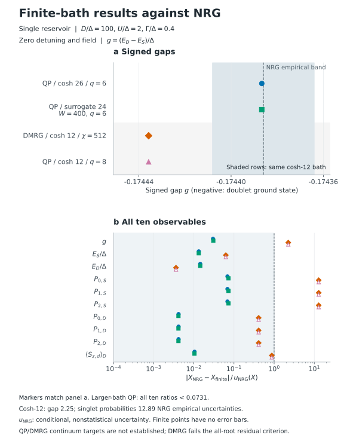
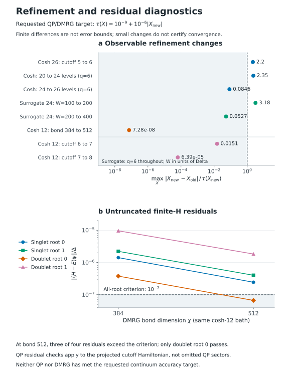

# Superconducting Impurity: Final Results

## TL;DR

- **Doublet ground state:** the signed singlet-doublet gap is approximately
  $-0.174387\Delta$ in the larger-bath QP calculations.
- **QP versus NRG:** the two larger-bath QP gaps differ by only
  $1.05\times10^{-8}\Delta$. All ten observables from both calculations lie
  within the corresponding NRG empirical uncertainty ranges.
- **DMRG versus QP:** on the identical 12-level bath, ground-branch energies
  agree within $3.7\times10^{-14}\Delta$. That smaller bath's gap differs from
  NRG by $4.98\times10^{-5}\Delta$, beyond the NRG empirical gap uncertainty.
- **Accuracy:** NRG meets its conditional empirical target. QP cutoff checks
  and DMRG residual checks prevent a claim of $10^{-6}$ relative continuum accuracy.

## Model

One superconducting reservoir with gap $\Delta=1$, normal-state **half-bandwidth**
$D=100\Delta$, interaction $U=2\Delta$, total hybridization $\Gamma=0.4\Delta$,
zero detuning and zero field. The impurity convention is
$H_d=U(n_d-1)^2/2$; energies subtract the disconnected vacuum of the corresponding
bath. The signed gap is $g=(E_D-E_S)/\Delta$, so a negative value means the doublet
is lower. See [model conventions](../../docs/models.md) for definitions.

Bath sizes count signed normal levels. Here $q$ is the QP cutoff, $\chi$ the DMRG
bond dimension, and $W$ the surrogate fitting-window upper limit in units of
$\Delta$; changing $W$ does **not** change physical $D$. Bath weights are not
renormalized, and discarded dark modes are not removed.

## Energies and Gap

| Method | Bath and numerical setting | $E_S/\Delta$ | $E_D/\Delta$ | $g$ |
|---|---|---:|---:|---:|
| NRG | Extrapolated, 32 twists per $\Lambda$ | -0.9012117 | -1.0755977 | -0.1743860 |
| QP | Cosh 26, $q=6$ | -0.9012216767 | -1.0756083653 | -0.1743866885 |
| QP | Surrogate 24, $W=400$, $q=6$ | -0.9012216636 | -1.0756083626 | -0.1743866990 |
| DMRG | Cosh 12, $\chi=512$ | -0.9011645848 | -1.0756003614 | -0.1744357767 |
| QP | Same cosh 12, $q=8$ | -0.9011645848 | -1.0756003614 | -0.1744357767 |

The NRG empirical uncertainties for these three columns are respectively
**$7.52\times10^{-4}$, $7.37\times10^{-4}$, and $2.21\times10^{-5}$**.
They combine numerical-refinement sensitivity and extrapolation-model spread;
they are **not statistical confidence intervals or rigorous bounds**. The gap
uncertainty is assessed directly, not obtained by adding energy uncertainties.
Displayed digits are rounded values, not claims of achieved precision.



The two cosh-12 results use the **same finite Hamiltonian**. Their common
difference from NRG cannot be attributed to a DMRG ground-energy error: it is
also present in QP. The larger-bath points use different finite Hamiltonians.

## Probabilities and Moment

$P_0$, $P_1$, and $P_2$ are impurity empty, singly occupied, and doubly occupied
probabilities. The moment $m_D=\langle S_d^z\rangle$ refers to the spin-up doublet
and is dimensionless; a free spin-up electron has $m_D=1/2$.

| Quantity | NRG | NRG empirical uncertainty | QP cosh 26 | QP surrogate 24 | DMRG cosh 12 |
|---|---:|---:|---:|---:|---:|
| Singlet $P_0$ | 0.27633722 | 9.31e-6 | 0.27633786 | 0.27633790 | 0.27645724 |
| Singlet $P_1$ | 0.44732556 | 1.86e-5 | 0.44732428 | 0.44732420 | 0.44708553 |
| Singlet $P_2$ | 0.27633722 | 9.31e-6 | 0.27633786 | 0.27633790 | 0.27645724 |
| Doublet $P_0$ | 0.06730101 | 8.60e-6 | 0.06730104 | 0.06730104 | 0.06730455 |
| Doublet $P_1$ | 0.86539799 | 1.72e-5 | 0.86539792 | 0.86539792 | 0.86539090 |
| Doublet $P_2$ | 0.06730101 | 8.60e-6 | 0.06730104 | 0.06730104 | 0.06730455 |
| Doublet $m_D$ | 0.42550108 | 1.01e-5 | 0.42550098 | 0.42550098 | 0.42549225 |

The same-bath cosh-12 QP probabilities agree with DMRG within
$3.0\times10^{-13}$, but their singlet probabilities differ from NRG by about
12.9 times its empirical uncertainties. These ratios are not statistical
significances. The singlet moment is a symmetry zero, excluded from the ten
nonzero accuracy targets.

## Achieved Accuracy

The requested observable tolerance is $10^{-9}+10^{-6}\lvert v\rvert$ for QP/DMRG
and $10^{-6}+10^{-3}\lvert v\rvert$ for NRG. All ten NRG estimates satisfy the
latter. NRG centers extrapolate linearly in $\log\Lambda$ from
$\Lambda=1.8,2,2.5,3,4$; uncertainties retain alternative fit forms/ranges and
propagated numerical sensitivity. Agreement with NRG does not establish the
stricter QP/DMRG target.

| Refinement | Largest absolute change / requested tolerance | Interpretation |
|---|---:|---|
| Cosh 26, QP cutoff 5 to 6 | 2.20 | Gap change still exceeds target |
| Cosh 20 to 24, $q=6$ | 2.35 | Gap and singlet probabilities exceed targets |
| Cosh 24 to 26, $q=6$ | 0.0846 | One stable bath-size step |
| Surrogate 24, $W=100$ to 200, $q=6$ | 3.18 | Both branch-energy changes exceed targets |
| Surrogate 24, $W=200$ to 400, $q=6$ | 0.0527 | One stable window step |
| Cosh 12, DMRG bond 384 to 512 | 7.28e-8 | Stable ground-branch values, but residual checks fail |

These changes are diagnostics, **not total error bounds**. The final stable
bath/window steps do not erase the preceding failures, and small-bath cutoff
stability does not certify a larger bath.



At $\chi=512$, the DMRG residuals divided by $\Delta$ are:

| Branch | Lowest root | Second root |
|---|---:|---:|
| Singlet | 2.429e-7 | 4.001e-7 |
| Doublet | 6.630e-8 | 1.826e-6 |

Only the lowest doublet passes the prescribed $10^{-7}$ criterion. DMRG therefore
does not meet the **all-root** qualification, despite excellent same-bath
ground-branch agreement. QP residuals are below $3.75\times10^{-13}$ at the two
larger-bath endpoints, but apply to the projected cutoff Hamiltonians, not the
omitted QP sectors. Neither solver has established the requested continuum accuracy.

## Data

- [Results JSON](output/results.json): numerical values, definitions, residuals,
  empirical uncertainties, and the refinement endpoints used in the comparisons.
- [Observable table](output/observables.csv) and [comparison table](output/comparisons.csv):
  exact stored values underlying the rounded tables and figures.

The data are self-contained; no external solver or local calculation directory
is needed to read them.

## Reproduction

The retained sources reproduce the calculation in principle, not the exact
historical sequence of checkpoints. The approved files in `output/` remain the
reference results. No raw NRG output, MPS checkpoint, or historical run directory
is required to start. Fresh DMRG states can yield different excited-state
residuals; examine the new diagnostics rather than assuming the published
qualification flags or digits will be reproduced.

### Inputs and Dependencies

- [physical.json](input/physical.json): Hamiltonian, observable targets, and resource limits.
- [qp-dmrg-focused.json](input/qp-dmrg-focused.json): the 12 published finite endpoints,
  including the final $\chi=512$ and $W=400$ calculations.
- [final-baths.json](input/final-baths.json): seven explicit baths, with the original
  nodes and unnormalized weights. Surrogate fitting settings are retained, but
  these calculations load the coefficients rather than fitting again.
- [nrg-targeted.json](input/nrg-targeted.json): five $\Lambda$ anchors, 32 twists,
  retention and chain-length checks. `retention2` is the final setting.
- [profiles.json](input/profiles.json): original small controls and broader
  `pilot`, `convergence`, `fulltest1`, and `nrg-refinement` study inputs.

Run from a fresh source checkout on **Linux**. The original resource supervisor
uses `/proc`, process groups, CPU affinity and `fcntl`. Install the Python solver
and optional backends with:

```sh
python -m pip install -e '.[dmrg,plots,dev]'
export OPENBLAS_NUM_THREADS=1 OMP_NUM_THREADS=1 MKL_NUM_THREADS=1
```

NRG additionally requires an external [NRG Ljubljana](https://github.com/rokzitko/nrgljubljana)
installation supporting SPSU2 and the `h5raw`/`h5last`/`h5ops` output used by
[nrg.py](nrg.py), plus licensed Mathematica and Python `h5py` (included in the
`dmrg` extra). Put `nrginit`, `nrg`, and Mathematica's `math` executable on `PATH`.
The published calculation used Mathematica 13.3 and a September 2026 NRG
implementation, but its exact historical NRG revision is not recorded in the
shipped provenance. These feature requirements alone do not identify a
reproducible NRG version. The decks select the standard `SIAM` and `CLEAN` models and
`n_d`, `n_d_ud`, `sigma_d` operators; the external installation must support these
definitions. No private model or operator modules are shipped here, and the
offline tests do not validate an external installation. The runner
allows one Mathematica kernel at a time and does not change the NRG installation.
QP/DMRG calculations and reading the results do not require NRG or Mathematica.

### Finite Baths

Planning only counts dimensions; it does not diagonalize or fit:

```sh
python -B NRG_comparisons/test1/focused_internal.py plan
python -B NRG_comparisons/test1/focused_internal.py prepare --campaign finite-reproduction
python -B NRG_comparisons/test1/focused_internal.py run --campaign finite-reproduction
python -B NRG_comparisons/test1/focused_internal.py report --campaign finite-reproduction
```

[focused_internal.py](focused_internal.py) reuses the original [run.py](run.py)
solver routines, with `compress=False`, two roots per sector, the original
residual tolerances and the 16-million-state QP dimension guard. It now starts
both DMRG endpoints from fresh states rather than requiring deleted checkpoints.
Use `--group bath`, `--group window`, or `--group dmrg` to select part of the
queue, and `--max-tasks 1` to run one calculation at a time. The task IDs in the
input match `output/results.json`; results and finite differences are written to
`runs/finite-reproduction/summary.json` and `REPORT.md`.

For a separate small independent electron-ED/QP Wilson-chain control:

```sh
python -B NRG_comparisons/test1/run.py run --profile controls --campaign control-ed --backend ed
python -B NRG_comparisons/test1/run.py run --profile controls --campaign control-qp --backend qp
```

### NRG

This sequence starts without a source campaign. `prepare` renders/checks settings
and records the local installation; only `run` launches the external executables.

```sh
python -B NRG_comparisons/test1/targeted_nrg.py plan --stage retention2
python -B NRG_comparisons/test1/targeted_nrg.py prepare --stage retention2 --campaign nrg-reproduction
python -B NRG_comparisons/test1/targeted_nrg.py run --stage retention2 --campaign nrg-reproduction
python -B NRG_comparisons/test1/targeted_nrg.py report --stage retention2 --campaign nrg-reproduction
```

The queue includes small `SIAM`/`CLEAN` controls in both energy units, the final
32-twist anchors, and the retention, energy-cutoff, minimum-retention, chain and
unit checks. Nested 8/16-twist grids are subsets of the 32-twist calculations.
The original [twist_analysis.py](twist_analysis.py) computes the linear-in-log
central estimate, alternative fits/ranges and propagated empirical sensitivity.
Missing or failed checks remain unresolved. Running only `--mode anchors` cannot
establish the reported uncertainty. `--source` is optional reuse of a newly
generated campaign, not a dependency on an unshipped baseline.

These are expensive research commands, not routine tests. The runners stop at
the limits in `physical.json` (up to 128 GiB and 48 hours across this case's run
directories; targeted NRG caps these at 126 GiB and 47.5 hours), with four hours
per task and four hours per finite-task group. A slower machine may exhaust the
budget before finishing. Review partial reports and resource requirements rather
than treating a stopped queue as convergence. Repeating `run` resumes completed
work; a failed task requires review and `--retry-failed`. Do not mix these fresh
commands with an old run directory whose shared budget is already spent.

### Tables and Figures

The original presentation code is retained in [generate.py](generate.py), without
the one-time historical archive importer. It reads the approved `results.json`
and recreates both CSVs and SVGs (plus PNG previews), without running solvers:

```sh
python -B NRG_comparisons/test1/generate.py
```

Files go to `runs/presentation/`, or `--output-dir PATH`; the script refuses to
overwrite `output/`. Its captions describe the approved results, not a new
calculation. Fresh solver results are in the numerical reports above and need
scientific review before replacing the publication. This preserves the existing
precision claims without making an automated claim about a fresh run.
