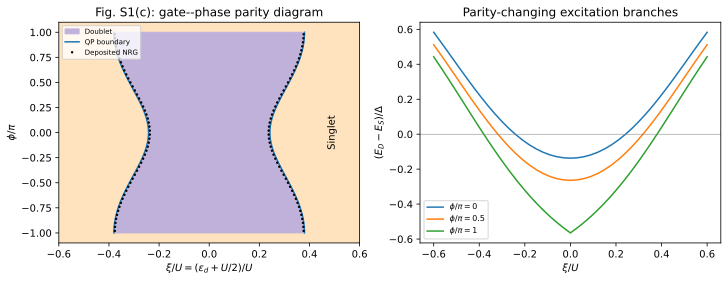

# Gate and phase control of the junction's ground-state parity

**Result:** the gate–phase singlet/doublet boundary is reproduced with a maximum
difference of **0.00517 in $\xi/U$** from the deposited processed NRG grid, whose
gate spacing is 0.01. Increasing phase toward $\pi$ broadens the odd-parity region.

## Paper and target

A. Bargerbos, M. Pita-Vidal, R. Žitko et al.,
*Singlet-Doublet Transitions of a Quantum Dot Josephson Junction Detected in a
Transmon Circuit*, PRX Quantum **3**, 030311 (2022).
[DOI](https://doi.org/10.1103/PRXQuantum.3.030311) ·
[arXiv:2202.12754](https://arxiv.org/abs/2202.12754).

The experiment detects junction parity through a transmon's microwave spectrum.
The target here is its **junction-only theoretical parity map, supplementary
Fig. S1(c)**. It illustrates the gate- and phase-controlled transition underlying
the experimental interpretation. Transmon transition frequencies and parity
lifetimes require additional circuit/dynamical modeling and are not the
observables calculated in this example.



## Model and conventions

| Quantity | Value |
|---|---|
| Superconducting gap | $\Delta=1$ |
| On-dot interaction | $U=5\Delta$ |
| Normal-state half-bandwidth | $D=10\Delta$ |
| Total coupling | $\Gamma=0.2U=\Delta$ |
| Lead couplings | $\Gamma_L=\Gamma_R=\Delta/2$ |
| Field and temperature | Zero |
| Gate coordinate | $\xi/U=(\epsilon_d+U/2)/U$ |

The package parameter `detuning` equals **$\xi$**, not $\epsilon_d$. The calculation sets
`detuning=U*gate_over_u` at each point. `model.detuning=0` identifies the origin
of this gate coordinate. In particular, the published gate values must not be
passed directly as the conventional bare electron level $\epsilon_d$.

Both superconducting leads are explicit and uncompressed. We set
`symmetry=False` throughout the gate sweep so that the impurity coordinates do
not change at $\xi=0$. This also makes charge-response and particle-hole checks
straightforward.

The Fig. S1 parameters are distinct from the paper's fitted experimental values
(such as $U/\Delta=12.2$ in the main text). This reproduction uses the specified
supplementary-model parameters throughout.

## Calculation

The main (`paper`) calculation uses **four signed spinful levels per lead**, fitted over
$0.001\leq\omega/\Delta\leq10$, and unrestricted QP diagonalization. The bath nodes and
weights are fixed during the gate and phase scans and saved in `manifest.json`.
The even $S_z=0$ and odd $S_z=1/2$ lowest energies determine the signed gap

```math
g(\xi,\phi)=E_D(\xi,\phi)-E_S(\xi,\phi).
```

At each of the 25 deposited positive phases, plus $0$ and $\pi$, the positive-gate
zero of $g$ is located with a $10^{-6}$ tolerance in $\xi/U$. Particle-hole symmetry gives
the negative-gate boundary; time-reversal symmetry supplies negative phases.
The colored map is built from these calculated boundaries. Separate 41-point
gate cuts at $\phi=0$, $\pi/2$ and $\pi$ check the surrounding phase regions.

The plot's signed gap is the separation of the lowest parity branches; its
absolute value gives the parity-changing excitation. At $\xi=0$, $\phi=\pi$ the two
even states cross. Selecting the lowest even branch creates the physical cusp
in the green excitation curve, consistent with the symmetry explored in the
[multi-terminal application](../zalom_2024_multiterminal/README.md).

## Results

| $\phi/\pi$ | Computed $\xi_c/U$ | Deposited NRG $\xi_c/U$ |
|---:|---:|---:|
| 0 | 0.24207458 | — |
| 0.02 | 0.24224770 | 0.23707396 |
| 0.50 | 0.31840381 | 0.31425628 |
| 0.98 | 0.38012731 | 0.37661233 |
| 1 | 0.38023975 | — |

The deposited phase mesh has spacing $0.04\pi$ and does not contain exactly $0$ or
$\pi$ in this file; the table therefore does not silently substitute nearby points
for those endpoints. The maximum boundary difference is **0.00517375** in $\xi/U$.
It is below one gate-grid interval, but exceeds our bath-refinement spread.
Interpolation, NRG discretization and finite-bath approximation are distinct
sources of numerical error; the deposit does not provide error bars for them.

The largest eigensolver residual is **$9.37\times10^{-13}\Delta$**. At $\xi/U=0.4$, $\phi=\pi/2$,
both parity branches satisfy the independent Hellmann–Feynman identity

```math
\frac{\partial E}{\partial\xi}=\langle n_d\rangle-1
```

to **1.45e-10** using a centered difference. The minus one follows from the
package's centered impurity Hamiltonian. Particle-hole-related energies agree
to **$8.0\times10^{-15}\Delta$**, and their charges sum to two.

## Convergence

Convergence is checked at phases $0.02\pi$, $\pi/2$ and $0.98\pi$:

| Change | Maximum change in $\xi_c/U$ |
|---|---:|
| 2 versus 4 bath levels | 0.00623 |
| 3 versus 4 levels | 0.000939 |
| 4 versus 5 levels, unrestricted | 0.000239 |
| Fit cutoff $20\Delta$ versus $10\Delta$, 4 levels | 0.000116 |
| QP cutoff 4 versus unrestricted, 4 levels | 0.0000356 |

The main result uses the unrestricted problem; the small cutoff error here is
specific to this regime and contrasts with the strongly coupled examples.
Five-level refinement explicitly selects sparse matrices. All differences and
the complete sector solutions are archived under `output/`.

## Deposited reference data and extraction

The reference is a **processed/interpolated NRG energy grid**, rather than raw
NRG iterations or experimental points, from Arno Bargerbos and Marta Pita Vidal,
[4TU dataset 10.4121/19102769.v1](https://doi.org/10.4121/19102769.v1), licensed
[CC BY 4.0](https://creativecommons.org/licenses/by/4.0/).

`extract_reference.py` retrieves the numerical grid by downloading only the
relevant parts of the ZIP archive: about **292 kB**, rather than the full
805 MB. It checks that the downloaded parts belong to the same archive and
verifies the data file's checksum. `reference/provenance.json` records a further
SHA-256 checksum identifying the extracted file. Only the numerical arrays are
read. The authors' plotting notebook was inspected to verify the axis and array
conventions.

`reference/boundary.csv` preserves the bracketing gate coordinates and stored
energy differences used for each linearly interpolated zero. The extraction
does not depend on assigning spin labels to the deposit's A1/A2 array order.
Reference NRG settings are $\Lambda=8$, up to 3000 spin multiplets and no twist
averaging. The exact member, source URL and transformation are in the provenance
file. The original large NRG archive is linked by the paper and the deposit.

## Reproduce and test

From the main source directory:

```sh
python -B -m applications.bargerbos_2022_parity_diagram.run --profile quick
python -B -m applications.bargerbos_2022_parity_diagram.run --profile paper
python -B -m applications.bargerbos_2022_parity_diagram.run --profile convergence
python -B -m applications.bargerbos_2022_parity_diagram.plot --output applications/bargerbos_2022_parity_diagram/runs/paper
```

Recorded quick/paper/convergence runtimes were about **0.7 s / 9.3 min / 16.9 min**
on the recorded single-thread arm64 environment. All use the base QP install.
The optional reference extraction is a separate network-dependent command.

Set `--output applications/bargerbos_2022_parity_diagram/output/<profile>` to
reproduce the archived result directories, then run
`python -B -m applications.analyze --case bargerbos_2022_parity_diagram`.

Numerical checks reuse the exact stored bath, check both sides of the boundary,
verify charge derivatives and particle-hole symmetry, and bracket a deposited
NRG crossing within one published gate-grid interval. See the
[application guide](../README.md) for common options and test commands.
