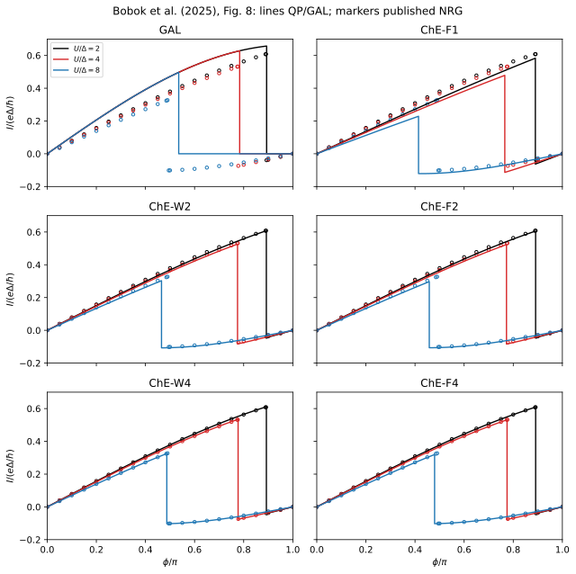
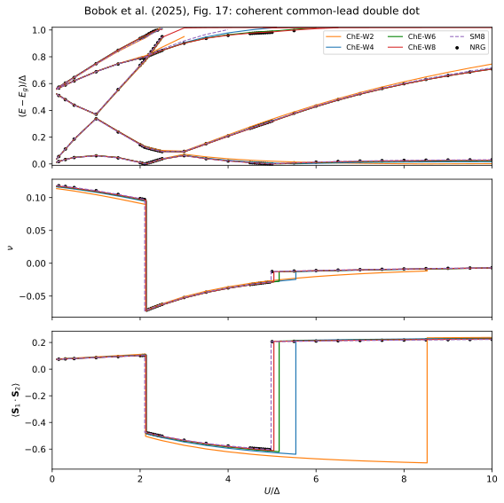

# Chain expansion, GAL currents, and common-lead high-spin physics

**Result:** four-site finite-band ChE reduces the maximum same-sign current
discrepancy from **0.137** for GAL to **0.00230** in $e\Delta/\hbar$. In the
shared-lead problem, the singlet–triplet transition moves from
**$U_c/\Delta=8.52577$** at two sites to **5.04081** at eight sites, approaching
the published NRG bracket from **4.95 to 5.00**. Ten-site checks still change
the ground state at $U=5\Delta$, so the remaining bath dependence matters.

This application compares the systematically refinable **Chain Expansion (ChE)**
reservoirs with dot-only **generalized atomic-limit (GAL)** models, fitted
surrogate reservoirs, and independent NRG results. It covers two complementary
targets: the current–phase relations in **Fig. 8**, and the spectra, induced
pairing and spin correlations of a coherent common-lead double dot in
**Fig. 17**.

## Paper and reference material

D. Bobok, L. Frk, V. Pokorný and M. Žonda, *Scalable effective models for
superconducting nanostructures: Applications to double, triple, and quadruple
quantum dots*, Physical Review B **112**, 205418 (2025).
[DOI](https://doi.org/10.1103/mxsl-fc96) ·
[arXiv:2508.18465v2](https://arxiv.org/abs/2508.18465v2).

We use the version-2 arXiv source and its original `fig_08.pdf` and `fig_17.pdf`,
released under [CC BY 4.0](https://creativecommons.org/licenses/by/4.0/).
The optional `extract_reference.py` reads marker centers and curve coordinates
from the original figures using PyMuPDF. The stored CSV tables retain these
coordinates; `reference/provenance.json` records source-file checksums and
axis calibrations.

The Fig. 8 legend identifies **black $U=2\Delta$, red $U=4\Delta$, blue
$U=8\Delta$**. The accompanying prose reverses the red and blue assignments;
we use the figure's explicit legend. Duplicate marker layers and legend symbols
are excluded. There are 72 distinct NRG current markers. Fig. 17 includes 141
excitation markers and 40 markers each for pairing and spin correlation.

Estimated coordinate uncertainties are $4\times10^{-6}$ in current and
$\phi/\pi$, $2\times10^{-5}$ in $U/\Delta$, and $10^{-5}$ in Fig. 17 ordinates.
Polyline simplification/interpolation error is additional. Appendix D specifies
NRG Ljubljana, normally $D=100\Delta$, and $\Lambda=4$ for two channels or
$\Lambda=2$ for one; kept-state and twist-averaging settings are not specified.
The reference is graphical numerical data, not raw NRG iterations.

## ChE construction and independent checks

Construct a ChE reservoir with `qdjj_solver.chain_expansion`. Its
[method guide](../../docs/chain_expansion.md) explains the finite-band
Gaussian/Radau construction equivalent to the paper's low-frequency Padé
prescription and the analytic wide-band coefficients

```math
h_0=L,\qquad h_\ell=\frac{L^2-\ell^2}{4\ell^2-1},
\qquad t_\ell=\Delta\sqrt{h_\ell},\quad 1\leq\ell<L,
\qquad \gamma_j=\sqrt{\Gamma_j\Delta h_0}.
```

The generator returns exact mirrored **star coordinates**. The whole impurity
Hamiltonian is then solved by QP diagonalization. We separately build
the physical-electron **chain** and compare it with star calculations using
both full ED and DMRG. A coordinate transformation by itself does not improve
the bath approximation.

- `ChE-WL` means $L$ sites per reservoir and the wide-band coefficients.
- `ChE-FL` means the finite-band construction with $D=100\Delta$.
- `SML` means $L$ signed spinful levels fitted with the
  [Baran–Frost–Paaske surrogate method](https://doi.org/10.1103/PhysRevB.108.L220506)
  on the frequency interval from $0.001\Delta$ to $100\Delta$.

For wide-band ChE, the bath object's finite `bandwidth=100` is solely the
density-normalization convention. It does not turn the target into a finite
band. Physical residues $w_i/(\pi\rho)$ are independent of that convention.
All weights retain their computed normal-state measure without renormalization.
Bath size and QP cutoff are separate parameters; all main curves are
unrestricted within their specified finite baths.

Tests verify the paper's explicit coefficients, analytic low-frequency moments,
direct chain/star resolvents, full many-body spectra, and physical-electron ED
spin observables. The separate four-site-chain DMRG study agrees with QP energies
within **$7.4\times10^{-15}\Delta$**, with pairing and spin-correlation errors
below **$4.3\times10^{-14}$** and maximum MPS residual
**$5.9\times10^{-11}\Delta$**. It checks representatives of all three ground-state
phases with bond dimension 64 and two initial-state trials.

## Fig. 8: current through a single dot



| Quantity | Value |
|---|---|
| Gap, field, temperature | $\Delta=1$, zero field, zero temperature |
| Per-lead hybridization | $\Gamma_L=\Gamma_R=\Delta$ |
| Total hybridization supplied to `reference_model` | $2\Delta$ |
| Interaction | $U/\Delta=2,4,8$ |
| Gate | Half filling: `detuning=0`, $\epsilon_d=-U/2$ |
| Phase | $0\leq\phi\leq\pi$ |
| Current unit | $e\Delta/\hbar$ |

The phase convention is $\phi=\phi_R-\phi_L$ with phases $[-\phi/2,+\phi/2]$.
Relabeling the identical leads aligns it with the paper's positive-current
orientation. The reported current is **twice** the solver's `phase_derivative`.
Both even and odd sector energies are computed at every point; branch currents
are retained along with the ground-state current.

For GAL, with $\Gamma=\Gamma_L+\Gamma_R$, we set
$\nu=(1+\Gamma/\Delta)^{-1}$, $\widetilde U=\nu^2 U$ and induced pairing
$\nu\Gamma\cos(\phi/2)$. This is the **uncorrected GAL** curve in Fig. 8(a).
At half filling, its doublet current vanishes. For $0\leq\phi<\pi$, its
singlet current is

```math
\frac{I_S}{e\Delta/\hbar}
=\frac{\nu\Gamma}{\Delta}\sin\frac\phi2
```

and is independent of $U$. ChE recovers the finite doublet current and the
interaction dependence of the singlet current. The additional GAL+C band
correction is a separate approximation and is not included in the GAL curve here.
The [2023 double-dot GAL application](../zonda_2023_double_dot/README.md)
provides a complementary geometry where GAL performs substantially better.

Transition phases are located from $E_D-E_S=0$, with root tolerance
$2\times10^{-7}$ in $\phi/\pi$. Current checks differentiate each smooth
parity branch. At $\phi=\pi$, the degenerate even sector has no unique branch
current; its `even_current` is left empty, while the ground-state current is
well defined.

### Current results

The main (`paper`) calculation contains **924 current data points**. At the 72 published
NRG phases, the maximum errors are:

| Model | Same-sign current error | Error including displaced jumps |
|---|---:|---:|
| GAL | 0.136805 | 0.700312 |
| ChE-F1 | 0.050963 | 0.670756 |
| ChE-F2 | 0.012174 | 0.614766 |
| ChE-F4 | 0.002301 | 0.608219 |
| ChE-W4 | 0.001821 | 0.429919 |
| SM8 | 0.000878 | 0.606022 |

Errors use $e\Delta/\hbar$. The large jump errors are real consequences of
slightly different transition positions, rather than errors in the smooth
branch amplitudes. For example, at $U=4\Delta$ the NRG markers bracket
$\phi_c/\pi$ between 0.776 and 0.778, while ChE-F4 gives **0.774809** and SM8
**0.775256**. The other NRG brackets are 0.891–0.893 for $U=2\Delta$ and
0.490–0.495 for $U=8\Delta$. No coupling or phase shift is fitted to improve
these comparisons. The smaller W4 amplitude error than F4 partly mixes bath
and physical-bandwidth differences; it is not a uniform wide-band advantage.

Across the nine convergence points (three interactions and three phases),
ChE-F6 to F8 changes the current by at most **0.000364**, while F8 to SM8 changes
it by **0.000391**. SM8 to SM10 changes it by **0.0000291**. The finite-/wide-band
difference at eight sites is **0.00156**, and a four-QP cutoff on F8 introduces
up to **0.00222**. These distinct effects must not be replaced by the much smaller
eigensolver residual. The maximum current/energy-derivative discrepancy is
**$5.8\times10^{-10}$**.

Vertical plot jumps are placed at the refined transition phases; branch limits
are interpolated from the archived smooth sector currents.

## Fig. 17: two dots sharing a coherent reservoir



| Quantity | Value |
|---|---|
| Per-dot coupling | $\Gamma_1=\Gamma_2=0.5\Delta$ |
| Cross coupling | $\Gamma_{12}=\sqrt{\Gamma_1\Gamma_2}$, or $\zeta=1$ |
| Interaction and gate | $U_1=U_2=U$, half filling |
| Direct interdot hopping and capacitance | $t_d=W=0$ |
| Reservoir | One shared superconducting lead |
| Reported observables | Subgap energies, per-dot $\nu=\mathrm{Re}\langle d^\dagger_{j\uparrow}d^\dagger_{j\downarrow}\rangle$, $\langle\mathbf S_1\cdot\mathbf S_2\rangle$ |

Here $\nu$ denotes the paper's pairing expectation, rather than the GAL
renormalization factor used in the preceding section.

The tunneling matrix couples **both dots to the same bath modes**, preserving
the off-diagonal hybridization. Replacing that matrix by independent reservoirs
changes the problem. Both impurity orbitals remain interacting and dynamical.

We compute low states in even $S_z=0$ and odd $S_z=1/2$ sectors, and check the
triplet independently in $S_z=1$. The observable $\mathbf S_{\mathrm{total}}^2$
includes **dots and bath**. Within degenerate Ritz subspaces we diagonalize that
operator before assigning multiplets, recomputing observables and residuals.
This distinguishes the same-parity singlet–triplet crossing, which a simple
even/odd ground-state comparison would miss.

The one-site ChE/ZBW model has a singlet at large $U$; longer chains support a
triplet. The small singlet–triplet splitting converges more slowly than most
other subgap excitations. At each parameter point, `spectrum_matching.csv`
uses one-to-one assignment of distinct calculated and published energy levels,
including retained eigenstates above the plotted energy window. It also reports
the number of reference levels that cannot be matched one-to-one within
$0\lt E-E_g\leq1.02\Delta$. This window counter does not mean that a finite-model
eigenstate is absent: its energy can instead have moved above the window.
Energy levels closer than
the graphical extraction precision are treated as unresolved. This avoids
matching multiple reference levels to one computed state. A separate
nearest-level table is retained as a diagnostic.

### Shared-lead results

The **258 shared-lead parameter points** recover the doublet–singlet–triplet sequence.
Critical interactions obtained from the signed multiplet gaps are:

| Model | Doublet–singlet $U_c/\Delta$ | Singlet–triplet $U_c/\Delta$ |
|---|---:|---:|
| ChE-W1 / ZBW | 2.016187 | No crossing through $U/\Delta=10$ |
| ChE-W2 | 2.123815 | 8.525772 |
| ChE-W4 | 2.139696 | 5.540585 |
| ChE-W6 | 2.137856 | 5.161024 |
| ChE-W8 | 2.135707 | 5.040812 |
| SM8 | 2.104311 | 4.977783 |
| NRG marker bracket | 2.10–2.15 | 4.95–5.00 |

The brackets describe the published sampling, not an NRG numerical error bar.
At $U=5\Delta$, the unrestricted W8 singlet–triplet gap is
**$+0.00066785\Delta$**, whereas W10 gives **$-0.00018256\Delta$**. This small
energy change reverses the ground-state spin and produces a large jump in its
correlation. The paper's eight-site result is a useful approximation, but this
calculation does not establish a uniformly converged transition boundary.

The one-to-one spectral comparison gives maximum energy discrepancies of
**$0.03296\Delta$**, **$0.01000\Delta$** and **$0.00462\Delta$** for W4, W6 and
W8 respectively. For SM8 the corresponding error is **$0.07573\Delta$**. At
12 interaction values, one displayed reference level lacks a distinct
computed partner inside the plotted window.
Thus the fitted bath's excellent ground-state observables do not certify its
near-edge excitations.

For the 39 NRG points where W8 has the same ground-state spin, its pairing and
spin-correlation errors are at most **0.000804** and **0.00550**. The remaining
point is $U=5\Delta$. SM8 has the same ground-state spin at all 40 pairing and
spin-correlation points, with errors **0.0000172** and **0.000134**, respectively. Its
singlet–triplet gap changes by at most **$5.70\times10^{-6}\Delta$** in the
two ten-level refinement calculations, $U/\Delta=5.0,5.3$.

Comparisons with the paper's own simplified ChE curves, excluding jumps in
pairing and spin correlation, give spectral interpolation differences below
**$0.00142\Delta$** for W2/W4/W6/W8. The W8 pairing and correlation differences
are below **0.000055** and **0.000208**. These graphical comparisons complement
the independent exact coefficient and finite-Hamiltonian tests.

Spin-correlation jumps in the plot use the separately archived multiplet
expectations at the refined crossings, rather than a sloped interpolation
between different phases.

### Many-body accuracy and cost

The largest QP residual across the paper and convergence profiles is
**$5.7\times10^{-12}\Delta$**; spin-Casimir and independent triplet-projection
errors are below **$1.4\times10^{-12}$**. At the five shared-lead convergence
points, a six-QP cutoff on W8 differs from its unrestricted calculation by
at most **$1.13\times10^{-8}\Delta$** in the doublet–singlet gap and
**$9.34\times10^{-9}\Delta$** in the singlet–triplet gap. This good truncation
performance is specific to this coupling regime.

For those five points, total QP diagonalization times were **74.4 s** for
unrestricted W8, **11.9 s** for W8 at cutoff six, and **93.8 s** for unrestricted
SM8. The two ten-level refinement calculations took **531 s** for W10 and **594 s** for SM10
with exact exchange-symmetry reduction. All counts, settings and timings are
archived; the latter pair uses fewer parameter points and more symmetry-sector
solves, so it is not a like-for-like speed ratio with the five-point rows.

### Exact symmetry reduction for larger baths

An initial unrestricted ten-level sparse calculation exceeded the storage limit
of 100 million nonzero matrix entries. The archived ten-level checks use a symmetric/
antisymmetric **impurity-coordinate rotation** and both eigenvalues of dot
exchange parity. Its even $S_z=0$ blocks have 1293292 and 1410864 states instead
of one 2704156-state block. The interaction contains the resulting exchange and
pair-hopping terms; the antisymmetric impurity orbital is **not frozen**.
All bath QP occupations remain included. Independent calculations confirm equality
with the original coordinates even at finite bath-QP cutoff.

The original storage-limit failure and the subsequent symmetry-resolved
calculation are documented in `output/resource_checks.json`. The limits remain
8 GiB of estimated storage and 100 million nonzero matrix entries; the
symmetry-resolved matrices fit within these limits.

## Outputs, convergence and reproduction

`input/parameters.json` defines the quick, paper and convergence sweeps.
The paper scan includes the published NRG abscissae and locates the relevant
crossings. Convergence changes bath size, finite-/wide-band target, surrogate
representation and QP cutoff. `input/dmrg_check.json` specifies the optional
independent physical-chain calculation.

Full error budgets, same-phase comparisons across observable jumps, spectral
matching counts and per-setting QP diagonalization times are in
[output/validation.json](output/validation.json). Solver timings exclude bath
construction, model assembly, and writing results to disk; each `manifest.json`
also records the complete calculation's elapsed time. A small residual establishes accuracy for a
finite Hamiltonian, not continuum convergence.

```sh
export OPENBLAS_NUM_THREADS=1 OMP_NUM_THREADS=1 MKL_NUM_THREADS=1 VECLIB_MAXIMUM_THREADS=1
python -B -m applications.bobok_2025_chain_expansion.run --profile quick
python -B -m applications.bobok_2025_chain_expansion.run --profile paper
python -B -m applications.bobok_2025_chain_expansion.run --profile convergence
python -B -m applications.bobok_2025_chain_expansion.chain_check
python -B -m applications.bobok_2025_chain_expansion.plot --output applications/bobok_2025_chain_expansion/runs/paper
```

The three standard profiles use the base QP installation. `chain_check` requires
the `dmrg` extra, plotting requires `plots`, and optional reference extraction
requires PyMuPDF. Ordinary calculations and tests need no network access.
New results are saved in `runs/`; the archived outputs include bath coefficients,
sector energies and observables, source-file checksums, software versions,
and computer details. The analyzer reads **only `output/`**, not the new `runs/`
results above. To intentionally regenerate the archive and then analyze those
new calculations, use explicit output directories:

```sh
for profile in quick paper convergence; do
  python -B -m applications.bobok_2025_chain_expansion.run --profile "$profile" --output "applications/bobok_2025_chain_expansion/output/$profile" || break
done
python -B -m applications.bobok_2025_chain_expansion.chain_check --output applications/bobok_2025_chain_expansion/output/dmrg
# Run only after all requested calculations have completed successfully.
python -B -m applications.analyze --case bobok_2025_chain_expansion
```

These commands replace reviewed outputs; inspect the changes before publishing.
Use the first command block for exploratory runs that should leave the archive
unchanged. See the [application guide](../README.md) for common options.

Recorded quick/paper/convergence runtimes were **0.22 s / 47.1 min / 28.3 min**
in the archived single-thread arm64 environment. These are the successful runs;
the exploratory sparse allocation failure is recorded separately.
