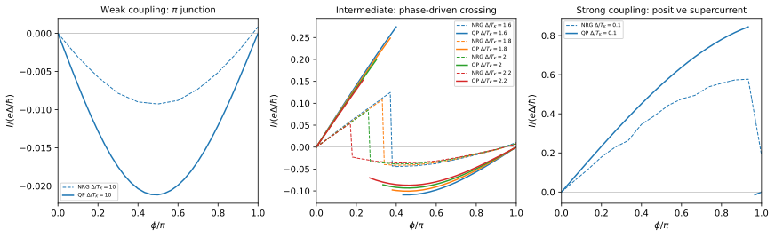

# Kondo screening and the Josephson 0–π crossover

**Outcome:** the competing junction regimes and phase-driven parity transitions
are reproduced. **The 2004 current curves are not reproduced quantitatively at
the stated bare parameters.** The discrepancy is retained and measured, with
full finite-bath QP, larger-bath and independent DMRG checks. This example is a
worked historical comparison, with explicit limits on the agreement achieved.

## Paper and target

M.-S. Choi, M. Lee, K. Kang, and W. Belzig,
*Kondo effect and Josephson current through a quantum dot between two
superconductors*, Phys. Rev. B **70**, 020502(R) (2004).
[DOI](https://doi.org/10.1103/PhysRevB.70.020502) ·
[arXiv:cond-mat/0312271v2](https://arxiv.org/abs/cond-mat/0312271v2).

The target is **Fig. 3(a–c)**: negative supercurrent when superconductivity
dominates, positive supercurrent when Kondo screening dominates, and an
intermediate regime whose ground-state parity depends on phase. The published
curves were calculated with superconducting NRG. We solve the same stated
single-level Anderson model with finite BCS reservoirs.



## Bare parameters and Kondo-temperature convention

The physical parameters are **$U/D=0.2$**, **total $\Gamma/D=0.04$**,
$\epsilon_d=-U/2$, and symmetric leads. $D$ is the normal-state half-bandwidth.
We use the paper's Eq. (4):

```math
T_K=\sqrt{U\Gamma/2}\exp[-\pi U/(8\Gamma)]
=0.008877583677244\,D.
```

The caption rounds this to $0.0089D$. We use the equation, rather than the rounded
number or a Kondo scale inferred by fitting a current. This is the paper's
conventional approximate normal-state scale, not a new susceptibility-based
measurement of $T_K$.

The six ratios $\Delta/T_K$ are **0.1, 1.6, 1.8, 2.0, 2.2, 10**. Bare $U/D$ and
$\Gamma/D$ remain fixed; varying $\Delta$ changes the competition of energy scales.
Each point is represented in gap units, $\Delta=1$, so the calculation converts
$U/\Delta$, $\Gamma/\Delta$ and $D/\Delta$ separately for each ratio. These converted
scales and the distinct bath records are archived. Each physical lead receives
$\Gamma/2$.

The package uses lead phases $(-\phi/2,+\phi/2)$; reflection of the symmetric leads
gives the paper's orientation. Current is reported in the paper's unit:

```math
\frac{I}{e\Delta/\hbar}=\frac{2}{\Delta}\frac{\partial E_g}{\partial\phi}.
```

We apply no fitted current prefactor, hybridization rescaling or adjustment of
the published parameter values.

## Calculation and results

The main calculation uses **eight signed normal levels per reservoir**,
surrogate fitting over $0.001\Delta$ to $D$, the verified symmetric paired-mode
reduction and **unrestricted QP diagonalization** of the retained finite problem.
Both parity branches are solved at each phase. The ground-state current uses
the lowest-energy branch, and roots of $E_D-E_S$ locate the transitions.

The 280-point phase scan gives:

| $\Delta/T_K$ | Computed $\phi_c/\pi$ | Behavior for $0<\phi<\pi$ |
|---:|---:|---|
| 0.1 | 0.94133777 | Positive current over most phases; narrow doublet region near $\pi$ |
| 1.6 | 0.42632696 | Singlet-to-doublet transition and current-sign switch |
| 1.8 | 0.37418786 | Singlet-to-doublet transition and current-sign switch |
| 2.0 | 0.32028513 | Singlet-to-doublet transition and current-sign switch |
| 2.2 | 0.26206952 | Singlet-to-doublet transition and current-sign switch |
| 10 | No crossing | Doublet throughout; approximately sinusoidal negative current |

These establish the paper's central qualitative competition. However, the
original figure gives smaller current amplitudes and different crossing phases.
The largest sampled discrepancies, in $e\Delta/\hbar$ units, are approximately:

| $\Delta/T_K$ | Maximum absolute current difference |
|---:|---:|
| 0.1 | 0.268 |
| 1.6 | 0.319 |
| 1.8 | 0.289 |
| 2.0 | 0.234 |
| 2.2 | 0.156 |
| 10 | 0.0119 |

Near a first-order transition, a difference in crossing location produces a
large current difference and sometimes opposite signs. The mismatch is also
visible well away from those crossings; it is not only a phase-grid effect.
The original EPS and the final publisher's Fig. 3 show the same qualitative
curves, so this is not explained by a changed preprint figure.

The largest residual in the main scan is **$5.32\times10^{-11}\Delta$**. Independent, branchwise
finite-difference energy derivatives agree with the current operator to
**1.09e-9** in the plotted current unit. The reference does not provide a raw NRG
input/output archive or a numerical error budget resolving the remaining
differences; this calculation alone does not establish their origin.

### The phase-pi endpoint

At half filling and symmetric coupling, $\chi=\lvert\cos(\phi/2)\rvert$ vanishes at $\pi$. The
symmetry-protected doublet region discussed in the later
[multi-terminal paper](../zalom_2024_multiterminal/README.md) persists in our
strong-coupling calculation. Thus the older paper's statement that the strong-
coupling ground state is singlet for *every* phase is not borne out at this
endpoint. The plotted current still has a predominantly positive, 0-like form.

The two lowest even states are degenerate at $\pi$. Their individual current
expectations depend on the arbitrary eigenvector combination returned by the
solver. The table therefore leaves `even_current` blank there; the ground-state
doublet current vanishes. Finite differences are evaluated on smooth branches
away from the cusp.

## Numerical convergence and comparison with DMRG

Six principal convergence points use $\Delta/T_K=0.1,1.8,10$ at $\phi/\pi=0.3$ and $0.8$:

| Comparison | Max signed-gap change / $\Delta$ | Max ground-current change |
|---|---:|---:|
| 6 versus 8 levels, unrestricted | 0.0116 | 0.00549 |
| 8 versus 10 levels, unrestricted | 0.00260 | 0.000165 |
| 8 levels, fit cutoff $2D$ versus $D$ | 2.34e-5 | 5.96e-6 |
| 8 levels, QP cutoff 4 versus unrestricted | 0.264 | 0.577 |

At the most demanding strong-coupling point, $\Delta/T_K=0.1$ and $\phi=0.3\pi$:

- A 12-level bath changes its current by **0.0278** when increasing QP cutoff
  from six to eight. Cutoff six is insufficient in this regime.
- The 12-level/cutoff-eight current differs from the unrestricted ten-level
  result by **0.000395**. This is a useful comparison, but does not prove that
  cutoff eight equals the unrestricted 12-level solution.
- An independent **DMRG calculation on the same eight-level finite model**,
  with `chi_max=256` and two initial-state trials, gives the same parity gap to about
  **$1.2\times10^{-13}\Delta$** and the ground current to **1.1e-9**. Its maximum physical
  residual is **$6.28\times10^{-8}\Delta$**.

The observed current discrepancies with the old NRG curves are much larger
than these refinement differences. The latter quantify convergence at the
selected points rather than bound errors everywhere in parameter space. In particular, the results
show why a low-QP approximation should not be assumed reliable merely because
the superconducting bath is gapped.

## Source and precision of the reference data

`reference/figure3.csv` is extracted from the original **Grace EPS** in the
arXiv source archive. Circle centers supply panels (a,b); colored polyline
vertices supply panel (c). The extraction script reads the drawing coordinates.
Axis calibration, checksums identifying the archive and figure, and extraction uncertainties are
in `reference/provenance.json`.

These are coordinates from the published figure, not raw NRG output. The EPS stores four-decimal
coordinates, implying phase uncertainty at most $0.0004\pi$ and current-coordinate
uncertainty at most 0.0005 in $e\Delta/\hbar$ units. NRG numerical uncertainty and
interpolation between source vertices are additional. Both positive and negative
published phases are preserved, while the new calculation uses the positive
half-period and exact symmetry checks.

## Reproduce and test

From the main source directory:

```sh
python -B -m applications.choi_2004_kondo_josephson.run --profile quick
python -B -m applications.choi_2004_kondo_josephson.run --profile paper
python -B -m applications.choi_2004_kondo_josephson.run --profile convergence
python -B -m applications.choi_2004_kondo_josephson.plot --output applications/choi_2004_kondo_josephson/runs/paper
```

The separate optional DMRG comparison uses:

```sh
python -B -m applications.choi_2004_kondo_josephson.run \
  --input applications/choi_2004_kondo_josephson/input/dmrg_check.json \
  --profile convergence --output applications/choi_2004_kondo_josephson/runs/dmrg
```

Recorded quick/paper/convergence runtimes were approximately **0.34 s / 6.9 min /
5.5 min** in the single-thread arm64 environment. The main profiles use the base
QP installation; the independent DMRG calculation additionally requires TeNPy.
Larger refinements explicitly choose sparse matrices within the specified
memory limit.

The commands above write fresh runs under
`applications/choi_2004_kondo_josephson/runs/`. To regenerate the archive instead,
set `--output applications/choi_2004_kondo_josephson/output/<profile>`
(or `--output applications/choi_2004_kondo_josephson/output/dmrg` for the
additional DMRG comparison), then run
`python -B -m applications.analyze --case choi_2004_kondo_josephson`.
Numerical checks reuse stored baths, verify the bare-parameter conversion,
check fixed-bath currents/energies to 2e-8, verify endpoint symmetry and competing
current signs, and perform the optional independent DMRG comparison. They do
not treat the discrepant published curves as exact numerical references.
