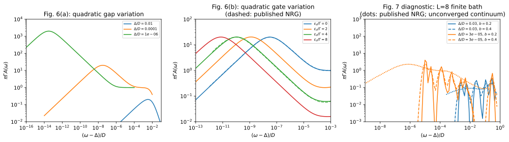

# Near-gap spectral peaks and finite-bath resolution

**Result:** the noninteracting near-gap peaks of Fig. 6 are reproduced by a
high-resolution finite-bath resolvent. Its near-edge curve differs from the
digitized analytic curve by at most **0.59%** at the stated broadening.
The interacting Fig. 7 calculation is an **unconverged resolution diagnostic**:
eight surrogate levels reproduce the two sampled ground-state parities but
do not resolve the continuum peaks. Both outcomes are archived explicitly.

## Paper and targets

T. Hecht, A. Weichselbaum, J. von Delft and R. Bulla, *Numerical renormalization
group calculation of near-gap peaks in spectral functions of the Anderson model
with superconducting leads*, Journal of Physics: Condensed Matter **20**, 275213
(2008). [DOI](https://doi.org/10.1088/0953-8984/20/27/275213) ·
[arXiv:0803.1251v3](https://arxiv.org/abs/0803.1251v3).

The paper shows that NRG resolves structure far below the superconducting gap.
Its key spectral signature is a narrow maximum above the gap, followed by a
square-root suppression at the edge itself. We target selected curves of
**Fig. 6(a,b)** and assess finite-bath feasibility for **Fig. 7(c)**.



## Model, units and independent references

One spin-degenerate dot is coupled to **one superconducting reservoir**, with
zero field and zero temperature. The original energy unit is the normal-state
half-bandwidth $D=1$ and $\rho=1/(2D)$. The paper's $\Gamma=\pi\rho t^2$ is the
single-reservoir hybridization.

| Target | Physical parameters in $D$ units |
|---|---|
| Fig. 6(a), selected gaps | $U=0$, $\epsilon_d=0$, $\Gamma=0.008$, $\Delta=10^{-2},10^{-4},10^{-6}$ |
| Fig. 6(b) | $U=0$, $\Gamma=0.008$, $\Delta=10^{-4}$, $\epsilon_d/\Gamma=0,2,4,8$ |
| Fig. 7(c), two parameter points | $U=0.6$, $\Gamma=0.049$, $\epsilon_d=-U/2$, $\Delta=0.03,3\times10^{-5}$ |

Calculations rescale each problem to $\Delta=1$; plotted frequency offsets are
$(\omega-\Delta)/D$, while `poles.csv` retains gap units. The impurity parameter
is `detuning=epsilon_d+u/2`. The plotted ordinate $\pi\Gamma A(\omega)$ is
dimensionless. $A$ is a **per-spin** spectral function; zero-field spin averaging
also averages the two doublet ground states.

`extract_reference.py` extracts coordinates from the original Grace EPS curves.
`reference/spectra.csv` retains every fifth vertex of the selected analytic and
NRG curves. Source-file checksums, curve assignments, and extraction precision are recorded
in `reference/provenance.json`. Log-axis rounding gives about **0.3%** relative
coordinate uncertainty. These are plotted, broadened NRG curves, not raw
transition lists. The paper uses $\Lambda=1.8$, twist spacing $\delta z=0.05$,
and 1024 then 512 kept states for its spectral calculations.

### Printed-formula check

Eq. (28), the normal-state Lorentzian limit, and the deposited analytic curves
give the following **unbroadened, wide-band, noninteracting** continuum result
per spin at positive frequency:

```math
A(\omega)=\frac{\Gamma\rho_\Delta}{\pi}
\frac{(\omega+\epsilon_d)^2+\Gamma^2}
{(\omega^2-\epsilon_d^2-\Gamma^2)^2+(2\Gamma\omega\rho_\Delta)^2},
\qquad \rho_\Delta=\frac{\omega}{\sqrt{\omega^2-\Delta^2}},\quad \omega>\Delta.
```

**The printed Eq. (30) has an extra $\Gamma$ in the last squared term.** Used
literally, it is dimensionally inconsistent and fails the normal-state limit.
The expression above agrees with the independently extracted analytic curves
within **0.194%**, below their estimated coordinate precision. No fit to the
computed bath spectra is used to correct it.

The factor $\rho_\Delta$ is the dimensionless BCS enhancement relative to the
normal-state density of states; $A(\omega)$ has units of inverse energy.

## Quadratic finite-bath calculation

The large-bath calculation integrates out the finite reservoir exactly in
the retarded Nambu resolvent. In gap units, for mirrored nodes,

```math
g_b(z)=\sum_i\frac{w_i}{\pi\rho(\xi_i^2+1-z^2)},\qquad s(z)=\Gamma g_b(z),
\qquad
G_{11}(z)=\frac{z[1+s(z)]+\epsilon_d}
{[z+(z-1)s(z)][z+(z+1)s(z)]-\epsilon_d^2}.
```

Four-point Gauss quadrature is applied in each logarithmic normal-energy cell,
including the central interval from zero to $10^{-9}\Delta$. Signed mirror
nodes retain the measure $\rho d\xi$ exactly up to roundoff. The paper profile
uses **4096 positive cells, 32768 signed spinful levels**, and
$z=\omega+i\eta$ with $\eta=0.01(\omega-\Delta)$.
Integrating out the noninteracting reservoir avoids constructing a many-body
Fock space for these tens of thousands of bath levels.

The same finite-bath Green function is checked against QP addition/removal
matrix elements on a small bath: maximum complex-resolvent error
**$1.71\times10^{-15}$**. Independent checks use a tensor-product electron-space
Lehmann calculation, including an interacting singlet and a degenerate doublet.

At $\Delta/D=10^{-4}$ the calculated maxima are close to
$\pi\Gamma A\simeq20$, moving toward the edge as $\epsilon_d$ increases. For
$\epsilon_d=0$ the sampled maximum lies near
$(\omega-\Delta)/D=3.02\times10^{-8}$; for $\epsilon_d=4\Gamma$ it lies near
$1.05\times10^{-10}$. Sampling is logarithmic, so peak positions have a larger
grid uncertainty than fixed-frequency amplitudes.

The maximum difference to the published Fig. 6 NRG curves on
$10^{-10}\leq(\omega-\Delta)/\Delta\leq0.1$ is **8.27%**. Even the zero-broadening
wide-band analytic formula differs from those digitized NRG curves by **8.41%** over
that interval. Thus the NRG comparison is not a sub-percent benchmark everywhere;
its broadening and discretization effects must be distinguished from quadrature
and coordinate errors.

### Quadratic error budget

For $\Delta/D=10^{-4}$ and $\epsilon_d/\Gamma=0,4$, the table gives maximum
absolute curve errors divided by the analytic peak height. Quadrature is
compared with the **finite-band continuum at the same complex frequency**;
broadening/band error compares that continuum with the unbroadened wide-band
formula.

| Cells | $\eta/(\omega-\Delta)$ | Quadrature / peak | Broadening and band / peak |
|---:|---:|---:|---:|
| 512 | 0.02 | 0.0854 | 0.01005 |
| 1024 | 0.02 | 0.00585 | 0.01005 |
| 2048 | 0.02 | 0.0000714 | 0.01005 |
| 4096 | 0.01 | 0.0000716 | 0.00502 |
| 8192 | 0.01 | $3.94\times10^{-7}$ | 0.00502 |
| 8192 | 0.005 | 0.0000685 | 0.00251 |

Reducing broadening requires refining the bath simultaneously. The quick
128-cell calculation is deliberately a coarse check of the procedure; its spectral amplitudes
are not the published reproduction.

## Interacting Lehmann/Lanczos diagnostic

For Fig. 7 we use unrestricted finite-QP models with 4, 6 and 8 signed bath
levels, fitted with the positive surrogate method of
[Baran, Frost and Paaske](https://doi.org/10.1103/PhysRevB.108.L220506). Each fit
covers $0.001\Delta$ through $D$ on the imaginary-frequency axis. Physical
electron operators, transformed to the solver's basis, generate addition and
removal vectors in all relevant spin sectors. A two-pass, fully reorthogonalized
Lanczos procedure constructs their
positive spectral measures with 240 steps, checked against 480 steps.

The complete per-spin spectral measure, including subgap and above-gap poles
at both positive and negative frequencies, obeys
$`\int_{-\infty}^{\infty} A(\omega)\,d\omega=1`$ to **$4.3\times10^{-14}$**.
The largest ground-state residual is **$5.3\times10^{-11}\Delta$**. Subgap poles
remain separate; continuum poles are broadened in their distance from the
physical gap using the normalized kernel

```math
K_b(x,x_m)=\frac{\exp[-\log^2(x/x_m)/b^2]}{\sqrt{\pi}\,b\,x},
\qquad x=\omega-\Delta>0,\quad x_m=E_m-\Delta>0.
```

We vary $b=0.2,0.4$ rather than treating smoothing as a substitute for bath
resolution. No pole is moved artificially onto the gap edge. In particular:

| $\Delta/D$ | Levels | $(E_D-E_S)/\Delta$ | First continuum pole's $(E-\Delta)/\Delta$ |
|---:|---:|---:|---:|
| 0.03 | 4 | -0.61271 | 0.20585 |
| 0.03 | 6 | -0.59468 | 0.12413 |
| 0.03 | 8 | -0.58993 | 0.08302 |
| 0.00003 | 4 | -0.14171 | 0.13996 |
| 0.00003 | 6 | 0.32333 | 0.36006 |
| 0.00003 | 8 | 0.70413 | 0.36471 |

The pole threshold uses weight greater than $10^{-10}$. At the small gap,
even the ground-state parity is wrong with four levels. Six/eight levels give
the expected singlet, but their gap and continuum structure remain bath dependent.
At $b=0.2$, doubling Lanczos steps changes the sampled spectrum by at most
**0.000402** in $\pi\Gamma A$, whereas changing six to eight bath levels changes
it by **2.57**. These are distinct convergence questions.

**The interacting near-gap peaks are not reproduced quantitatively here.**
A dense continuum resolution, suitable dynamical many-body method, and further
bath convergence would be needed. The archived `interacting_continuum_converged`
flag is false. This example supplies a validated spectral calculation and a
measured boundary of the compact-surrogate approach's applicability.

## Reproduce

```sh
export OPENBLAS_NUM_THREADS=1 OMP_NUM_THREADS=1 MKL_NUM_THREADS=1 VECLIB_MAXIMUM_THREADS=1
python -B -m applications.hecht_2008_gap_edge.run --profile quick
python -B -m applications.hecht_2008_gap_edge.run --profile paper
python -B -m applications.hecht_2008_gap_edge.run --profile convergence
python -B -m applications.hecht_2008_gap_edge.plot --output applications/hecht_2008_gap_edge/runs/paper
```

All numerical profiles require only the base QP installation. Plotting requires
the `plots` extra. `poles.csv` stores `omega` as $\omega/\Delta$; multiply by
`delta_over_D` to obtain $\omega/D$. Its dimensionless `weight` already includes
the $1/2$ spin average: sum rows for each setting and gap without averaging again.
`spin=0/1` denotes up/down electrons. `addition=1` (`True` in `krylov.csv`) means
electron addition at positive frequency; `addition=0` (`False`) means removal at
negative frequency. `krylov.csv` stores weights, Krylov dimensions and terminal
coefficients: individual-channel weights are unaveraged, while the
`spin=sum, addition=both` row gives the combined spin-averaged weight.
A terminal Lanczos coefficient is not an eigensolver residual or a continuum
error estimate.
`spectra.csv`, `comparison.csv` and [validation.json](output/validation.json)
contain the comparison and convergence quantities. The `manifest.json` files
record bath coefficients, software versions, computer details, and checksums
identifying the solver and calculation scripts. See the
[application guide](../README.md) for calculation and numerical-check commands.
