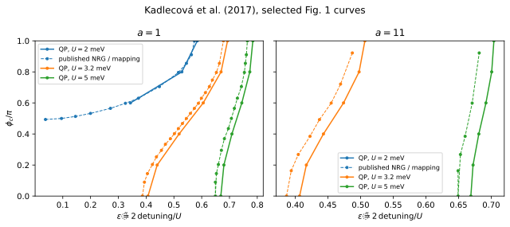

# Exact contact-asymmetry mapping and the parity boundary

**Result:** independently constructed asymmetric and symmetric finite-bath
junctions agree to **$7.4\times10^{-15}\Delta$** in energy and
**$6.2\times10^{-16}$** in mapped current. Selected Fig. 1 gate–phase boundaries
have a maximum discrepancy of **0.0218 in $\tilde\epsilon$** from the plotted
NRG data. Bath and bandwidth refinement reduce that discrepancy but do not
justify treating the finite-bath curves as exact continuum boundaries.

## Paper and target

A. Kadlecová, M. Žonda and T. Novotný, *Quantum dot attached to superconducting
leads: Relation between symmetric and asymmetric coupling*, Physical Review B
**95**, 195114 (2017).
[DOI](https://doi.org/10.1103/PhysRevB.95.195114) ·
[arXiv:1610.08366v3](https://arxiv.org/abs/1610.08366v3).

The targets are **Fig. 1(a,b)** for $U=2,3.2,5$ meV, and the exact
energy/on-dot/current conversion formulas **Eqs. (5)–(7)**. The application
demonstrates disappearance of the $U=2$ meV transition under strong contact
asymmetry at fixed total hybridization. This exemplifies why a single
$T_K/\Delta$ coordinate cannot describe junctions of arbitrary asymmetry.



## Physical inputs

| Quantity | Value |
|---|---|
| Equal lead gaps | $\Delta=0.17$ meV |
| Total hybridization | $\Gamma_L+\Gamma_R=0.44$ meV |
| Interaction | $U=2,3.2,5$ meV |
| Asymmetry | $a=\Gamma_L/\Gamma_R=1,11$ |
| Published gate coordinate | $\tilde\epsilon=1+2\epsilon_d/U=2\mathrm{detuning}/U$ |
| Half-bandwidth used here | $D=100\Delta$, checked against $200\Delta$ |
| Field and temperature | Zero |

The numerical Hamiltonian uses $\Delta=1$: divide the meV parameters by 0.17.
Use `detuning=tilde_epsilon*u/2`, and divide total $\Gamma$ between the leads as
$\Gamma_L=a\Gamma/(1+a)$, $\Gamma_R=\Gamma/(1+a)$. No experimental parameters are
refitted. The caption does not specify a numerical bandwidth, so finite-band
sensitivity is recorded separately.

The main (`paper`) calculation uses four signed spinful bath levels per lead, fitted over
frequencies from $0.001\Delta$ to $100\Delta$ with the positive surrogate method
of [Baran, Frost and Paaske](https://doi.org/10.1103/PhysRevB.108.L220506).
All QP configurations in each selected symmetry sector of the finite model are retained.

## Mapping and current normalization

For a single Anderson impurity with spin-independent tunneling, identical
reservoir gaps and normal spectral measures, and no direct interlead hopping,
define

```math
\tau=\frac{4a}{(1+a)^2},\qquad
\chi(\phi,a)=1-\tau\sin^2\frac\phi2,
\qquad \phi_S=2\arcsin\!\left(\sqrt{\tau}\sin\frac\phi2\right).
```

Here **$\chi$ is the squared phasor magnitude**; it is the square of the
quantity named $\chi$ in the
[Zalom multi-terminal application](../zalom_2024_multiterminal/README.md).
For $0\leq\phi\leq\pi$, the symmetric junction at $\phi_S$ has the same
gauge-invariant impurity quantities and many-body energy differences. The
Josephson current requires the derivative Jacobian:

```math
I_A(\phi)=\frac{\sqrt{\tau}\cos(\phi/2)}{\sqrt{\chi(\phi,a)}}I_S(\phi_S),
\qquad I=\frac{2e}{\hbar}\frac{\partial E_g}{\partial\phi}.
```

Currents are recorded in $e\Delta/\hbar$. For $a=1$ the Jacobian is one,
including its limiting value at $\phi=\pi$. For $a\ne1$ it vanishes at $\pi$.
The mapping preserves $a\leftrightarrow1/a$. The paper's reversed phase
orientation is equivalent after relabeling leads; we consistently use
$\phi=\phi_R-\phi_L$.

The inverse mapping exists only if
$\sin(\phi_S/2)\leq2\sqrt a/(1+a)$. Its failure is a physical absence of an
accessible transition, not a numerical root-finding failure. In particular
for $a=11$ only $\chi\geq25/36$ is accessible.

## Calculation and results

At each physical phase, the calculation finds $\phi_S$, compares even $S_z=0$
and odd $S_z=1/2$ energies, and searches for the positive-gate zero of
$E_D-E_S$ with tolerance $2\times10^{-6}$ in $\tilde\epsilon$. If the half-filled
junction is already singlet and the boundary is inaccessible, the table stores
an empty gate and `has_transition=0`. No fictitious zero-gate crossing is drawn.

The 36 main-scan points reproduce the disappearance of the $U=2$ meV curve
at $a=11$ and the narrowing/shift of the other transition regions. Maximum
gate discrepancy against linearly interpolated NRG markers is **0.0217715**.
At $U=3.2$ meV and $\phi=\pi/2$:

| Bath levels per lead | Symmetric $\tilde\epsilon_c$ | Asymmetric $\tilde\epsilon_c$ ($a=11$) |
|---:|---:|---:|
| 2 | 0.63219946 | 0.53592228 |
| 3 | 0.57938010 | 0.47353076 |
| 4 | 0.56321271 | 0.45874335 |
| 5 | 0.55864923 | 0.45413830 |

These gate boundaries at larger $U/\Delta$ are more bath sensitive than those in
the [Bargerbos example](../bargerbos_2022_parity_diagram/README.md).

### Independent exact-identity check

A separate calculation constructs two explicit, uncompressed reservoirs with unequal
tunneling amplitudes and independently compares them with the symmetric model.
It uses the **same finite bath** on both sides, $a=1,4,11,1/11$, two phases,
nonzero detuning and both parity sectors. Maximal differences are:

- Energy: **$7.33\times10^{-15}\Delta$**.
- Impurity charge: **$1.00\times10^{-15}$**.
- Current after the analytic Jacobian: **$6.11\times10^{-16}$**.

These numerical identities validate the mapping implementation independently
of continuum or NRG accuracy. Further checks differentiate the effective
phase numerically and check the reciprocal asymmetry and phase endpoints.

## Convergence and reference precision

For the two $U=3.2$ meV, $\phi=\pi/2$ boundaries:

| Change | Maximum $\tilde\epsilon_c$ change |
|---|---:|
| 3 versus 4 levels per lead | 0.01617 |
| 4 versus 5 levels, unrestricted | 0.00461 |
| QP cutoff 4 versus unrestricted, 4 levels | 0.00158 |
| Fit-frequency cutoff doubled | 0.0000269 |
| Half-bandwidth and fit-frequency cutoff doubled | 0.00762 |

The largest eigensolver residual in the paper scan is
**$3.90\times10^{-12}\Delta$**. It is much smaller than the separate gate-root,
bath, bandwidth and reference-coordinate errors. Refinement is checked at the
specified two boundaries, not assumed uniformly over all experimental regimes.
Full data and runtimes are in [output/validation.json](output/validation.json).

The optional extractor reads ten-sided circle centers in the original MATLAB
`fig_phase-boundary.eps`, keeping **137 NRG markers** from all nine published
$U$ curves. It excludes the plotted interpolation polylines. The half-pixel
export gives approximate uncertainties **0.0018** in $\tilde\epsilon$ and
**0.0017** in $\phi/\pi$. Endpoint clipping is restricted to that rounding
precision. NRG and subsequent interpolation errors are additional. Checksums
identifying the source archive and figure, and independent axis calibration, are in
`reference/provenance.json`.

## Reproduce

```sh
export OPENBLAS_NUM_THREADS=1 OMP_NUM_THREADS=1 MKL_NUM_THREADS=1 VECLIB_MAXIMUM_THREADS=1
python -B -m applications.kadlecova_2017_asymmetry.run --profile quick
python -B -m applications.kadlecova_2017_asymmetry.run --profile paper
python -B -m applications.kadlecova_2017_asymmetry.run --profile convergence
python -B -m applications.kadlecova_2017_asymmetry.plot --output applications/kadlecova_2017_asymmetry/runs/paper
```

Recorded quick/paper/convergence times were approximately **1 s / 6.6 min /
14.7 min** in the single-thread environment retained in the manifests. All
numerical profiles use the base QP installation; plotting needs the `plots`
extra. Normal runs use the stored reference CSV and need no network access.
See the [application guide](../README.md) for reusing bath coefficients and
running numerical checks.
