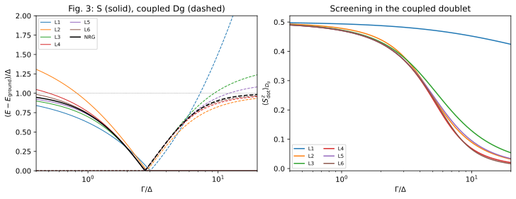

# Surrogate reservoirs and the superconducting subgap spectrum

**Result:** the even/odd bath-size effects and coupled singlet/doublet spectrum
of the paper are reproduced. At 72 points digitized from the original figure, our
finite-bath results differ from the authors' surrogate curves by at most
**$5.29\times10^{-4}\Delta$**. Six bath levels give a maximum difference of **$0.0389\Delta$**
from the independently calculated NRG curve over the sampled range.

## Paper and target

V. V. Baran, E. J. P. Frost, and J. Paaske,
*Surrogate model solver for impurity-induced superconducting subgap states*,
Phys. Rev. B **108**, L220506 (2023).
[DOI](https://doi.org/10.1103/PhysRevB.108.L220506) ·
[arXiv:2307.11646v3](https://arxiv.org/abs/2307.11646v3).

We reproduce **Fig. 3**, including the impurity-spin screening in its inset.
The key result is that a few effective superconducting levels can reproduce
the interacting subgap states, with systematic improvement as the bath is
enlarged. The parity of the number of levels matters near the continuum edge.



## Model and parameters

| Quantity | Value/convention |
|---|---|
| Gap | $\Delta=1$ |
| Interaction | $U=15\Delta$ |
| Gate | $\epsilon_d=-U/2$; `detuning=0` |
| Normal-state half-bandwidth | $D=10\Delta$ |
| Phase | $\phi=0$ |
| Coupling | **Total** $\Gamma=\Gamma_L+\Gamma_R$, swept from $0.4\Delta$ to $20\Delta$ |
| Surrogate sizes in the main plot | 1, 2, 3, 4, 5, 6 signed spinful normal levels per reservoir |

The archived coefficients are the authors' own full-precision values, taken
from revision `1ef00d1018a61be5a2b892ce3b9d2082288e81ec` of
[their surrogate repository](https://github.com/virgilb91/surrogate_models).
For their residues $\gamma_l$ and normal energies $\xi_l$, the package bath weights
are **$w_l=\pi\rho\gamma_l$**, with $\rho=1/(2D)$. This produces the published
tunneling amplitude $\sqrt{\Gamma\gamma_l}$. We do not normalize these weights to
sum to one.

## Coupled and spectator doublets

At zero phase, the symmetric combination of the two leads couples to the dot
with total $\Gamma$; the antisymmetric combination is free. We therefore solve
the **one-active-channel Hamiltonian** using `geometry="single"`. Its odd
state is the paper's **gerade doublet $D_g$**.

This distinction is essential: a small odd-level surrogate can put $D_g$ above
$\Delta$. The full two-lead system then has a *different*, lower odd excitation,
made by adding a free antisymmetric-channel quasiparticle to the coupled
singlet. Substituting that state would artificially pin the plotted excitation
at $\Delta$ and miss one of the paper's main findings. An independent finite-bath check
compares these two states and checks their energy reference.

All computations retain the complete finite one-channel bath and use physical
electrons on the impurity, with no paired-mode compression. We solve the
even $S_z=0$ and odd $S_z=1/2$ sectors. The plotted energies are

```math
E_S-E_g=\max(E_S-E_{D_g},0),\qquad
E_{D_g}-E_g=\max(E_{D_g}-E_S,0).
```

The spin expectation is the local dot spin in $D_g$, including when $D_g$ is excited.
These discrete coupled-state energies are not a broadened continuum spectrum.

## Results

The computed singlet/doublet crossing approaches $\Gamma_c\approx2.753\Delta$
as the surrogate is refined:

| Levels | $\Gamma_c/\Delta$ |
|---:|---:|
| 1 | 3.00732101 |
| 2 | 2.83848169 |
| 3 | 2.76232697 |
| 4 | 2.75602380 |
| 5 | 2.75341308 |
| 6 | 2.75314463 |

Two characteristic features are visible:

- **Weak coupling:** an odd-level bath contains $\xi=0$ and reproduces the
  zero-coupling screening-quasiparticle energy $\Delta$. An even-level bath has
  minimum quasiparticle energy greater than $\Delta$ and overestimates the singlet
  excitation. At $\Gamma=0$ the independent check is
  $E_S-E_D=\min(U/2,\min_l\sqrt{\xi_l^2+\Delta^2})$.
- **Strong coupling:** the one-level model retains a poorly screened dot spin
  and greatly overestimates $D_g$. Enlarging the bath allows the residual spin to
  move away from the impurity. For example, at $\Gamma=20\Delta$ the local spin is
  0.01644 for six levels and 0.01337 for ten levels.

The 409-point main calculation has maximum eigensolver residual
**$1.10\times10^{-11}\Delta$**. Agreement with the original colored surrogate curves to
$5.29\times10^{-4}\Delta$ is a comparison of independent implementations at the published
bath parameters. Agreement with the black NRG curve is less precise because it
additionally tests the surrogate's approximation to the continuum.

## Convergence

Five convergence points cover $\Gamma/\Delta=0.5,2,3,10,20$. Maximum absolute changes:

| Refinement | Signed singlet/doublet gap / $\Delta$ | Local doublet spin |
|---|---:|---:|
| 4 versus 8 levels | 0.0704 | 0.00586 |
| 6 versus 8 levels | 0.0174 | 0.00196 |
| 7 versus 8 levels | 0.0588 | 0.0166 |
| 8 versus 10 levels | 0.00667 | 0.00142 |
| 8 levels, fit window $20\Delta$ versus $10\Delta$ | 0.00192 | 0.000258 |
| 8 levels, QP cutoff 4 versus unrestricted | 0.129 | 0.0162 |

Odd and even bath-size sequences need not converge monotonically together.
The cutoff-four result also demonstrates why a small projected residual alone
does not establish many-body accuracy. All main-plot results are unrestricted.
Near-gap states remain more demanding than the crossing itself. These are
empirical differences at the selected parameter points, not rigorous uniform
continuum error bars.

## Independent sources and reproducibility

`reference/figure3.csv` contains coordinates extracted from the PDF for the NRG and
surrogate curves. Tick positions calibrate the logarithmic $\Gamma$ axis and the
linear energy axis. Coordinates and source-file checksums are retained in the
reference files. The NRG reference used $\Lambda=2$, 500 kept states, and no
$z$-averaging. Its computational uncertainty is additional to figure extraction
and interpolation uncertainty.

`reference/baths.json` contains the deposited bath coefficients. The copied
data's MIT notice is in `reference/LICENSE-bath-data.txt`. The optional extractor
requires PyMuPDF and network access; the stored data suffice for calculations
and numerical checks.

From the main source directory:

```sh
python -B -m applications.paaske_2023_surrogate_spectrum.run --profile quick
python -B -m applications.paaske_2023_surrogate_spectrum.run --profile paper
python -B -m applications.paaske_2023_surrogate_spectrum.run --profile convergence
python -B -m applications.paaske_2023_surrogate_spectrum.plot --output applications/paaske_2023_surrogate_spectrum/runs/paper
```

Recorded quick/paper/convergence runtimes were approximately **0.14 s / 9.4 s /
105 s** with single-thread numerical libraries on arm64. Ten-level refinement
uses sparse matrices explicitly. To reproduce the archived results, set `--output` to
`applications/paaske_2023_surrogate_spectrum/output/<profile>` and run
`python -B -m applications.analyze --case paaske_2023_surrogate_spectrum`.

Tests reuse the stored baths, compare calculated energies and spin expectations
with stored values to an absolute tolerance of 2e-9, check original figure points
at their extraction precision, and verify both the
zero-coupling edge and the coupled-versus-spectator distinction. See the
[application guide](../README.md) for output formats and common commands.
