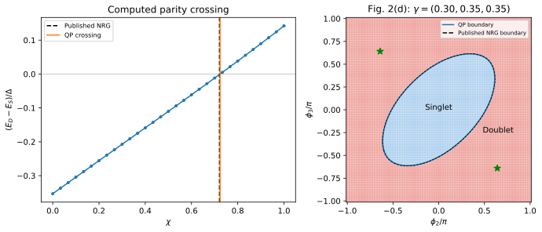

# Hidden symmetry of an interacting three-terminal Josephson junction

**Result:** the solver reproduces the published three-terminal singlet/doublet
phase diagram. It gives **$\chi_c=0.723564$**, versus the published rounded NRG
value **0.721**. Direct three-lead calculations independently verify the mapping
to two effective leads to approximately **1e-14 in energy** and **1e-15 in current**.

## Paper and target

P. Zalom, M. Žonda, and T. Novotný,
*Hidden symmetry in interacting-quantum-dot-based multi-terminal Josephson
junctions*, Phys. Rev. Lett. **132**, 126505 (2024).
[DOI](https://doi.org/10.1103/PhysRevLett.132.126505) ·
[arXiv:2310.02933v2](https://arxiv.org/abs/2310.02933v2).

We reproduce **Fig. 2(d)** (panel D in arXiv) and numerically verify the central
mapping and current relation, Eqs. (3), (4), (6). The result permits an interacting
multi-terminal impurity problem to be solved using a symmetric two-lead reference
problem, with all geometry encoded in a single scalar.



## Physical parameters

| Parameter | Value |
|---|---|
| Gap | $\Delta=1$, identical in all leads |
| Interaction and gate | $U=3\Delta$, $\epsilon_d=-U/2$ (`detuning=0`) |
| Total hybridization | $\Gamma=\Gamma_1+\Gamma_2+\Gamma_3=\Delta$ |
| Relative couplings | $(\gamma_1,\gamma_2,\gamma_3)=(0.30,0.35,0.35)$ |
| Normal-state half-bandwidth | **$D=2000\Delta$** |
| Gauge | $\phi_1=0$; independently vary $\phi_2$ and $\phi_3$ |
| Temperature and field | Zero |

The bandwidth and NRG settings are in **Supplement VI of the PDF**, which is
absent from the arXiv HTML rendering. The reference used $\Lambda=4$, four $z$ values,
and at most 2000 kept states. The cited Zenodo NRG record is a software release,
not a deposited table of the figure's numerical values.

## Mapping and what is calculated

Define

```math
\gamma_j=\frac{\Gamma_j}{\Gamma},\quad \Gamma=\sum_j\Gamma_j,\quad
z=\sum_j\gamma_j e^{i\phi_j},\quad \chi=\lvert z\rvert,\quad
\phi_{\mathrm{eff}}=2\arccos\chi.
```

The effective two-lead problem has $\Gamma_L=\Gamma_R=\Gamma/2$ and the same $U$,
$\Delta$, $D$. Its dot hybridization function equals the original one up to a global
gauge rotation. For this single spin-degenerate Anderson level, the mapping
holds at any interaction strength and detuning. It requires equal gaps and
lead hybridization functions with the same energy dependence, spin-independent
tunneling, and no direct interlead hopping. The local impurity Hamiltonian
conserves charge, so the overall phase of $z$ can be removed by a gauge rotation;
an independently fixed local pairing phase would introduce another physical
phase difference. The effective phase lies in $0\leq\phi_{\mathrm{eff}}\leq\pi$.

The calculation proceeds as follows:

1. Fit an eight-level bath and solve both parity sectors of the effective model.
2. Find the zero of **$E_D(\chi)-E_S(\chi)$** numerically.
3. Generate the 81-by-81 phase map using that **computed** critical value.
4. Solve four geometries with **three explicit, independent leads**, and compare
   both parity energies, dot charges and terminal currents with the equivalent
   two-lead calculation at the **same finite bath**.
5. Check the symmetry-protected pair of equal-energy even states at $\chi=0$.

Thus the phase diagram's transition scale comes from the solver; the published
0.721 is used only for the comparison contour.

The main bath uses the
[Baran–Frost–Paaske fit](https://doi.org/10.1103/PhysRevB.108.L220506)
on 1000 logarithmic frequencies from $0.001\Delta$ to $100\Delta$. The symmetric effective
model uses paired-mode compression and unrestricted diagonalization of the
retained finite space. Direct mapping checks use two levels **per explicit lead**
and no compression; a separate one-level-per-lead dense calculation resolves
the exactly degenerate multiplet. All bath coefficients are stored in the
`manifest.json` calculation records.

### Energy reference and spectator states

Both model constructors subtract the isolated BCS vacuum energy. The resulting
coupled subgap energies can therefore be compared directly. Without this
subtraction a three-lead calculation contains one extra lead's vacuum energy.
The extra free bath also contributes spectator quasiparticles, so the full
many-body spectra do not have identical multiplicities above the subgap sector.

### Currents

The paper uses $J_0=2e\Delta/\hbar$, so the numerical phase derivative already gives
$J_j/J_0$ when $\Delta=1$. For $0<\chi<1$,

```math
g_j=\partial_{\phi_j}\chi
=-\frac{\gamma_j}{\chi}\sum_l\gamma_l\sin(\phi_j-\phi_l),\qquad
\frac{J_j}{J_0}
=-\frac{2g_j}{\sqrt{1-\chi^2}}\,
\frac{\langle\partial_{\phi_{\mathrm{eff}}}H\rangle}{\Delta}.
```

The direct calculation constructs each **partial** phase derivative separately.
Its sum must vanish. A derivative along a path that varies two terminal phases
would measure a sum of terminal currents instead of either current individually.
The singular parameterizations $\chi=0$ and $1$ are excluded from this chain-rule
test; they are not replaced by an arbitrary division cutoff.

## Results and convergence

| Bath/solver choice | Computed $\chi_c$ |
|---|---:|
| 4 levels, unrestricted | 0.724758940 |
| 6 levels, unrestricted | 0.723778911 |
| 8 levels, unrestricted (paper map) | **0.723563892** |
| 10 levels, unrestricted | 0.723523019 |
| 8 levels, fit cutoff $2000\Delta$ | 0.723605648 |
| 8 levels, QP occupation cutoff 4 | 0.724961526 |
| Published NRG, rounded | **0.721** |

The eight-to-ten-level change is 4.09e-5; the fit-window change is 4.18e-5.
The finite-QP-cutoff change is appreciably larger, 0.00140, so the main calculation
uses the unrestricted finite space. Its transition corresponds to
**$\phi_{\mathrm{eff}}/\pi=0.48500543$**, compared with the paper's rounded **0.487**.

The remaining $\chi_c$ discrepancy is about 0.36%. It exceeds the displayed
bath-refinement spread and the rounding precision; it should not be described
as numerical equality with the published NRG value. The reference supplies no
error bars or raw data with which to further resolve this difference. The
result reproduces the phase topology and boundary closely, with a small
quantitative offset explicitly visible in the comparison.

The largest residual in the main calculation is $3.09\times10^{-12}\Delta$.
Over eight direct/mapped comparisons (four geometries, two parity sectors):

| Exact finite-bath identity | Largest discrepancy |
|---|---:|
| Energy, in $\Delta$ | 2.22e-14 |
| Terminal current, in $J_0$ | 6.11e-16 |
| Sum of terminal currents, in $J_0$ | 5.97e-16 |

These tight identities test the implementation at a fixed bath; they are
independent of the continuum accuracy of $\chi_c$.

### Finite-energy singlet crossing

For these couplings, phasor closure occurs at
$\phi_2=-\phi_3=\arccos(-3/7)=0.640982964\pi$. The stars mark the two such points.
The dense one-level-per-lead check finds an even-state splitting below
$7\times10^{-16}\Delta$ and a doublet ground state. Its even excitation energy is
$0.331002874\Delta$, a **small-bath diagnostic**, not a continuum NRG energy estimate.

At exact degeneracy an eigensolver may return arbitrary combinations of states.
A single vector's current expectation is then not a unique branch derivative.
Furthermore, single-vector Lanczos can miss an exactly repeated eigenvalue.
We use dense diagonalization for the small closure check and compare the current
operator over the complete degenerate subspace in the mode-reduction check.
`spectrum.csv` leaves the even current blank at $\chi=0$ for this reason.

## Source details worth checking when extending this example

The paper's geometric relations are stronger references than an unqualified
transcription of every label. In its separate Fig. 3 example with couplings
$(0.45,0.40,0.15)$, setting $\phi_3=\pi$ gives $\chi\in[0.1,0.7]$, hence a **doublet**
throughout according to its own $\chi_c=0.721$ criterion; the published text calls
this state a singlet. Its main Eq. (5) also disagrees with the supplementary
cosine-law expression. We determine $\chi$ directly from the complex sum and
obtain the closure point from that sum.

## Reproduce and test

From the main source directory:

```sh
python -B -m applications.zalom_2024_multiterminal.run --profile quick
python -B -m applications.zalom_2024_multiterminal.run --profile paper
python -B -m applications.zalom_2024_multiterminal.run --profile convergence
python -B -m applications.zalom_2024_multiterminal.plot --output applications/zalom_2024_multiterminal/runs/paper
```

The recorded quick/paper/convergence runs took about **0.5 s / 73 s / 320 s**
with single-thread numerical libraries on arm64. The ten-level refinement
explicitly uses sparse matrices. Full outputs include each parity solution,
the geometric map, mapping checks, fitted bath coefficients, and calculation settings.

To reproduce the archived `output/` directories, add
`--output applications/zalom_2024_multiterminal/output/<profile>`, then plot and
run `python -B -m applications.analyze --case zalom_2024_multiterminal`.

Small tests reuse stored baths and check energy/current mapping to 1e-9, global
gauge invariance, current conservation, the stored finite-bath transition, and
the complete degenerate even pair. See the [application guide](../README.md) for
installation requirements, saved results, and test commands.
