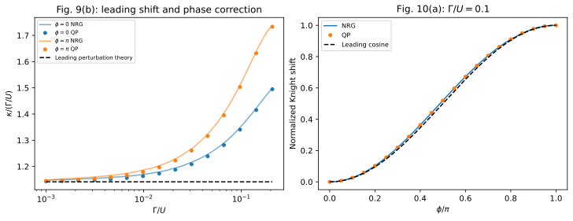

# Impurity Knight shift in a quantum-dot Josephson junction

**Result:** this calculation reproduces the leading hybridization-dependent
suppression of the doublet Zeeman splitting and its approximately cosine-shaped
phase modulation. Over the selected published parameter range the largest
absolute discrepancy from the deposited NRG results is **0.00115 in $\kappa$**.

## Paper and reproduction target

L. Pavešić, M. Pita-Vidal, A. Bargerbos, and R. Žitko,
*Impurity Knight shift in quantum dot Josephson junctions*,
SciPost Phys. **15**, 070 (2023).
[DOI](https://doi.org/10.21468/SciPostPhys.15.2.070) ·
[arXiv:2212.07185v3](https://arxiv.org/abs/2212.07185v3).

The target is **Fig. 9(b), restricted to $0.001\leq\Gamma/U\leq0.20796506$**, and the
**$\Gamma/U=0.1$ curve of Fig. 10(a)**. The original Fig. 9 extends well into the
strong-coupling regime; that full range is outside this example's reported scan.

The impurity's spin is partially carried by superconducting quasiparticles.
Consequently its effective Zeeman splitting is reduced from the bare local
splitting. Writing that reduction as the Knight shift $\kappa$, the leading term is
linear in $\Gamma$ (second order in tunneling), while the leading phase-dependent
part is quadratic in $\Gamma$ (fourth order in tunneling).



## Physical model and conventions

| Parameter | Value |
|---|---|
| Superconducting gap | $\Delta=1$ |
| Interaction | $U=10\Delta$ |
| Normal-state half-bandwidth | $D=100\Delta$ |
| Gate | $\epsilon_d=-U/2$; package `detuning=0` |
| Hybridization | $\Gamma=\Gamma_L+\Gamma_R$; each lead receives $\Gamma/2$ |
| Phase | Package phases $(-\phi/2,+\phi/2)$; the shift is even in $\phi$ |
| Field | Local `field=E_Z`, multiplying $S_z$; no reservoir field |

Positive field raises the bare up-spin level. The lowest state in the **odd,
total $S_z=+1/2$ sector** is used even when the global ground state is a singlet.
An impurity-spin expectation is not a total-spin label.

The zero-field Knight shift can be obtained either from the linear Zeeman
splitting or from the local spin expectation (paper Eqs. 12–16):

```math
\kappa=1-\lim_{E_Z\to0}\frac{E_\uparrow(E_Z)-E_\downarrow(E_Z)}{E_Z}
=1-2\langle D,\uparrow\vert S^z_{\mathrm{dot}}\vert D,\uparrow\rangle_{E_Z=0}.
```

At nonzero $E_Z$, the energy quotient is a finite-field estimate of this
linear-response quantity; its leading correction here is quadratic in $E_Z$.

An independent finite-bandwidth perturbative expression, Eq. (26), gives

```math
\lim_{\Gamma\to0}\frac{\kappa}{\Gamma}
=\frac{1}{\pi}\int_{-D}^{D}
\frac{d\xi}{[U/2+\sqrt{\Delta^2+\xi^2}]^2}
=0.114153752512283\,/\Delta.
```

Thus the ordinate of Fig. 9(b), **$\kappa/(\Gamma/U)$**, tends to 1.14153752512.
This also explains the factor of $U$ in the plotted perturbative line.

## Inputs, methods and reference data

`input/parameters.json` specifies every scan and refinement. The main (`paper`) calculation
uses eight signed spinful normal levels per reservoir, fitted over
$0.001\leq\omega/\Delta\leq100$ on 1000 logarithmic points. We use
[Baran–Frost–Paaske surrogate reservoirs](https://doi.org/10.1103/PhysRevB.108.L220506).
Actual nodes and weights are in each output's `manifest.json`.

The paired-mode reduction freezes exactly decoupled bath modes in their vacuum.
We use the package's transformed **built-in** spin observable and solve the
retained finite problem without a QP occupation cutoff. Small uncompressed
calculations independently validate the reduction. The reported states are the
impurity-bound doublets; this is not a calculation of the above-gap continuum.

The independent NRG numbers in `reference/` were extracted from the authors'
[Zenodo deposit 7951006](https://doi.org/10.5281/zenodo.7951006), by Luka Pavešić
and Rok Žitko, licensed [**CC BY 4.0**](https://creativecommons.org/licenses/by/4.0/).
The file `reference/provenance.json` identifies the source archive and data
files, including their checksums; `extract_reference.py` recreates the tables.

- Fig. 9: $\Lambda=8$, $z=1$ and $0.5$ averaged, $E_Z/\Delta=0.01$.
- Fig. 10: $\Lambda=4$, $z=1$, $E_Z/\Delta=0.001$.
- Fig. 10's stored `corr.dat` uses nominal phases. The generating sweep adds
  **0.0001 to $\phi/\pi$**; both nominal and actual phases are archived here, and
  the solver uses the actual ones.
- The NRG input's `Gamma1=Gamma2` is accompanied by a $1/\sqrt{2}$ hopping factor.
  Reading those names as physical per-lead widths would double the coupling.

## Numerical results

At $\Gamma/U=0.1$, the phase scan gives:

| Actual $\phi/\pi$ | QP $\kappa$ | Deposited NRG $\kappa$ |
|---|---:|---:|
| 0.0001 | 0.1346028241 | 0.13517118 |
| 0.5001 | 0.1432751452 | 0.14392664 |
| 1.0001 | 0.1513088311 | 0.15204138 |

The calculated modulation is **0.01670601**, compared with **0.01687020** in the
NRG data, a difference of about 0.97%. The normalized phase curve reproduces
the cosine-like shape and its small higher-harmonic correction. The graph's
normalization is performed separately for each dataset; the table above retains
the absolute amplitudes.

The maximum absolute errors are 0.00114766 over the coupling scan and 0.00073255
over the phase scan. These differences include bath approximation and reference
NRG discretization/truncation effects; the published data supply no numerical
error bars that would permit assigning the remainder to either method alone.

At $\Gamma=\Delta$, $\phi=\pi/2$, the finite-field estimate differs from the
zero-field spin result by:

| $E_Z/\Delta$ | Energy-quotient minus zero-field spin result |
|---:|---:|
| 0.010 | 3.00e-7 |
| 0.005 | 7.50e-8 |
| 0.001 | 3.01e-9 |

The quadratic field dependence is the expected correction to linear response.
The largest paper-profile eigensolver residual is $2.63\times10^{-12}\Delta$.

## Convergence and independent checks

The refinement scan tests $\Gamma/U=0.001,0.1,0.2$ at $\phi/\pi=0,0.5,1$.
Maximum absolute changes over those **nine parameter points** are:

| Comparison | Change in $\kappa$ |
|---|---:|
| 4 versus 8 surrogate levels | 2.34e-3 |
| 6 versus 8 levels | 6.96e-4 |
| 8 versus 10 levels, both unrestricted | 1.62e-4 |
| Fit cutoff $200\Delta$ versus $100\Delta$, 8 levels | 2.76e-5 |
| QP occupation cutoff 4 versus unrestricted, 8 levels | 3.39e-3 |
| Cosh quadrature, 6 positive pairs and QP cutoff 6, versus 10-level surrogate | 1.17e-4 |

In particular, a small QP cutoff is not sufficiently accurate everywhere in this
range, despite the much smaller eigensolver residuals. The reported curve
therefore uses the unrestricted finite problem. The refinement differences are
empirical estimates at the selected points, not rigorous uniform continuum error bounds.

The analysis script updates `output/validation.json`. Numerical checks reuse
the **quick calculation's exact stored bath**, with a 2e-9 absolute tolerance on
$\kappa$, and independently check the Zeeman identity, perturbative coefficient,
quadratic phase correction, and compressed/uncompressed equivalence. They do not
use the rounded NRG numbers as machine-precision targets.

## Reproduce

From the main source directory:

```sh
python -B -m applications.zitko_2023_knight_shift.run --profile quick
python -B -m applications.zitko_2023_knight_shift.run --profile paper
python -B -m applications.zitko_2023_knight_shift.run --profile convergence
python -B -m applications.zitko_2023_knight_shift.plot --output applications/zitko_2023_knight_shift/runs/paper
```

New results are saved in `runs/`. The archived calculations took about
**0.3 s / 30 s / 191 s** for quick/paper/convergence on the recorded arm64
environment with single-thread numerical libraries. Ten-level refinement calculations
explicitly select the sparse-matrix solver; the automatically selected matrix-free method is
substantially slower for this problem.

To reproduce the archived results in their `output/` directories, add
`--output applications/zitko_2023_knight_shift/output/<profile>` to each run,
then use the plotter's corresponding `--output` and run
`python -B -m applications.analyze --case zitko_2023_knight_shift`.
Retrieving reference data is optional and requires network access:
`python -B -m applications.zitko_2023_knight_shift.extract_reference`.

The general [application guide](../README.md) explains the calculation records,
reuse of bath coefficients, detailed result files, installation requirements,
and numerical-check commands.
