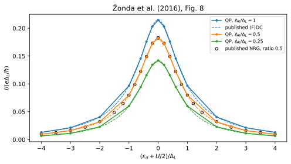

# Josephson current with unequal superconducting gaps

**Result:** the gate-dependent current in Fig. 8 agrees with its published NRG
markers to **0.000404** in $e\Delta_L/\hbar$. Independent left/right current
operators cancel within **$1.5\times10^{-13}$**, including unequal gaps. The
finite-band and bath-size changes are comparable to the literature discrepancy.

## Paper and target

M. Žonda, V. Pokorný, V. Janiš and T. Novotný, *Perturbation theory for an
Anderson quantum dot asymmetrically attached to two superconducting leads*,
Physical Review B **93**, 024523 (2016).
[DOI](https://doi.org/10.1103/PhysRevB.93.024523) ·
[arXiv:1509.06959v2](https://arxiv.org/abs/1509.06959v2).

**Fig. 8** compares self-consistent second-order approximations (FDC and DC)
and NRG. Unequal gaps are especially informative: FDC conserves current, whereas
DC has a small mismatch between its two junction currents. The finite-Hamiltonian
calculation conserves current independently of that approximation.



## Physical inputs and conventions

| Quantity | Value |
|---|---|
| Energy unit | $\Delta_L=1$ |
| Right gap | $\Delta_R/\Delta_L=1,1/2,1/4$ |
| Interaction | $U=\Delta_L$ |
| Per-lead couplings | $\Gamma_L=0.5\Delta_L$, $\Gamma_R=0.25\Delta_L$ |
| Phase difference | $\phi=\pi/2$ |
| Gate | $\xi=(\epsilon_d+U/2)/\Delta_L$, from $-4$ to $4$ |
| Half-bandwidth used here | $D=100\Delta_L$; checked against $200\Delta_L$ |
| Field and temperature | Zero |

The paper's continuum formulas take a wide band; Fig. 8 does not specify a
finite NRG bandwidth. The bandwidth test therefore measures an explicit model
limit rather than assuming identical band conventions. Both leads are kept as
independent, uncompressed reservoirs, with tunneling

```math
t_j=\sqrt{\frac{\Gamma_j}{\pi\rho_j}},\qquad \rho_j=\frac{1}{2D}.
```

Each bath is fitted at **its own gap**, using the positive surrogate construction
of [Baran, Frost and Paaske](https://doi.org/10.1103/PhysRevB.108.L220506).
Its weights retain their normal-state measure without renormalization. The
main (`paper`) calculation uses four signed spinful levels per lead, a frequency-fit interval
from $0.001\Delta_L$ to $100\Delta_L$, and unrestricted finite-space QP solves.

Our phase convention is $\phi=\phi_R-\phi_L$, with phases $[-\phi/2,+\phi/2]$.
The paper uses the opposite lead orientation. Its plotted positive-current
branch is compared with $I=J_R=-J_L$ in our orientation, where

```math
J_j=\frac{2e}{\hbar}\frac{\partial E_g}{\partial\phi_j},
\qquad I=\frac{2e}{\hbar}\frac{\partial E_g}{\partial\phi}.
```

The figure sets $e=\hbar=1$: multiply the solver's phase derivative by **two**
to obtain its $J/\Delta_L$ ordinate. `detuning` is the centered gate
$\epsilon_d+U/2$, not the unshifted electron level.

## Results and independent checks

The 45-point paper scan compares the even $S_z=0$ and odd $S_z=1/2$ sectors;
all these parameter points have a singlet ground state. At half filling:

| $\Delta_R/\Delta_L$ | $I/(e\Delta_L/\hbar)$ |
|---:|---:|
| 1 | 0.21458313 |
| 0.25 | 0.14201679 |

- Maximum difference from the Fig. 8 NRG curve: **0.00040362**.
- Maximum difference from the published FDC/DC left-current curves: **0.00062032**.
- Largest paper-profile eigensolver residual: **$2.55\times10^{-12}\Delta_L$**.
- Centered phase finite differences reproduce the current within **$7.4\times10^{-10}$**.
- Particle-hole-related gates have equal current and charges adding to two.
- An independent tensor-product physical-electron ED calculation checks both sector
  energies for unequal gaps, without the solver's Bogoliubov construction.

## Convergence and scope

Convergence is checked at $\Delta_R/\Delta_L=1,1/4$ and $\xi=0,1$:

| Change | Maximum current change in $e\Delta_L/\hbar$ |
|---|---:|
| 2 versus 4 levels per lead | 0.00422 |
| 3 versus 4 levels | 0.00216 |
| 4 versus 5 levels, unrestricted | 0.000872 |
| QP cutoff 4 versus unrestricted, 4 levels | 0.000791 |
| Fit-frequency cutoff doubled | $8.91\times10^{-7}$ |
| Half-bandwidth and fit-frequency cutoff doubled | 0.000464 |

These are separate empirical changes, not rigorous continuum error bars. In
particular the **odd-sector excitation** at the smaller gap changes by about
$0.0284\Delta_L$ between four and five levels; that excitation lies near the
physical continuum edge and is much less converged than the ground-state
current. This report's literature target is the current, not a precision
continuum excitation energy. Full tables are in
[output/validation.json](output/validation.json).

## Source and precision of the reference data

`extract_reference.py` reads `J_LR.eps` from the original arXiv source archive
and extracts its drawing coordinates. It retains FDC
left-current and DC left/right-current polylines for all three gap ratios. The
NRG circle centers trace the curve with gap ratio $1/2$. The caption and curve positions
identify the assignments; no calculated solver values calibrate the axes.

The EPS's integer-coordinate precision implies about **0.00073** in gate and
**0.000036** in current. Comparisons interpolate the retained coordinates;
NRG discretization and diagrammatic approximation errors are additional.
`reference/provenance.json` records checksums identifying the source files and
the axis calibration.

## Reproduce

From the main source directory, with the base solver installed:

```sh
export OPENBLAS_NUM_THREADS=1 OMP_NUM_THREADS=1 MKL_NUM_THREADS=1 VECLIB_MAXIMUM_THREADS=1
python -B -m applications.zonda_2016_unequal_gaps.run --profile quick
python -B -m applications.zonda_2016_unequal_gaps.run --profile paper
python -B -m applications.zonda_2016_unequal_gaps.run --profile convergence
python -B -m applications.zonda_2016_unequal_gaps.plot --output applications/zonda_2016_unequal_gaps/runs/paper
```

Plotting requires installation with `[plots]`. Ordinary calculations require
no network access. Each `manifest.json` records bath coefficients, calculation
settings, solver identity, software versions, computer details, and elapsed time;
`eigenstates.json` stores sector energies and expectation values.
See the [application guide](../README.md) for reusing baths, changing output
directories, and running numerical checks.
