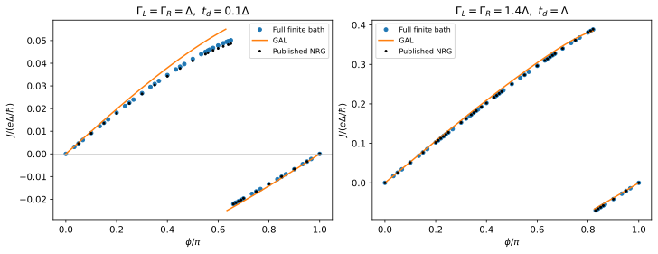

# Josephson current through a serial double quantum dot

**Result:** both published current–phase curves are reproduced, including the
singlet–doublet transition and the resulting current-sign change. The calculated
transition phases are **$0.650899\pi$** and **$0.828527\pi$**, inside the brackets
defined by the published NRG markers.

## Paper and target

M. Žonda, P. Zalom, T. Novotný, G. Loukeris, J. Bätge, and V. Pokorný,
*Generalized atomic limit of a double quantum dot coupled to superconducting
leads*, Phys. Rev. B **107**, 115407 (2023).
[DOI](https://doi.org/10.1103/PhysRevB.107.115407) ·
[arXiv:2211.10312v2](https://arxiv.org/abs/2211.10312v2).

We reproduce **Fig. 9(a)**, solving the finite-gap two-impurity Anderson model
and comparing it with the paper's NRG results and its generalized atomic-limit
(GAL) effective Hamiltonian. This tests the paper's central result that a small
renormalized effective model captures useful double-dot transport physics,
including phase-driven changes of the ground state.



## Model and exact parameter translation

Both dots have $U=4\Delta$ and $\epsilon_d=-U/2$; the package's shifted
`detuning` is zero. The normal-state half-bandwidth is $D=100\Delta$, and $\Delta$
is the energy unit. The left lead couples only to the left dot, and the right
lead only to the right dot. The interdot Hamiltonian is

```math
H_t=-t_d\sum_\sigma(d^\dagger_{L\sigma}d_{R\sigma}+\mathrm{h.c.}).
```

| Curve | $\Gamma_L/\Delta$ | $\Gamma_R/\Delta$ | $t_d/\Delta$ |
|---|---:|---:|---:|
| `weak` | 1.0 | 1.0 | 0.1 |
| `strong` | 1.4 | 1.4 | 1.0 |

**$\Gamma$ in this paper denotes the per-lead coupling** for the symmetric device.
The calculation constructs two tunneling matrices explicitly. Their nonzero
spin-conserving amplitudes are $V_j=\sqrt{\Gamma_j/(\pi\rho)}$, with
$\rho=1/(2D)$ per spin. Each matrix uses its lead's coupling $\Gamma_j$ directly.

The package uses lead phases $(-\phi/2,+\phi/2)$. Its current derivative is converted
to the figure's units by

```math
J/(e\Delta/\hbar)=2\,\langle\partial_\phi H\rangle/\Delta.
```

The opposite left/right phase convention in the paper is equivalent here under
lead/dot reflection. The plotted orientation is positive on the singlet branch.
These are **current–phase curves**, not phase-maximized critical currents.

## Calculation and independent comparison

`input/parameters.json` specifies the scan. The main (`paper`) calculation uses **four signed
normal levels per lead**, no bath-mode compression, and **unrestricted QP exact
diagonalization** in even $S_z=0$ and odd $S_z=1/2$ sectors. The even-sector dimension
is 184756. The bath is fitted once with the
[Baran–Frost–Paaske method](https://doi.org/10.1103/PhysRevB.108.L220506)
on 1000 logarithmic frequencies from $0.001\Delta$ to $100\Delta$. Nodes and weights are
stored in `manifest.json` along with the calculation settings.

At each phase, the sign of $E_D-E_S$ determines the ground state. Both branch
currents are retained in `current.csv`, including the branch that is excited.
Transition phases are refined by solving $E_D-E_S=0$. Finite differences are taken
within each smooth parity branch, not across the ground-state cusp.

The GAL calculation is a distinct effective-model comparison. We build its
four-mode Hamiltonian from Eq. (9) and Eqs. (19)–(22):

```math
\nu_j=(1+\Gamma_j/\Delta)^{-1},\quad
\widetilde U_j=\nu_j^2U_j,\quad
\widetilde\Gamma_j=\nu_j\Gamma_j,\quad
\widetilde t_d=\sqrt{\nu_L\nu_R}\,t_d.
```

All dots are half-filled, so the additional phenomenological MGAL gate scaling
is unnecessary. GAL is an approximation, and agreement with GAL alone would
not validate the finite-gap solver. The independent NRG comparison is therefore
essential. The retained GAL curves show its useful, but imperfect, agreement,
especially for the smaller current of the weak-hopping case.

### Source and precision of the reference data

`reference/figure9a.csv` contains **69 distinct NRG marker centers** extracted
from the arXiv SVG, not raw NRG output. `extract_reference.py` reproduces the
extraction and stores a checksum identifying the source file. Original figure
coordinates are retained.
The transformation is calibrated by the plotted frame and tick labels; duplicate
and legend markers are removed explicitly. Estimated graphical uncertainties
are $10^{-4}$ in $\phi/\pi$ and $1.5\times10^{-4}$ in $J/(e\Delta/\hbar)$.

The reference NRG calculation additionally has its own discretization/truncation
uncertainty. Appendix C specifies $D/\Delta=100$ and two-channel $\Lambda=4$, with
$n_s=6000$, $E_C=6$ and $n_m=600$ or $1000$ for boundaries. No raw data or panel-specific
error bars were recovered.

The Fig. 9(a) caption points to Fig. 6(a), but its own $U=4\Delta$ label corresponds
to **Fig. 6(b)**. We use the explicit Fig. 9(a) parameter labels. GAL is assembled
from the Hamiltonian, avoiding ambiguities in the appendix's printed eigenvalue
expressions.

## Results

| Quantity | Weak hopping | Strong hopping |
|---|---:|---:|
| Computed $\phi_c/\pi$ | 0.6508991281 | 0.8285266206 |
| NRG marker bracket for $\phi_c/\pi$ | $[0.65,0.66]$ | $[0.82,0.83]$ |
| Largest absolute current discrepancy at NRG phases | 0.00151144 | 0.000818909 |

Current errors use $e\Delta/\hbar$ units. Every extracted nonzero NRG marker has
the same current sign as the computed ground state. The largest current error
is roughly 3% of the weak curve's peak and 0.2% of the strong curve's peak.
The crossing uncertainty is dominated by bath/reference accuracy, not the
$10^{-6}\pi$ root-finding tolerance.

The largest eigensolver residual in the 110-point main scan is
**$5.57\times10^{-12}\Delta$**. At $\phi=\pi/2$, the independent energy finite-difference check
agrees with the current operator to **3.22e-10** over both branches and curves.

## Convergence

The principal convergence points are $\phi/\pi=0.5$ and $0.9$ for both parameter sets.
All current differences below concern the **ground-state current**; the complete
branch-resolved results are in the CSV files.

| Comparison over four parameter points | Max change in $(E_D-E_S)/\Delta$ | Max change in $J/(e\Delta/\hbar)$ |
|---|---:|---:|
| 2 versus 4 levels, unrestricted | 2.70e-3 | 2.37e-3 |
| 3 versus 4 levels, unrestricted | 2.95e-3 | 1.25e-3 |
| 5 levels, QP cutoff 6, versus 4 levels unrestricted | 5.71e-4 | 3.50e-4 |
| QP cutoff 4 versus unrestricted, 4 levels | 1.14e-2 | 5.00e-3 |
| Fit window $200\Delta$ versus $100\Delta$, 4 levels | 1.69e-6 | 6.15e-7 |
| DMRG versus unrestricted QP, same 3-level bath | 1.51e-14 | 1.47e-10 |

The convergence study also includes an **unrestricted five-level calculation** at
$\phi=0.9\pi$ for the strong curve, isolating the QP-cutoff error of the larger bath.
There, removing the six-QP cutoff changes the signed gap by **$2.90\times10^{-4}\Delta$**
and the ground current by **$3.86\times10^{-5}e\Delta/\hbar$**. Comparing the unrestricted
five-level and four-level baths changes these quantities by **$7.93\times10^{-5}\Delta$**
and **$2.17\times10^{-4}e\Delta/\hbar$**, respectively. These results concern one parameter point;
the detailed comparisons are in `output/validation.json`.
Odd/even surrogate sizes need not approach the continuum monotonically. The
variation across these comparisons is an empirical error estimate, not a rigorous global bound.

For the independent DMRG calculation we use `chi_max=256`, two initial-state trials, and a
required physical residual below $10^{-6}\Delta$. The achieved largest residual is
$3.25\times10^{-9}\Delta$. An exploratory four-level, `chi_max=128` calculation failed with
residual $0.00689\Delta$; it was not accepted as a converged result. The reported
four-level main scan uses unrestricted QP diagonalization throughout.

## Reproduce and test

From the main source directory:

```sh
python -B -m applications.zonda_2023_double_dot.run --profile quick
python -B -m applications.zonda_2023_double_dot.run --profile paper
python -B -m applications.zonda_2023_double_dot.run --profile convergence
python -B -m applications.zonda_2023_double_dot.plot --output applications/zonda_2023_double_dot/runs/paper
```

The paper scan took about **18 minutes** and the quick example about **1.6 s**
in the recorded single-thread arm64 environment. The final convergence run took
about **6 minutes** and includes
a larger sparse problem and DMRG using TeNPy; reserve several additional
minutes and up to the specified 8 GiB estimated QP storage limit. Its
`manifest.json` gives the measured elapsed time.

Use `--output applications/zonda_2023_double_dot/output/<profile>` to reproduce
the archived result directories, followed by the plotting script and
`python -B -m applications.analyze --case zonda_2023_double_dot`.
`extract_reference.py` optionally retrieves the literature data over the network;
ordinary runs use the stored reference table.

Small numerical checks reuse the stored two-level bath and compare energies and
both branch currents to reference values within 2e-9. They also verify the
independent current derivative and the analytical GAL transition formula at
$\phi=\pi$. An extended test compares QP and DMRG on
a small identical bath. See the [application guide](../README.md) for commands,
saved results and reuse of exact bath coefficients.
