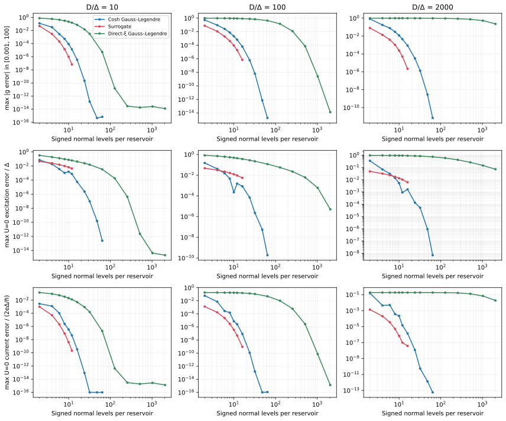
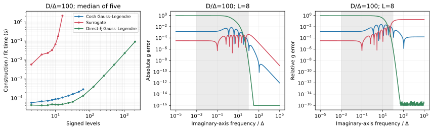
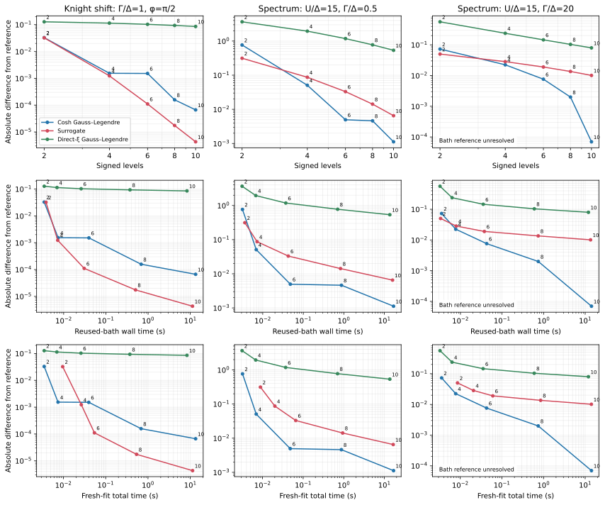
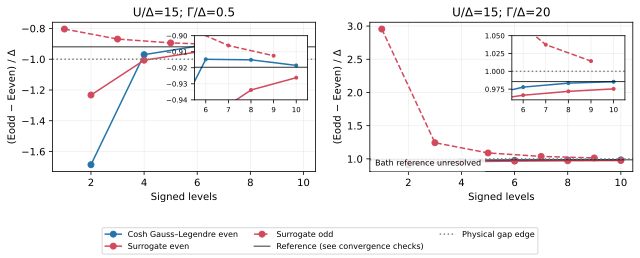
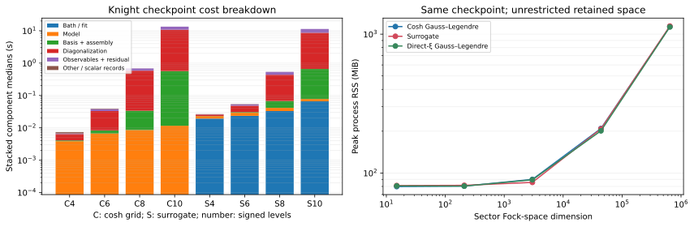

# Bath and reservoir representations: accuracy, convergence, and cost

`qdjj_solver` replaces superconducting reservoirs by finite sets of spinful
normal-state levels. **The bath approximation and the many-body solver
approximation are separate choices.** This guide explains the available bath
representations, every bath-generation parameter, how to switch representations,
and how to compare their accuracy and runtime.

The available bath choices are **`cosh-grid`**, **`surrogate`**,
**`chain-expansion`**, and **`discrete`**. Each supplies a finite reservoir
(`DiscreteBath`) to the same model constructors for QP diagonalization and DMRG.
The choice of quasiparticle vacuum, removal of decoupled modes, and star/chain
representation introduce additional choices described below.

## Contents

- [Choosing a representation](#choosing-a-representation)
- [Shared definitions and units](#shared-definitions-and-units)
- [Cosh-transformed Gauss–Legendre quadrature](#cosh-transformed-gausslegendre-quadrature)
- [Fitted surrogate reservoirs](#fitted-surrogate-reservoirs)
- [Padé chain-expansion reservoirs](#padé-chain-expansion-reservoirs)
- [Explicit discrete reservoirs and alternative grids](#explicit-discrete-reservoirs-and-alternative-grids)
- [Switching in Python and configuration files](#switching-in-python-and-configuration-files)
- [Coordinates, compression, and chains](#coordinates-compression-and-chains)
- [A convergence procedure](#a-convergence-procedure)
- [Measured comparison](#measured-comparison)
- [Reproducing and extending the benchmarks](#reproducing-and-extending-the-benchmarks)

## Choosing a representation

| Goal | Starting point | Refinement to check |
|---|---|---|
| Deterministic continuum quadrature, broad frequency accuracy, independent reference | `cosh_grid` | Increase `pairs` at fixed physical parameters; reconverge the many-body calculation. |
| A compact bath for expensive interacting calculations or a long parameter sweep | `fit_surrogate` | Increase `levels`; vary the fitting window and objective; check the physical observable against another representation. |
| A prescribed low-frequency Padé approximation with explicit chain coefficients | [`chain_expansion`](chain_expansion.md) | Increase `levels`; distinguish finite- and wide-band targets and verify small spin splittings separately. |
| Reproduce published coefficients or reuse a stored fit exactly | `DiscreteBath.from_record` | Verify the source conventions and reproduce its explicit coefficients before changing the bath. |
| Test a different positive quadrature or a genuinely finite reservoir | `DiscreteBath` | Supply a justified refinement sequence; the class itself defines no continuum extrapolation. |
| Full finite-bath spectrum or arbitrary electron-operator transitions | Any bath, with `compress=False` | Include relevant sectors and check the actual continuum threshold separately. |
| Improve QP convergence in the presence of direct lead–lead hopping | Consider `bath_reference="coupled"` | Compare cutoff sequences for both vacua; equal cutoffs need not have equal errors. |

**Main finding from benchmarking/convergence studies:** the preferred bath depends on the observable and accuracy
target. In our convergence studies, the surrogate was about 25 times faster at one interacting
$10^{-4}$ spin-response target, including fitting. At equal size the cosh grid
has smaller worst-case near-edge excitation errors, while the surrogate has
smaller current errors. The [measured comparison](#measured-comparison) gives
the parameters, reference checks, and limits of these findings.
The [ChE application](../applications/bobok_2025_chain_expansion/README.md)
reports an additional Padé-bath comparison using Josephson currents and
common-lead spin transitions, with its own parameters and convergence evidence.

For repeated calculations at fixed gap and bandwidth, **construct and save the
bath once**. Changing impurity interaction, tunneling, or phase does not require
refitting that same reservoir kernel. The fitting time is then incurred only
once for the entire parameter scan. Changing the reservoir gap, bandwidth, or target
hybridization function does require a new bath assessment.

## Shared definitions and units

### What is discretized?

A bath has signed normal-state energies $\xi_i$, positive contact weights $w_i$,
superconducting gap $\Delta$, and normal-state **half-bandwidth** $D$.
For a flat band, the normal-state density of states per spin, the contact
operator, and the quasiparticle energies are

```math
\rho=\frac{1}{2D},\qquad
C_\sigma=\sum_i\sqrt{w_i}\,c_{i\sigma},\qquad
w_i\simeq\rho\,d\xi,\qquad
E_i=\sqrt{\xi_i^2+\Delta^2}.
```

The weights represent the **normal-state measure**, not the superconducting
density of states. Each `xi` entry is a spinful orbital and supplies **two**
positive-energy quasiparticle modes before any compression. A mirrored pair
$-\xi,+\xi$ therefore supplies four QP modes per reservoir.

The physical tunnel amplitude multiplies $\sqrt{w_i}$. Direct interlead hopping
multiplies $\sqrt{w_iw_j}$. Renormalizing a bath's weights changes its physical
couplings. The contact operator obeys
$`\{C_\sigma,C_\sigma^\dagger\}=\sum_i w_i`$ and need not be a normalized fermion
orbital for a finite approximation. The bath constructors preserve the supplied
or calculated weights.

`reference_model(gamma=...)` uses **total** hybridization
$\Gamma=\sum_l\Gamma_l$, with $\Gamma_l=\pi\rho_l|V_l|^2$. For its symmetric
two-lead junction each lead has $\Gamma/2$. A paper quoting a per-lead coupling
must be converted before comparing results.

### The finite-band hybridization target

For particle–hole-symmetric flat BCS reservoirs, the scalar kernel is

```math
g_D(i\omega)=\frac{1}{\pi}\int_{-D}^{D}
\frac{d\xi}{\omega^2+\Delta^2+\xi^2}
=\frac{2}{\pi}\frac{\arctan(D/a)}{a},
\qquad a=\sqrt{\omega^2+\Delta^2}.
```

A finite bath approximates it by

```math
g_L(i\omega)=\sum_{i=1}^{L}
\frac{w_i/(\pi\rho)}{\omega^2+\Delta^2+\xi_i^2}.
```

`qdjj_solver.common.baths.hybridization_g` evaluates the continuum expression;
`discrete_g` evaluates the finite sum. Supply the real number $\omega$ when
evaluating $g(i\omega)$; these functions do not take a complex retarded frequency.
For asymmetric explicit baths, this scalar kernel alone does not specify all
components of the Nambu hybridization.

The high-frequency limit reveals the meaning of the zeroth-moment error:

```math
g_D(i\omega)\sim\frac{2D}{\pi\omega^2},\qquad
g_L(i\omega)\sim\frac{2D}{\pi\omega^2}\sum_iw_i.
```

Thus `sum(weights)-1` is the asymptotic relative normalization error. Good
low-frequency accuracy and accurate high-frequency moments are distinct goals.

### Physical scales and supported limits

- All energies use the supplied Hamiltonian's units. The software does not
  automatically set $\Delta=1$ or rescale the fitting window.
- `delta` and `bandwidth` must be positive and finite. The bath constructors do
  not accept a zero-gap normal metal, zero bandwidth, or infinite bandwidth.
  `chain_expansion(..., wide_band=True)` explicitly targets the wide-band kernel
  while keeping a finite density-normalization parameter; see the
  [ChE conventions](chain_expansion.md#wide-band-construction-and-normalization).
  General finite Hamiltonians can also be supplied directly.
- Increasing $D$ changes the physical model. Increasing bath resolution at fixed
  $D$ converges toward a **finite-band** continuum, not automatically a wide-band limit.
- There is no temperature parameter in these generators. `frequency_min` is not
  a temperature and the fitting mesh is not a thermal Matsubara grid.
- The atomic/GAL effective models used in some applications are separate
  approximations. Sending $\Delta$ to infinity at fixed $D$ is not equivalent to
  the usual wide-band superconducting atomic limit.

See [models and conventions](models.md) for energy zeros, phases, fields, and
observable normalization.

## Cosh-transformed Gauss–Legendre quadrature

### Construction

```python
from qdjj_solver import cosh_grid

bath = cosh_grid(pairs=8, delta=1.0, bandwidth=100.0)
assert bath.levels == 16
```

The implementation uses Gauss–Legendre quadrature in a hyperbolic coordinate,
**not directly in normal energy**:

```math
T=\mathrm{asinh}(D/\Delta),\qquad
\xi=\pm\Delta\sinh t,\qquad
E=\Delta\cosh t,\qquad 0\le t\le T.
```

Given $P$ Gauss–Legendre nodes $x_j$ and weights $\lambda_j$ on $[-1,1]$,

```math
t_j=\frac T2(x_j+1),\qquad
\xi_j^\pm=\pm\Delta\sinh t_j,\qquad
w_j^\pm=\lambda_j\frac T2\frac{\Delta\cosh t_j}{2D}.
```

The Jacobian places resolution near the superconducting edge while still
covering large normal-state energies. Coordinates and weights are exactly mirrored.

### Parameters

| Parameter | Default | Meaning and effect |
|---|---|---|
| `pairs` | Required in Python | Positive integer $P$; yields $L=2P$ signed normal levels **per reservoir**. Increasing it improves quadrature resolution and enlarges the many-body problem. |
| `delta` | `1.0` | Positive finite superconducting gap; sets both the QP dispersion and the grid transformation. |
| `bandwidth` | `100.0` | Positive finite normal-state half-bandwidth $D$. Larger $D/\Delta$ generally needs more resolution. |

An omitted bath section in a `qdjj-solver` reference-model input selects a
cosh grid with `pairs=8`. For reproducible work, write the bath section explicitly.
The bath's JSON `kind` must be **`"cosh-grid"`**.

`bath.metadata["measure_error"]` records $\sum_iw_i-1$. Coarse quadratures are
not normalized by hand; this error converges as the quadrature is refined.

### Convergence properties

- A $P$-point Gaussian rule is exact for polynomials through degree $2P-1$ in
  **the transformed coordinate**. This is not a polynomial-exactness statement
  about arbitrary functions of $\xi$.
- For a fixed positive gap and finite bandwidth, the imaginary-axis integrands
  are smooth. Their analyticity permits rapid high-order quadrature convergence.
  The useful rate depends on the observable and on $D/\Delta$.
- The nodes are interior: a finite cosh grid has no level exactly at $\xi=0$.
  Its minimum bath QP energy is therefore strictly above $\Delta$. A very accurate
  imaginary-axis kernel can coexist with slower gap-edge spectral convergence.
  At fixed $D/\Delta$, the closest transformed Gaussian node has
  $t_{\min}=O(P^{-2})$, so $E_{\min}-\Delta=O(P^{-4})$ asymptotically.
  This estimates the grid's edge resolution, not every observable's error.
- Refinement moves the nodes and weights. These finite Hamiltonians are not
  nested variational subspaces, so their energies and currents need not change
  monotonically with `pairs`.
- Construction is deterministic and inexpensive, with no nonlinear optimization
  or fit-window choice. At very high order, double-precision roundoff limits
  further improvement.

A practical sequence is `pairs=2, 3, 4, 6, 8, 12`, with the many-body solver
reconverged at each size. Check both the reported observable and its distance
from any threshold or parity crossing.

## Fitted surrogate reservoirs

### Construction and objective

```python
from qdjj_solver import fit_surrogate

bath = fit_surrogate(
    levels=8, delta=1.0, bandwidth=100.0,
    frequency_min=1e-3, frequency_cutoff=100.0,
    frequency_points=1000, starts=4, seed=1729, relative_weight=0.0,
)
```

The method of [Baran, Frost, and Paaske](references.md#method-references) replaces
the continuum kernel by a compact positive rational function. The fit has
`levels // 2` mirrored pairs and, for odd `levels`, one fixed level at zero.
Residues and nonzero positive energies are optimized in logarithmic variables,
which enforce positivity.

The mesh contains `frequency_points` logarithmically spaced frequencies between
`frequency_min` and `frequency_cutoff`. With $`r=\texttt{relative\_weight}`$, the
minimized sum of squared residuals is

```math
\sum_k\left[
\frac{g_L(i\omega_k)-g_D(i\omega_k)}
{g_D(i\omega_k)^r\,g_{\max}^{1-r}}
\right]^2,\qquad
g_{\max}=\max_k g_D(i\omega_k).
```

Consequently, `relative_weight=0` is **absolute least squares**, apart from a
constant scale; `relative_weight=1` is **relative least squares**. Equal logarithmic
sampling also gives roughly equal sample counts per frequency decade. A reported
maximum relative error is not the default optimization objective.

### Parameters

| Parameter | Default | Meaning, constraints, and tuning |
|---|---|---|
| `levels` | Required | Positive integer $L$: total signed spinful normal levels per reservoir. Even and odd sequences have different gap-edge structure. |
| `delta` | `1.0` | Positive finite superconducting gap in Hamiltonian energy units. |
| `bandwidth` | `100.0` | Positive finite target half-bandwidth. It is a physical parameter, not an optimization bound on fitted poles. |
| `frequency_min` | `1e-3` | Positive lower fitting frequency, strictly below `frequency_cutoff`. Decreasing it adds low-frequency decades to the objective; zero itself is not sampled. |
| `frequency_cutoff` | `100.0` | Finite upper fitting frequency in the same energy units. Extending it tests sensitivity to high-frequency information. It need not equal $D$. |
| `frequency_points` | `1000` | Integer mesh size, at least 10. More points test mesh convergence; they do not add poles or fix an insufficient bath size. |
| `starts` | `4` | Positive integer number of optimization starts. One deterministic initialization is followed by randomized starts. More starts can improve robustness and increase fitting cost. |
| `seed` | `1729` | Random-number seed for initial guesses. A fixed seed aids reproducibility; save the final coefficients to reuse the identical bath with other library versions. |
| `relative_weight` | `0.0` | Any finite exponent is accepted. Values between zero and one interpolate between the absolute and relative objectives. Weighting the high-frequency relative error more strongly can change low-energy accuracy at fixed $L$. |
| `max_nfev` | `5000` | Keyword-only positive integer (not a boolean): maximum function evaluations **per start**, not an accuracy control or a shared budget across starts. |

Changing `delta` or `bandwidth` **does not rescale the frequency defaults**.
For example, expressing a model in units where $\Delta=0.01$ while leaving the
mesh at `1e-3` to `100` changes the dimensionless fitting window dramatically.
Specify it in the intended units.

The implementation uses SciPy `least_squares`, an analytic Jacobian, Jacobian
scaling, and fixed stopping tolerances
$\mathrm{ftol}=\mathrm{xtol}=\mathrm{gtol}=2\times10^{-13}$.
The default budget remains 5,000 function evaluations per start; the public
`fit_surrogate(..., max_nfev=...)` argument changes only that budget. It does not
loosen tolerances or change parameter bounds, the absolute/relative objective,
or the weight convention. Fitted weights are not renormalized.

Selection still requires optimizer success and finite parameters and residuals;
among eligible starts, the smallest residual norm wins. If no start qualifies,
`RuntimeError` reports `max_nfev` and each start's index, status, evaluation count
(`nfev`), and termination message. There is no fallback that accepts a failed
start, even if its residual is small.

There are $L$ optimized logarithmic parameters for either parity of $L$.
Use substantially more frequency points than fit parameters; the accepted
minimum mesh size of ten is the smallest accepted input, not a sufficient
resolution criterion for every bath size.

### Reading fit diagnostics

The bath's `metadata` dictionary stores the fitting settings and the following
diagnostics, all retained by `bath.record()`:

| Field | Interpretation |
|---|---|
| `max_nfev` | Requested function-evaluation budget per start. |
| `selected_start` | Zero-based index of the selected successful start in `optimizer_trials`. |
| `optimizer_trials` | Diagnostics for **all** starts, successful or failed, in initialization order; see below. |
| `cost` | Full sum of squares of the scaled residuals defined above, not SciPy's half-sum-of-squares cost. |
| `max_relative_fit_error` | Maximum relative kernel error **on the fitting mesh**. |
| `fit_optimality` | Selected optimizer's first-order optimality diagnostic. |
| `evaluations` | Function evaluations for the selected start, not total work across all starts. |
| `fit_seconds` | Total elapsed fitting time, including all initial guesses. |
| `measure_error` | $\sum_iw_i-1$; no normalization constraint is imposed. |

Each `optimizer_trials` entry contains `success`, `status`, `message`,
`evaluations`, `optimality`, and `cost`. The trial `cost` uses the same full
sum-of-squares convention as the selected cost; non-finite trial optimality or
cost is recorded as `None` (`null` in JSON). Sum the trial `evaluations` to obtain
the function-evaluation count across all starts.

Optimizer success does not imply that the fit meets a requested physical error
target. Validate it on an independent frequency grid, including zero and frequencies
outside the fit window, and then check the observable of interest.

### Evaluation budgets for high-accuracy studies

When starts exhaust their evaluation budget, increasing `max_nfev` is a
case-specific, controlled retry, not a new accuracy setting. Hold the physical
parameters, level count, mesh, objective, seed, and number of starts fixed so the
comparison isolates the budget. Keep the stopping tolerances and bounds unchanged;
do not accept failed starts or renormalize weights to hide a moment error.

Optimizer success and a small held-out kernel error do not establish continuum
accuracy. Check the high-frequency moment and physical observables independently;
evaluation counts can vary with numerical-library versions and platform.

### Convergence properties and odd/even effects

1. **Compactness:** optimized poles can reproduce the important hybridization
   structure with far fewer levels than a generic energy grid. This can save
   much more solver time than the fit itself costs.
2. **Window dependence:** a fit optimized over one interval has no uniform
   accuracy guarantee elsewhere. Vary the window while holding $L$ fixed, then
   vary $L$ while holding the objective fixed.
3. **No monotonicity guarantee:** nonlinear optimization can find different
   local minima. Neither the practical fit-error sequence nor the many-body
   observable sequence is guaranteed to be monotone.
4. **Odd sizes:** the fixed $\xi=0$ level gives an exact bath QP mode at $\Delta$.
   Even sizes have a lowest QP level above $\Delta$. Follow odd and even size sequences
   separately when studying excitations close to the edge.
5. **Effective poles:** fitted $|\xi_i|$ can exceed $D$. These are rational
   approximation parameters, not necessarily physical samples of the target band.
6. **Real-frequency limitations:** a small imaginary-axis residual is not a
   uniform real-frequency error bound. Individual bath poles, continuum line
   shapes, weak binding energies, and crossing locations require direct checks.
7. **Optimization limits:** adding more poles can make residues and energies
   poorly determined or make all starts fail. Inspect convergence status and
   consider a different mesh/objective or deterministic quadrature as a check.

Save the explicit bath whenever it defines a reported result. `seed=1729` alone
does not guarantee identical optimized coefficients on every SciPy
version or platform.

### Why a tiny fit residual can miss a shallow bound state

For a real subgap energy $E$, the analytically continued kernel involves a
smaller scale $\kappa=\sqrt{\Delta^2-E^2}$:

```math
g_D(E)=\frac{2}{\pi}\frac{\arctan(D/\kappa)}{\kappa},\qquad
g_L(E)=\sum_i\frac{w_i/(\pi\rho)}{\xi_i^2+\kappa^2}.
```

As $E$ approaches $\Delta$ from below, the continuum diverges as $1/\kappa$.
A finite even bath without a zero node remains finite there; an odd surrogate's
zero node instead contributes a $1/\kappa^2$ pole. Both can nevertheless fit the
imaginary-axis kernel well. Refining the bath resolves this difference over a
larger subgap interval, but proximity to the edge must be tested explicitly.
The same issue explains the cosh grid's slower convergence for very shallow
bound states. The function `hybridization_g` evaluates $g(i\omega)$ from a real
$\omega$; the real-energy continuation above is a separate formula.

## Padé chain-expansion reservoirs

`chain_expansion(levels, delta=1.0, bandwidth=100.0, wide_band=False)` constructs
the chain exansion (ChE) approximation of Bobok et al. by matching the low-frequency expansion
of the reservoir kernel. It returns `levels` signed spinful levels per reservoir
in star coordinates, together with the equivalent chain coefficients. The
default describes a finite band; `wide_band=True` selects the analytic wide-band
coefficients. See the [ChE guide](chain_expansion.md) for the derivation,
normalization, and convergence checks.

## Explicit discrete reservoirs and alternative grids

```python
from qdjj_solver import DiscreteBath

bath = DiscreteBath(
    xi=[-2.0, 0.0, 2.0], weights=[0.2, 0.1, 0.2],
    delta=1.0, bandwidth=10.0,
    metadata={"source": "illustrative finite reservoir"},
)
```

### Parameters and validation

| Parameter | Default | Meaning and requirements |
|---|---|---|
| `xi` | Required | Nonempty, finite, one-dimensional normal-state energies. |
| `weights` | Required | Finite, strictly positive values with the same shape as `xi`. |
| `delta` | `1.0` | Positive finite superconducting gap. |
| `bandwidth` | `100.0` | Positive finite half-bandwidth, used in the density/coupling convention even for externally supplied poles. |
| `metadata` | Empty dictionary | Optional notes on the bath's source and numerical diagnostics, saved with its coefficients. |

The bath keeps a fixed copy of the supplied arrays. It does not require
sorted or distinct energies, particle–hole symmetry, a weight sum of one, or
nodes within $[-D,D]$. A one-level bath at zero is allowed, although `bandwidth=0`
is not.

The paired-mode symmetry reduction requires more: `bath.paired` checks exact equality
of `xi` with `-xi[::-1]`, and of `weights` with `weights[::-1]`. Sort mirrored
nodes consistently and retain exact mirrored weights if using symmetry reductions.

### Importing published surrogate coefficients

Check whether a reference tabulates contact weights or rational-function
residues. If its convention is
$g_L(i\omega)=\sum_i R_i/(\omega^2+\Delta^2+\xi_i^2)$, convert with

```math
w_i=\pi\rho R_i=\frac{\pi R_i}{2D}.
```

The residues $R_i$ have energy units; the contact weights are dimensionless.
For coefficients quoted in gap units, restore both $\xi_i=\Delta\tilde\xi_i$
and $R_i=\Delta\tilde R_i$. If a table lists only positive poles and uses an
explicit factor of two, mirror each pole with the same individual weight;
do not double both mirrored weights. Count a zero pole once. These residues
are distinct from the impurity's total hybridization $\Gamma$.

### Direct normal-energy Gauss–Legendre control

The benchmark includes ordinary Gaussian quadrature directly in $\xi$:

```python
from scipy.special import roots_legendre
from qdjj_solver import DiscreteBath

D, L = 100.0, 8
x, w = roots_legendre(L)
bath = DiscreteBath(D*x, w/2, delta=1.0, bandwidth=D)
```

Here $w/2$ already includes $`\rho\,d\xi`$ after mapping from $[-1,1]$ to $[-D,D]$.
This is a user-supplied `discrete` bath; **`linear-gl` is the label used for it
in the comparison tables**, rather than a bath-generation option.

The rule integrates normal-energy polynomials through degree $2L-1$ exactly in
exact arithmetic. For a smooth fixed-scale integrand it has rapid asymptotic
convergence. At large $D/\Delta$, however, the low-energy structure occupies a
very small fraction of the normal band. Many nodes may be needed before that
asymptotic regime is useful. Exact low-order normal moments do not establish
accurate superconducting observables.

For even $L$ the nearest normal energy is asymptotically $O(D/L)$. Once it is
small compared with $\Delta$, the bath-edge displacement is
$E_{\min}-\Delta=O(D^2/(\Delta L^2))$, slower than the cosh rule's edge-resolution
scaling. Odd direct Gaussian rules have a zero node; the matched direct-Gaussian
benchmark uses even sizes, like the cosh grid.

Other positive linear, logarithmic, adaptive, or externally fitted meshes can be
supplied through the same class. Their convergence belongs to the chosen rule:
`DiscreteBath` supplies neither a generator nor an extrapolation for them.
There is no built-in Wilson/NRG logarithmic-discretization switch.

## Switching in Python and configuration files

### Python: hold physics and level count fixed

```python
from qdjj_solver import Sector, cosh_grid, fit_surrogate, reference_model, solve

baths = {
    "cosh": cosh_grid(pairs=2, delta=1.0, bandwidth=10.0),
    "surrogate": fit_surrogate(
        levels=4, delta=1.0, bandwidth=10.0,
        frequency_cutoff=100.0, starts=4, seed=1729,
    ),
}
for label, bath in baths.items():
    h = reference_model(bath, u=2.0, gamma=0.4, phi=0.8, compress=False)
    even = solve(h, cutoff=None, sector=Sector(0, 0), backend="qp")
    odd = solve(h, cutoff=None, sector=Sector(1, 1), backend="qp")
    print(label, "Eodd-Eeven =", odd.energies[0] - even.energies[0])
```

This is a small finite-bath comparison, not a claim of continuum convergence.
At zero field in this spin-symmetric example the two doublet projections are
equivalent. At finite field, compare both projections; for general models check
all relevant sectors.

After installing `[dmrg]`, use the same `h` with `backend="dmrg"`, `cutoff=None`,
and explicit MPS settings. DMRG requires an unrestricted QP occupation space for
the modes present in `h`; modes removed during model construction are already absent.

```python
mps = solve(
    h, backend="dmrg", cutoff=None, sector=Sector(1, 1),
    options={"chi_max": 128, "energy_tolerance": 1e-11,
             "residual_tolerance": 1e-7, "require_convergence": True},
)
```

Increase the bond dimension and compare observables to establish MPS convergence;
the selected `chi_max` is a starting point, not an accuracy guarantee.

### JSON input files

For a reference model, specify the reservoir in the `bath` entry:

```json
{
  "format_version": 1,
  "backend": "qp",
  "model": {
    "kind": "reference", "u": 2.0, "gamma": 0.4, "phi": 0.8,
    "compress": false, "bath_reference": "isolated"
  },
  "bath": {"kind": "cosh-grid", "pairs": 2, "delta": 1.0, "bandwidth": 10.0},
  "cutoff": null,
  "sector": {"parity": 1, "twice_sz": 1},
  "solver": {"tolerance": 1e-11}
}
```

For a fitted surrogate, use this `bath` entry instead:

```json
{
  "kind": "surrogate", "levels": 4, "delta": 1.0, "bandwidth": 10.0,
  "frequency_min": 0.001, "frequency_cutoff": 100.0,
  "frequency_points": 1000, "relative_weight": 0.0,
  "starts": 4, "seed": 1729
}
```

Run the calculation with:

```sh
qdjj-solver solve model.json --output results/state.json
```

For `model.kind="multi-orbital"`, place bath specifications in
`model.reservoirs`, one per reservoir. Different reservoirs can have different
positive gaps, bandwidths, sizes, or discretization families. The Python equivalent
is passing the bath list to `make_model`; supply tunneling matrices using each
reservoir's own density convention.

Specify settings explicitly: Python `solve` defaults to full finite space,
whereas the `qdjj-solver` QP command defaults to cutoff two when omitted. Python
`reference_model` defaults to compression when symmetry permits it, whereas the command
defaults to an uncompressed model. See the [complete defaults table](interfaces.md#defaults).

### Fit once and reuse the saved coefficients

```python
import json
from pathlib import Path
from qdjj_solver import DiscreteBath, fit_surrogate

bath = fit_surrogate(6, bandwidth=10.0, frequency_cutoff=100.0, seed=1729)
Path("bath.json").write_text(json.dumps(bath.record(), indent=2), encoding="utf-8")
record = json.loads(Path("bath.json").read_text(encoding="utf-8"))
replayed = DiscreteBath.from_record(record)
config_bath = {"kind": "discrete", **record}
```

Use Python or a surrogate configuration to control the fit. The `qdjj-solver`
command has no `fit` subcommand.

The saved bath contains `xi`, `weights`, energy scales, and `metadata`. To use
those coefficients in a model input file, add `"kind": "discrete"` alongside
them. An entry such as `metadata.kind="surrogate"` records how the coefficients
were obtained; it does not request a new fit. Read the bath file in Python or
copy its contents into the model input; the `bath` entry does not accept a filename.

When switching a JSON input between QP and DMRG, also choose the appropriate
numerical settings. For example, replace QP `tolerance` with DMRG
`energy_tolerance` and set `cutoff` to `null`.

The research applications use their own parameter-scan input files, with entries
such as `bath_kind: "cosh"` and `bath_record`. Follow the particular case's README
for these settings; a single `qdjj-solver solve` input uses the format above.

## Coordinates, compression, and chains

These choices act **after specifying the finite reservoir measure**.

| Choice | Physical target and requirements | Accuracy/cost consequence |
|---|---|---|
| `bath_reference="isolated"` | Default QPs of each disconnected BCS reservoir; supports general spin-mixing contacts. | Interlead hopping can create QPs relative to this vacuum. Its importance must be captured by the QP cutoff or MPS. |
| `bath_reference="coupled"` | Diagonalizes the entire quadratic finite environment, including direct lead contacts. Requires spin-conserving direct hopping and an unpolarized, gapped QP vacuum. | Dense environment diagonalization adds setup cost but can reduce QP-vacuum mismatch. The isolated-BCS energy reference is retained. |
| Eta coordinates | Verified matched, mirrored, half-filled single-dot junction with compatible tunneling/direct hopping. | A QP-number-preserving symmetry transformation can expose useful sectors. Not available with the coupled-bath reference. |
| `compress=True` | Freezes discarded dark modes in their vacuum; eligible eta construction and vanishing direct spin-orbit contact are required. | Often greatly reduces the finite problem for bound impurity states. It can omit spectator/continuum excitations. |
| Physical-electron chain | Lanczos tridiagonalization starting from the normalized contact orbital, available in the earlier DMRG routines described below. | Preserves the contact spectral measure; changes MPS entanglement and MPO structure. It is not a new continuum discretization. |
| DMRG `mode_order`, `group_size` | Orders/groups the existing canonical modes along the MPS. | Can change computational cost and bond convergence without performing a star-to-chain transformation. |

The relevant settings and defaults are:

| Function or setting | Default | How to use it |
|---|---|---|
| `reference_model(..., bath_reference=...)` or `make_model` | `"isolated"` | Select `"coupled"` to diagonalize the finite environment first. |
| `reference_model(..., symmetry=...)` | `True` | Use eta coordinates when the symmetry requirements hold; `False` keeps physical-electron coordinates on the impurity. |
| `reference_model(..., compress=...)` | `True` in Python | Remove dark modes only when symmetry permits it. Inspect `h.metadata["paired_mode_compression"]` to see what was selected. The `qdjj-solver` command defaults this to `False`. |
| `make_model(..., eta_basis=...)` | `False` | Explicitly request eta coordinates; invalid symmetry conditions raise an error. |
| `make_model(..., compress_pairs=...)` | `False` | Explicit compression request; requires eligible eta coordinates. |
| Model `coefficient_tolerance` | `1e-14` | Hamiltonian coefficients below this magnitude are discarded, in input energy units. Their summed magnitudes bound the operator-norm change and are recorded. Check this approximation separately from bath refinement. |
| DMRG `mode_order` | `None` | Keep the model's mode ordering, or provide a permutation of **all canonical mode indices**. Supply it under solver options. |
| DMRG `group_size` | `2` | Group one or two canonical modes per MPS site; valid choices are `1` and `2`. |

For example, an explicit uncompressed coupled reference is constructed with
`reference_model(bath, bath_reference="coupled", symmetry=False, compress=False)`.
The exact transformation is already accounted for in built-in observables.

Isolated and coupled coordinates describe the same unrestricted finite physical
problem. A finite QP cutoff selects different trial spaces in these two vacua;
equal cutoffs do not imply equal accuracy. Compare them against an unrestricted
same-bath result before comparing their cost at a target error.

Compression is a physical subspace restriction. DMRG cannot recover removed
modes. `h.physical_operator(...)` cannot transform arbitrary electron operators
into a compressed model, because products of separately projected
operators would miss dark-vacuum contractions. Built-in compressed observables
include the required contractions. Use `compress=False` for general transitions.

The earlier DMRG module
`qdjj_solver.dmrg_solver.legacy` provides `chain_coefficients`,
`dmrg_chain_reference`, and `dmrg_reference`. These DMRG routines support symmetric
half-filled single-dot geometries and `twice_sz` in `(-1, 0, 1)`; they are not
general replacements for `make_model` and `qdjj_solver.solve`. Their
`chi`, `max_sweeps`, and `energy_tolerance` control the MPS calculation, not bath
resolution. The chain coefficients include a contact norm
$\sqrt{\sum_iw_i}$, which must multiply tunneling. Repeated normal energies can
shorten the contact-cyclic chain and leave spectator modes outside it.

The legacy star routine automatically freezes dark modes for eligible mirrored
junction baths with `rho_ws=0` and `twice_sz=+1` or `-1`. "Unrestricted" then
means unrestricted QP number within the retained modes, not all original bath
modes. Inspect its returned `paired_mode_compression` and `bath_modes`. For
full-mode calculations, use `reference_model(..., compress=False)` with the
current DMRG backend; the legacy routine has no compression switch.

The earlier chain routine defaults to `chi=128`, `max_sweeps=40`; its QP-star
counterpart defaults to `chi=64`, `max_sweeps=60`. Both default to
`energy_tolerance=1e-11`, `threads=1`, and variance calculation. The star routine
also has `calculate_current=True`. These settings differ from those of
`qdjj_solver.solve(..., backend="dmrg")`, which uses `chi_max` and evaluates the
full residual directly. The earlier routines' variance evaluation by
subtracting extensive energies can suffer cancellation; inspect bond refinement
and independent finite-model agreement as well.

For the spectrum reference study,
[`tools/refine_bath_chain.py`](../tools/refine_bath_chain.py) constructs a
single-reservoir physical-electron chain using the existing `chain_coefficients`
mapping and a general `Hamiltonian`. It then uses `qdjj_solver.solve` with DMRG, including
the untruncated physical residual. Small unrestricted star/chain comparisons
check its energy zero, contact normalization, and impurity observables.
An occupation cutoff in these physical chain electrons would be a different
approximation from a cutoff in BCS quasiparticles; the chain references retain
the full mode space and control MPS bond dimension instead.

Reusing bath coefficients is independent of continuing saved eigenvectors or
MPS states. State continuation requires compatible canonical coordinates;
phase-dependent compression or coupled-reservoir transformations can change
those coordinates even when `xi` and `weights` stay fixed. See
[continuing from saved states](interfaces.md#starting-states-and-continuation)
for the basis and symmetry requirements.

## A convergence procedure

### Cost scaling

For $N_r$ reservoirs with $L_l$ signed levels, the uncompressed number of bath
QP modes is $M=2\sum_l L_l$. With $n_{\mathrm{imp}}$ impurity spin-orbitals, the
Fock-space dimensions before selecting symmetry sectors are

```math
\dim\mathcal H_{\mathrm{full}}=2^{n_{\mathrm{imp}}+M},\qquad
\dim\mathcal H_q=2^{n_{\mathrm{imp}}}\sum_{k=0}^{\min(q,M)}\binom{M}{k}.
```

Symmetry sectors and justified compression reduce these counts. This steep
dependence explains why saving two bath levels can matter more than milliseconds
or seconds of fitting. DMRG avoids enumerating the full Fock basis, but its cost
depends on the required bond dimensions, MPO structure, mode ordering, initial
states, and sweeps. There is no bath-independent runtime scaling at fixed
physical accuracy.

### Recommended sequence

1. **Fix the physical target:** $D$, $\Delta$, total/per-lead $\Gamma$, interaction,
   detuning, field, phases, retained channels, and energy/current conventions.
2. **Inspect the bath:** level count per reservoir, exact weights, kernel on an
   independent grid, fit termination, moment errors, and minimum QP energy.
3. **Converge the finite calculation:** compare QP cutoffs, or MPS bond dimensions,
   sweeps and initial states. Use unrestricted ED for accessible same-bath problems.
4. **Refine the bath:** change size at fixed fitting objective or quadrature rule.
   Repeat the finite-calculation checks. Follow odd and even surrogate sizes
   separately near spectral thresholds.
5. **Change an independent numerical choice:** another bath family, fitting
   window, objective, or a validated continuum/analytic limit.
6. **Assess the actual observable:** excitation differences, charge, spin,
   currents, and crossing locations can have different convergence rates.
7. **Report the evidence separately:** eigensolver residual, cutoff/bond changes,
   bath-size changes, window changes, and reference discrepancies.

A small QP residual is a residual of $P_qHP_q$, not a bound on omitted QPs.
Increasing the cutoff at fixed Hamiltonian gives nested variational spaces and
nonincreasing ordered Ritz energies, but differences and expectations need not
be monotone. The reported MPS convergence concerns the finite Hamiltonian and does
not certify bath convergence or prove that no lower state was missed.

Near a parity crossing, compare smooth sector branches before taking their
minimum. Use absolute errors for currents or gaps close to zero. At exact
degeneracy, check the relevant subspace rather than attaching significance to
an arbitrary eigenvector's expectation values.

## Measured comparison

The companion [benchmark inputs](benchmarks/baths/input.json) define a controlled
comparison of cosh-grid, surrogate, and the Gaussian control directly in $\xi$. The
results distinguish equal-size comparisons from comparisons at an achieved
observable accuracy.

The archived run used an **Apple M1 Max, 64 GiB RAM**, Darwin/arm64,
Python 3.14.7, NumPy 2.5.2, SciPy 1.18.0, OpenBLAS 0.3.34, and TeNPy 1.1.1,
with one computational thread. The timings apply to this hardware and
numerical-library configuration. The [calculation record](benchmarks/baths/manifest.json)
identifies the source revision, solver files, and numerical-library versions;
[generated tables](benchmarks/baths/tables.md) provide additional digits and cases.

### Protocol and independent references

- All benchmark energies use $\Delta=1$. Current means
  $I/(2e\Delta/\hbar)=(\partial E/\partial\phi)/\Delta$.
- The default surrogate uses the implemented absolute objective, 1,000 mesh
  points over $[10^{-3},100]$, four starts, and seed 1729. Sensitivity runs are
  identified separately.
- Kernel errors use 2,003 validation points in the fitting interval and a separate
  out-of-window grid, including zero and frequencies up to
  $\max(10D,100\omega_{\max})$. These maximum errors are mesh diagnostics,
  not rigorous supremum bounds.
- The noninteracting study uses three points
  $(\Gamma,\phi,\epsilon)=(0.3,0.8,0)$, $(2,1.7,0.6)$, and $(10,0.2,0)$.
  Excitation and current error maxima cover all three.
- The main interacting convergence sequences use full finite-space QP diagonalization.
  Larger reference baths use separately recorded QP cutoffs and MPS bond-dimension sequences.
- QP timings explicitly select the sparse solver, one eigenstate per requested sector,
  tolerance `1e-12`, residual tolerance `2e-8`, a three-million-state limit,
  and an 8 GiB limit on estimated storage. This avoids an automatic
  change between sparse and matrix-free diagonalization being mistaken for a
  bath-family effect. DMRG refinement calculations use two initial-state trials,
  up to 60 sweeps, energy tolerance `1e-11`, and physical residual tolerance `1e-7`.
- Timings have one untimed warm-up followed by five bath-construction repetitions
  or three many-body repetitions. Each task runs in a fresh process, serially,
  with one computational thread. Individual samples, medians, and quartiles are
  retained. Loading Python modules, reference calculations, and writing results
  to disk are excluded.
- Reused-bath time includes model construction, the requested sector solves,
  observables, and residual checks. Fresh-fit time adds the independently measured
  median bath-construction time. It is a sum of measured medians, not a separate
  process-startup measurement.
- Peak memory is the largest measured resident memory of the running program,
  including loaded libraries and warm-up, rather than an estimate of eigensolver storage.

The separately archived [reference refinements](benchmarks/baths/refinement-input.json)
use a centered mode ordering, larger MPS bonds, energy tolerance `1e-12`, and a
residual tolerance of `1e-5`. Their purpose is to resolve the reference for
observable errors around $10^{-4}$, with actual residuals and bath/bond changes
reported. These expensive reference calculations use one measured repetition
after warm-up and are not the timings ranked in the finite-ED comparison.
The [electron-chain spectrum refinements](benchmarks/baths/chain-input.json)
use a bond-dimension sequence with two initial-state trials, energy tolerance
`1e-11`, and residual tolerance `1e-4`, aimed at resolving energy differences around
$10^{-3}\Delta$.
The actual residual and bath/bond changes still determine which finer targets
are marked resolved; changing representation does not remove these checks.
The weak-coupling spectrum also has a matching
[QP-star bond-dimension study](benchmarks/baths/edge-refinement-input.json), since an
electron-chain representation need not be the more efficient MPS reference.

For the independent noninteracting reference ($U=0$), the two leads have identical
flat bands, equal gaps and equal couplings, with no direct interlead hopping
or magnetic field. Here $\Gamma=\Gamma_L+\Gamma_R$ and
$\epsilon=\epsilon_d=\texttt{detuning}$. Integrating out the finite-band BCS
reservoirs gives

```math
A(\omega)=\omega^2[1+\Gamma g_D(i\omega)]^2+\epsilon^2+
[\Gamma\Delta\cos(\phi/2)g_D(i\omega)]^2,
```

```math
\frac{\partial E_g}{\partial\phi}
=\frac{\Gamma^2\Delta^2\sin\phi}{2\pi}
\int_0^\infty\frac{g_D(i\omega)^2}{A(\omega)}\,d\omega,
\qquad
\langle n_d\rangle=1-\frac{2\epsilon}{\pi}\int_0^\infty\frac{d\omega}{A(\omega)}.
```

These are zero-temperature ground-state expressions, evaluated away from a
zero-energy crossing. The current includes the continuum contribution. The
subgap root follows from the analytically continued finite-band kernel. Checks against independent
physical-electron BdG matrices, full finite-Fock spectra, and finite differences
are in [the independent numerical checks](../tests/test_bath_benchmarks.py).
A separate weak-hybridization spin check uses the finite-band perturbative
result at $U=10\Delta$ documented in the
[Knight-shift application](../applications/zitko_2023_knight_shift/README.md).

The quadratic integrals use absolute and relative integration tolerances of
$2\times10^{-11}$ and the root finder uses an absolute tolerance of $10^{-13}$.
Results approaching reference/roundoff precision should be read as a numerical
floor, rather than used to rank representations by insignificant final digits.

### Equal-size comparison: what does eight levels buy?

All rows use **eight signed normal levels per reservoir**. Preparation is the
median bath-construction or fit time. Kernel error is the maximum absolute
error on the common imaginary-frequency interval. The last two columns give
the maximum physical error across the three independent quadratic parameter points.

| $D/\Delta$ | Representation | Preparation (ms) | Max $\lvert\delta g\rvert$ | Max excitation error / $\Delta$ | Max current error / $(2e\Delta/\hbar)$ |
|---|---|---:|---:|---:|---:|
| 10 | Cosh GL | 0.0828 | $5.36\times10^{-4}$ | $1.04\times10^{-3}$ | $2.43\times10^{-6}$ |
| 10 | Surrogate | 110.5 | $1.40\times10^{-5}$ | $9.88\times10^{-3}$ | $8.69\times10^{-8}$ |
| 10 | GL directly in $\xi$ | 0.0433 | $3.09\times10^{-1}$ | $9.47\times10^{-2}$ | $3.23\times10^{-2}$ |
| 100 | Cosh GL | 0.0802 | $7.33\times10^{-3}$ | $4.51\times10^{-3}$ | $1.54\times10^{-4}$ |
| 100 | Surrogate | 32.93 | $4.14\times10^{-4}$ | $1.60\times10^{-2}$ | $2.95\times10^{-6}$ |
| 100 | GL directly in $\xi$ | 0.0465 | $9.15\times10^{-1}$ | $5.34\times10^{-1}$ | $1.75\times10^{-1}$ |
| 2000 | Cosh GL | 0.0793 | $2.93\times10^{-2}$ | $1.38\times10^{-2}$ | $3.69\times10^{-4}$ |
| 2000 | Surrogate | 25.83 | $1.05\times10^{-3}$ | $1.73\times10^{-2}$ | $5.05\times10^{-6}$ |
| 2000 | GL directly in $\xi$ | 0.0442 | $9.96\times10^{-1}$ | $9.35\times10^{-1}$ | $1.84\times10^{-1}$ |

**The ranking depends on the observable.** The default surrogate has smaller
absolute-kernel and current errors at this size, while the cosh grid has the
smaller maximum excitation error. At $D=100$, the maximum *relative*
kernel error is about 0.0256 for cosh GL and 0.0829 for the surrogate, reversing
their absolute-kernel ranking. The default surrogate optimizes absolute residuals.

The strong-coupling quadratic example illustrates the gap-edge issue particularly
clearly: at $D=100$, $\Gamma=10$, $\phi=0.2$, and zero detuning,
the continuum excitation is $0.9722095762\Delta$. The eight-level cosh and
surrogate values are $0.9676977005\Delta$ and $0.9561715327\Delta$, respectively.
Yet the surrogate current error at that same point is only
$6.22\times10^{-8}$ in the stated current units. Excellent current accuracy does
not certify the shallow-bound-state energy.



At $D=100$, increasing the cosh bath from eight to 24 levels reduces the maximum
absolute kernel error from $7.33\times10^{-3}$ to $6.09\times10^{-7}$;
48 levels give approximately $7.10\times10^{-13}$. GL directly in $\xi$ needs
1,024 levels to reach $2.53\times10^{-9}$ in this metric. At $D=2000$, even
2,048 direct Gaussian levels still have a maximum absolute error of about 0.228.
Their accurate normal-state moments do not resolve the narrow low-energy region.
The high-level-count rows here are inexpensive **bath-only** calculations;
they are not claims that full Fock diagonalization at those sizes is feasible.



### What changing surrogate parameters actually did

The complete [sensitivity table](benchmarks/baths/fit_sensitivity.csv) varies one
control at a time, plus a wide-band/window/weighting combination. Selected
eight-level, $D=100$ results are:

| Setting | Fit time (ms) | Weak-spin-slope error | Max quadratic excitation error | Max quadratic current error |
|---|---:|---:|---:|---:|
| Defaults | 32.93 | $1.56\times10^{-5}$ | 0.01604 | $2.95\times10^{-6}$ |
| `frequency_cutoff=10` | 63.38 | $1.49\times10^{-3}$ | 0.01067 | $1.83\times10^{-5}$ |
| `frequency_cutoff=1000` | 32.83 | $5.72\times10^{-6}$ | 0.01627 | $3.28\times10^{-6}$ |
| `relative_weight=0.5` | 22.51 | $8.81\times10^{-6}$ | 0.01923 | $1.38\times10^{-5}$ |
| `relative_weight=1` | 21.98 | $1.84\times10^{-6}$ | 0.02323 | $6.28\times10^{-5}$ |
| `frequency_points=250` | 19.13 | $1.51\times10^{-5}$ | 0.01605 | $2.97\times10^{-6}$ |
| `frequency_points=4000` | 94.11 | $1.57\times10^{-5}$ | 0.01604 | $2.95\times10^{-6}$ |
| `starts=1` | 8.34 | $1.56\times10^{-5}$ | 0.01604 | $2.95\times10^{-6}$ |
| `starts=8` | 69.92 | $1.56\times10^{-5}$ | 0.01604 | $2.95\times10^{-6}$ |

The weak-spin-slope column is the absolute error in
$\lim_{\Gamma\to0}\kappa/\Gamma$ at $U=10$, an independent analytic diagnostic.
It has inverse-energy units; the other physical errors have the normalizations
specified above. Increasing relative weighting improves this slope while
degrading these current and near-edge excitation comparisons.

In this particular fit, one, four, and eight starts select identical coefficients;
the two additional tested seeds do too. Extra starts therefore only add cost
here. That finding is not a general guarantee: the default 16-level fit at
$D=10$ failed to converge at all, so calculations requiring that bath could not be performed.
The failure is retained in [the failure record](benchmarks/baths/failures.json).

For $D=2000$, extending the absolute-objective window from 100 to 2000 improves
the weak-spin-slope error from $9.12\times10^{-5}$ to $1.59\times10^{-5}$, while
the maximum quadratic-current error grows from $5.05\times10^{-6}$ to
$9.25\times10^{-6}$. Choosing the window from one kernel metric alone would
miss this observable-dependent tradeoff.

### Interacting cases and interpretation

| Study | Physical parameters and purpose |
|---|---|
| Knight shift | $U=10$, $D=100$, total $\Gamma=0.01,1,2$, and $\phi=0,\pi/2,\pi$. Compare $\kappa=1-2\langle S^z_{\mathrm{dot}}\rangle$ in the spin-up doublet; same dark-vacuum restriction for every family. |
| Near-edge spectrum | $U=15$, $D=10$, total $\Gamma=0.5,2,3,10,20$ in the single active reservoir at zero phase. Compare signed $E_{\mathrm{odd}}-E_{\mathrm{even}}$ for odd and even bath-size sequences. |
| Wide-band parity branches | $U=3$, $D=2000$, total $\Gamma=1$, phases $1.50,1.53,1.56$. Check sensitivity near the parity transition. |
| Double dot | $U_L=U_R=4$, $D=100$, weak/strong junctions at $\phi=\pi/2$ and $0.9\pi$ from the reviewed double-dot application. |
| Coordinates | $U=2$, $D=10$, total $\Gamma=0.4$, $\phi=0.8$, $\rho W_N=0.08$. Same uncompressed finite bath in isolated and coupled QP coordinates. |
| Earlier star/chain routines | $U=10$, $D=10$, total $\Gamma=1$, one reservoir, spin-up doublet. Compare star/chain DMRG and two bond limits. |

For interacting observables the largest converged calculation is labelled an
**empirical reference**, not an exact continuum answer. Its bath, bond, and
cross-family changes are reported separately. Time-to-accuracy targets finer
than the demonstrated reference stability are marked unresolved.
Specifically, a resolved target $\tau$ requires both final bath and bond changes
below $\tau/5$ and a reference residual below $\tau/10$. This is an empirical
reporting criterion, not a rigorous residual-to-observable error bound.

In the single-active-reservoir spectrum study the decoupled spectator channel
of the original zero-phase two-lead junction is absent. A branch above $\Delta$
must not be relabelled a physical subgap state of the full two-lead system.
The earlier star/chain DMRG routines use different initial states and minimum
sweep counts; these also contribute to their measured calculation times.

**Absolute energy is a separate accuracy target.** At the Knight-shift parameter point
$U=10$, $D=100$, $\Gamma=1$, $\phi=\pi/2$, the ten-level cosh and surrogate
baths give odd-sector energies $-1.96027616\Delta$ and $-1.93914255\Delta$ in
the same isolated-BCS-subtracted convention: a difference of about
$0.0211\Delta$. Their spin responses, however, are 0.14335647 and 0.14328566,
differing by only $7.08\times10^{-5}$. Accuracy in a spin expectation, an energy
difference, or a phase derivative does not establish accuracy in the absolute
excess energy. The raw tables retain all of these quantities.

### Interacting calculations: time needed for a given accuracy

For the representative Knight-shift parameter point $U=10$, $D=100$, $\Gamma=1$,
$\phi=\pi/2$, the 24-level cosh/MPS reference gives
$\kappa\simeq0.1432899623$. Its final 16-to-24-level change is
$3.57\times10^{-7}$; increasing the bond from 128 to 256 changes $\kappa$ by
$1.90\times10^{-10}$. The selected reference has physical residual
$7.28\times10^{-6}\Delta$ and passes its declared `1e-5` residual budget.
The independent 16-level surrogate with bond 256 differs from it by
$1.25\times10^{-7}$. These are separate checks, rather than a summed error bar.

The table selects the fastest **tested** even bath size meeting each target
under unrestricted retained-space QP diagonalization. Targets through $10^{-4}$
pass the stated reference-resolution criterion; the $10^{-5}$ target does not.

| Target $\lvert\delta\kappa\rvert$ | Family | Levels | Difference from reference | Fresh-fit total (s) | Reused-bath total (s) |
|---|---|---:|---:|---:|---:|
| $10^{-2}$ | Cosh GL | 4 | $1.54\times10^{-3}$ | 0.00746 | 0.00739 |
| $10^{-2}$ | Surrogate | 4 | $1.23\times10^{-3}$ | 0.02650 | 0.00723 |
| $10^{-3}$ | Cosh GL | 8 | $1.58\times10^{-4}$ | 0.6859 | 0.6858 |
| $10^{-3}$ | Surrogate | 6 | $1.11\times10^{-4}$ | 0.05412 | 0.03068 |
| $10^{-4}$ | Cosh GL | 10 | $6.65\times10^{-5}$ | 13.375 | 13.375 |
| $10^{-4}$ | Surrogate | 8 | $1.74\times10^{-5}$ | 0.5371 | 0.5042 |

At the loose target, constructing the cosh grid is cheaper and the reused solve
times are similar. At $10^{-4}$, the surrogate saves two levels and is about
**25 times faster including fitting**, or 27 times faster when the bath is reused.
The corresponding peak process memory is about 208 MiB instead of 1,135 MiB.
The Gaussian control directly in $\xi$ does not reach even the $10^{-2}$ target within
the tested interacting sizes up to ten levels.

For a sweep of $N$ comparable-cost points, the relevant total is
$t_{\mathrm{bath}}+N t_{\mathrm{reused}}$, not $N$ independent fits. Compare both
columns for one-off work; use the reused column with the one-time setup cost for
a sweep. The full [time-to-accuracy table](benchmarks/baths/time_to_accuracy.csv)
also records unachieved targets and unresolved references.



The spectrum panels use signed parity-energy differences and their own
references, not the Knight-shift reference. All plotted ordinates are differences
from the labelled empirical reference; digits below its demonstrated resolution
do not establish correspondingly precise continuum predictions.

For the weak-coupling spectrum point $U=15$, $D=10$, $\Gamma=0.5$, the
24-level QP-star/MPS reference gives
$(E_{\mathrm{odd}}-E_{\mathrm{even}})/\Delta=-0.9196648505$.
The final bath change is $5.40\times10^{-5}\Delta$, the bond change is
$1.34\times10^{-11}\Delta$, and the maximum physical residual is
$6.14\times10^{-7}\Delta$. This resolves the $10^{-2}$ and $10^{-3}$ comparison
targets under the stated criterion, but not $10^{-4}$.

Here the ranking reverses:

| Target gap error / $\Delta$ | Family | Levels | Difference from reference / $\Delta$ | Fresh-fit total (s) | Reused-bath total (s) |
|---|---|---:|---:|---:|---:|
| $10^{-2}$ | Cosh GL | 6 | 0.00495 | 0.04805 | 0.04798 |
| $10^{-2}$ | Surrogate | 10 | 0.00651 | 16.520 | 15.898 |

The cosh grid is about **344 times faster including preparation** at this
particular near-edge target. Neither family's tested unrestricted-ED sizes up
to ten levels reaches $10^{-3}\Delta$; the larger MPS reference calculations show why
further refinement is needed. This contrasts with the surrogate's advantage for
the spin-response target above.

The stronger $\Gamma=20$ reference remains **bath-unresolved in this study**.
The 12-level chain calculation passes its declared finite-solver checks, but
the 16- and 24-level chain calculations at bond 256 do not. For example, the
24-level maximum residual is $2.55\times10^{-3}\Delta$, above its `1e-4` budget.
Consequently, its continuum time-to-accuracy entries are explicitly unresolved;
the spectrum panel shows finite-reference differences, not a certified precision
ranking. This is retained as a convergence limitation rather than assigning
the largest attempted bath the status of an exact reference.



For example, at $U=15$, $D=10$, and $\Gamma=20$, odd surrogate sizes seven and
nine give signed parity gaps $1.03740\Delta$ and $1.01435\Delta$, while the
even ten-level bath gives $0.97535\Delta$. Treating adjacent sizes as a single
monotone sequence, or treating the zero bath pole as a guarantee of the correct
physical threshold, would obscure this behavior.

### Coordinate choices: a same-bath accuracy/time comparison

For the uncompressed four-level-per-lead cosh bath at $D=10$, $U=2$,
$\Gamma=0.4$, $\phi=0.8$, and $\rho W_N=0.08$, unrestricted ED supplies an
independent reference for each truncated calculation:

| Bath reference | QP cutoff | Max sector-energy error / $\Delta$ | Signed-gap error / $\Delta$ | Reused-bath time (s) |
|---|---:|---:|---:|---:|
| Isolated | 2 | 0.1373 | 0.08695 | 0.0193 |
| Coupled | 2 | 0.01568 | 0.01287 | 0.0256 |
| Isolated | 4 | $2.65\times10^{-3}$ | $1.79\times10^{-3}$ | 0.0728 |
| Coupled | 4 | $6.03\times10^{-6}$ | $4.93\times10^{-6}$ | 0.0725 |
| Isolated | Full | Reference | Reference | 2.543 |
| Coupled | Full | $2.99\times10^{-14}$ | $5.88\times10^{-15}$ | 2.095 |

The full coordinate choices agree, while at cutoff four the coupled vacuum
reduces the energy error by about **440-fold at essentially the same runtime**.
It absorbs the quadratic environment's correlations before QP truncation.
This improves the finite-solver approximation; it does not change the quadrature.

At the same parameter point, the general DMRG solver with `chi_max=64` takes 63.9 s in isolated
coordinates and 7.97 s in coupled coordinates. Its measured energy errors against
ED are $9.58\times10^{-6}\Delta$ and $4.48\times10^{-12}\Delta$, respectively.
Both runs still fail the stricter declared full-state residual threshold of
$10^{-7}\Delta$. The independently checked energy accuracy is real, but does
not certify every expectation value or establish convergence of the full state.
The [complete coordinate table](benchmarks/baths/coordinate_comparison.csv)
also includes the surrogate baths and lower bond/cutoff values.

### Physical-electron chain versus QP star

For the earlier routines' single-reservoir comparison at $U=10$, $D=10$, $\Gamma=1$, an
eight-level cosh bath and the spin-up doublet, unrestricted QP diagonalization
supplies the same-finite-bath energy reference:

| Earlier DMRG routine | Bond limit | Absolute energy error / $\Delta$ | Median time (s) |
|---|---:|---:|---:|
| Electron chain | 32 | $1.46\times10^{-4}$ | 3.070 |
| QP star | 32 | $2.90\times10^{-7}$ | 2.995 |
| Electron chain | 64 | $3.03\times10^{-7}$ | 3.194 |
| QP star | 64 | $7.11\times10^{-10}$ | 3.029 |

These compare complete calculations with these routines, including their different sweep
policies. The QP star has the more accurate state at the same bond limit in this
weakly hybridized example. A chain representation is therefore not automatically
the better MPS choice merely because its Hamiltonian is spatially local.
The [full star/chain comparison](benchmarks/baths/layout_comparison.csv) includes
surrogate baths, spin errors, actual bonds, sweeps, and variance diagnostics.

The larger reference calculations also show why bond convergence must be repeated
after bath refinement. At the weak-spectrum point $\Gamma=0.5$, the electron
chain's maximum residual at bond 256 grows from $8.49\times10^{-4}\Delta$ at
12 levels to $1.25\times10^{-2}\Delta$ at 24 levels. The 24-level QP-star result
at the same bond limit instead has residual $6.14\times10^{-7}\Delta$.
The [combined refinements](benchmarks/baths/refinement.csv) retain these unconverged
runs alongside the converged reference.

### Cost breakdown and memory



The representative Knight-shift problem has sector dimensions 3,003, 43,758,
and 646,646 at six, eight, and ten levels, respectively. Its measured peak
process memory rises from roughly 90 MiB to 210 MiB and then 1.1 GiB.
Thus a reduction in required bath size can save both runtime and memory, even
when fitting is much slower than generating a quadrature. Stacked component
medians need not sum exactly to the median total; individual samples and
end-to-end medians are archived separately.

### Relation to existing application evidence

The [Knight-shift study](../applications/zitko_2023_knight_shift/README.md) already
found agreement within approximately $1.17\times10^{-4}$ in $\kappa$ between a
12-level cosh bath with cutoff six and a 10-level unrestricted surrogate.
That is an independent consistency check, not an equal-size or equal-accuracy
speed comparison. The new matched convergence sequences address that distinction.

The [double-dot](../applications/zonda_2023_double_dot/README.md),
[surrogate-spectrum](../applications/paaske_2023_surrogate_spectrum/README.md), and
[multiterminal](../applications/zalom_2024_multiterminal/README.md) applications
provide additional physical context and literature comparisons. Published NRG,
digitized figure curves, and the largest available finite bath have different
uncertainties, which must be considered when using them as continuum references.

## Reproducing and extending the benchmarks

From the main source directory, install the additional packages for DMRG,
plotting, and numerical checks:

```sh
python -m pip install -e '.[dmrg,dev,plots]'
export OPENBLAS_NUM_THREADS=1 OMP_NUM_THREADS=1 MKL_NUM_THREADS=1 VECLIB_MAXIMUM_THREADS=1

# Small calculation to check the procedure; the base QP installation suffices.
python -B tools/benchmark_baths.py --profile smoke --output results/bath-smoke

# Full comparison, including DMRG and the earlier star/chain routines.
python -B tools/benchmark_baths.py --profile full --dmrg --output results/bath-full
python -B tools/benchmark_baths.py \
  --input docs/benchmarks/baths/refinement-input.json \
  --profile full --dmrg --output results/bath-refinement
python -B tools/refine_bath_chain.py --output results/bath-chain
python -B tools/benchmark_baths.py \
  --input docs/benchmarks/baths/finite-controls-input.json \
  --profile full --output results/bath-controls
python -B tools/benchmark_baths.py \
  --input docs/benchmarks/baths/edge-refinement-input.json \
  --profile full --dmrg --output results/bath-edge
python -B tools/plot_bath_benchmarks.py results/bath-full \
  --supplement results/bath-refinement --supplement results/bath-chain \
  --supplement results/bath-controls --supplement results/bath-edge
```

Rerun the same command to continue unfinished calculations. Completed results
and recorded failures are retained; use a fresh output directory to retry a
failed calculation. Continuation checks that the input, selected profile,
calculation script, and solver code match the original run. Use a fresh output
directory after changing them. Each completed calculation is saved separately.
Failed fits, calculations exceeding storage limits, and unconverged states are
recorded. The diagnostic MPS sequences use `require_convergence=False` so that
unconverged results can be inspected; these results are excluded from the
empirical references.

The reviewed archives contain **520 distinct calculations**. One 16-level surrogate fit
failed, preventing four MPS calculations that required it. Recorded calculation times sum
to about **8.3 hours**, including warm-ups, on the stated single-threaded
environment. The full calculation can therefore take many hours; the `smoke`
profile checks the complete procedure in seconds.

Use `--stage bath` to run only bath construction and quadratic diagnostics;
`--stage solve` includes bath preparation and the many-body calculations; `--stage legacy`
includes preparation and the earlier star/chain DMRG comparisons. Omit `--dmrg`
for a QP-only run. `--input path.json` selects a different set of calculations.

For construction timings, each bath is generated or fitted afresh.
Repeated many-body calculations use the same stored bath coefficients.
Each timed solve starts from the recorded random-number seeds and reconstructs
its model and basis/MPO. The reused-bath timings therefore describe independent
eigenstate searches.
Construction and solver times therefore remain separable, and a parameter
sweep of $N$ points can account for fitting as approximately
$t_{\mathrm{fit}}/N$ per point plus its reused-bath cost.

To export compact reviewed results and regenerate the report without fitting
or solving again:

```sh
python -B tools/benchmark_baths.py --output results/bath-full --export results/bath-reviewed
python -B tools/benchmark_baths.py --output results/bath-refinement --export results/bath-reviewed/refinement
python -B tools/benchmark_baths.py --output results/bath-chain --export results/bath-reviewed/chain
python -B tools/benchmark_baths.py --output results/bath-controls --export results/bath-reviewed/controls
python -B tools/benchmark_baths.py --output results/bath-edge --export results/bath-reviewed/edge
python -B tools/plot_bath_benchmarks.py results/bath-reviewed \
  --supplement results/bath-reviewed/refinement --supplement results/bath-reviewed/chain \
  --supplement results/bath-reviewed/controls --supplement results/bath-reviewed/edge
```

The saved comparison contains exact bath coefficients in `baths.json`, individual
timing samples and state diagnostics in `measurements.json`, the input and a
`manifest.json` file documenting the software and computer used,
CSV tables, and explicit failures. The plotter produces SVG figures,
`tables.md`, empirical-reference assessments, and time-to-accuracy selections.
Full scans are run with the research commands above. Routine tests use small
independent physics checks and verify reproduction of saved calculations.
