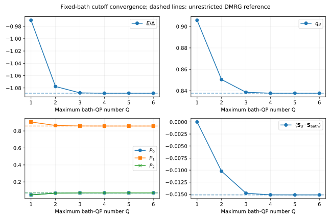
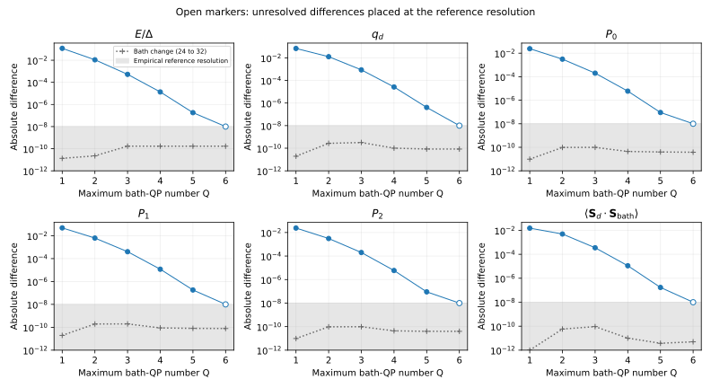
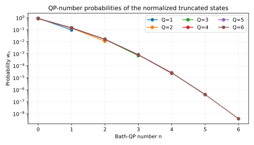

# Convergence with the quasiparticle cutoff

**Converge the observable you intend to use.** At the reference junction studied
here, a two-QP calculation gives the doublet's local-moment fraction to about
1.5%, but underestimates the magnitude of its dot–bath spin correlation by about
32%. Increasing the cutoff through six QPs brings energy, local spin, charge
probabilities, and the spin correlation within the empirical reference
resolution of $10^{-8}$ in the units specified below.

This page includes a [small runnable example](#a-quick-finite-bath-example), a
larger fixed-parameter study, and [locally archived inputs and numerical evidence](benchmarks/qp_convergence/README.md).
It extends the general [numerical-methods guide](numerics.md). The large study
uses calculation records from Teodor Iličin and Rok Žitko's manuscript
[*Quasiparticle-resolved variational theory of Andreev spin qubits*](references.md#qp-variational-method),
with new observable-resolved analysis and current-solver checks. The scripts and data
needed to reproduce this page are supplied in this repository.

## What the cutoff controls

The integer $Q$ limits the number of occupied **bath quasiparticle modes**.
All four configurations of the single impurity orbital are retained. At a
fixed bath, reference vacuum, canonical basis, and symmetry sector, the solver
diagonalizes

```math
H_Q=P_Q H P_Q.
```

The spaces are nested, so their lowest energies satisfy
$E_{Q+1}\leq E_Q$ up to numerical error. Charge and spin expectations, excitation
energies, and currents have no corresponding variational monotonicity theorem.
`cutoff=None` includes every configuration of the declared finite bath.

Three different checks are needed:

1. **Eigensolution:** the residual of $H_Q$ checks the solution inside the
   retained space. It does not measure the omitted-QP contribution.
2. **QP cutoff:** increase $Q$ while holding the finite Hamiltonian and
   coordinates fixed; compare each observable with a higher-cutoff or
   unrestricted result.
3. **Bath resolution:** repeat the cutoff checks after refining the reservoir
   at fixed physical parameters and normal-state measure. See also the
   [bath representation guide](bath_representations.md).

The reference vacuum matters. With finite direct interlead hopping, an
isolated-BCS-vacuum expansion also has to build the dressed background-junction
vacuum. Its convergence can differ greatly from an expansion around the coupled
quadratic reservoirs. Keep that choice fixed along a cutoff ladder.

## Observables and the selected state

We follow the lowest impurity-bound odd-parity doublet, choosing its
$S=1/2$, $S_z=+1/2$ member. At zero field and without spin–orbit coupling, the
other member is related by spin rotation. Fixing the spin projection avoids
arbitrary mixtures of the two degenerate states. To identify a global ground
state at a new parameter point, compare the lowest relevant even and odd sectors.

### Local-moment fraction and impurity charge probabilities

The fraction of the doublet's spin on the dot is

```math
q_d=2\langle S_d^z\rangle,
\qquad S_d^z=\frac12(n_\uparrow-n_\downarrow).
```

Spin is measured in units of $\hbar$. The probabilities for zero, one, and two
**physical electrons on the impurity** are

```math
P_2=\langle n_\uparrow n_\downarrow\rangle,
\qquad P_1=\langle n_d\rangle-2P_2,
\qquad P_0=1-\langle n_d\rangle+P_2.
```

Thus $P_0+P_1+P_2=1$. Particle–hole symmetry gives $P_0=P_2$ and
$\langle n_d\rangle=1$. The local spin magnitude obeys
$\langle\mathbf S_d^2\rangle=3P_1/4$; it differs from the spin fraction $q_d$.

These quantities use the built-in physical observables, which include the
constructor's coordinate transformation:

```python
obs = result.observables
n_d = obs["impurity_charge"][0].real
P_2 = obs["double_occupancy_0"][0].real
P_1 = n_d - 2*P_2
P_0 = 1 - n_d + P_2
q_d = 2*obs["impurity_spin_z"][0].real
```

In particular, counting canonical impurity occupations in an eta-charge basis
would not in general give the physical $P_0$ and $P_2$.

### Dot–bath spin correlation

Here “bath spin” means the total spin of **both entire leads**:

```math
\mathbf S_{\mathrm{bath}}=\mathbf S_L+\mathbf S_R,
\qquad
\mathbf S_l=\frac12\sum_i\sum_{\alpha,\beta}
c_{li\alpha}^\dagger\boldsymbol\sigma_{\alpha\beta}c_{li\beta}.
```

There are no contact/quadrature weights in this total-spin sum. A contact-local
spin density would define a different observable. We report

```math
C_{d,\mathrm{bath}}
=\langle\mathbf S_d\cdot\mathbf S_{\mathrm{bath}}\rangle
=\langle S_d^z S_{\mathrm{bath}}^z\rangle
+\frac12\langle S_d^+S_{\mathrm{bath}}^-+S_d^-S_{\mathrm{bath}}^+\rangle,
```

in units of $\hbar^2$. A negative value indicates antiferromagnetic correlation.
For a single-orbital dot in an SU(2)-symmetric doublet, a singly occupied dot
couples to bath spin zero or one. If $p_t$ is the probability of the latter,
angular-momentum addition gives

```math
q_d=P_1-\frac43p_t,
\qquad C_{d,\mathrm{bath}}=-p_t=\frac34(q_d-P_1).
```

The large-bath table uses this identity, so its correlation is a derived
observable. The [small example](../examples/qp_convergence.py) evaluates the full
spin operator independently and verifies both this identity and
$\langle\mathbf S_{\mathrm{tot}}^2\rangle=3/4$ at every cutoff. These identities
require the stated total-spin state and spin-rotation symmetry; finite
spin–orbit coupling or a local field generally invalidates the doublet formula.

The identity also separates charge fluctuations from spin compensation:
$1-q_d=P_0+P_2+4p_t/3$. At $Q=1$, the retained bath cannot carry spin one,
so $q_d=P_1$ and $C_{d,\mathrm{bath}}=0$. Higher QP sectors introduce that
additional screening contribution. At general $Q$, $p_t$ is a bath-spin
probability, rather than the probability of exactly two QPs.

## Reference junction and numerical settings

| Setting | Value |
|---|---|
| Gap | $\Delta=1$ |
| Repulsion | $U/\Delta=2$ |
| Total hybridization | $\Gamma/\Delta=0.4$; $\Gamma/2$ per lead |
| Normal-state half-bandwidth | $D/\Delta=100$ |
| Phase difference | $\phi=3\pi/5$; lead phases $[-\phi/2,+\phi/2]$ |
| Detuning, field, direct interlead hopping | All zero |
| Bath | Cosh-transformed Gauss–Legendre quadrature |
| Signed normal levels per lead | $N=24,32$, corresponding to `pairs=12,16` |
| QP cutoff | $Q=1,2,3,4,5,6$ |
| QP symmetry sector | `Sector(parity=1, twice_sz=1, eta=1)` |
| QP reference vacuum | Isolated BCS reservoirs |
| Mode reduction | `compress=True`: exactly decoupled modes frozen in their vacuum |

The reduction targets this impurity-bound doublet. Its equivalence to an
uncompressed calculation is checked on small baths. An unrestricted DMRG
reference here removes the **QP-number cutoff** within this same reduced
representation. See the [model conventions](models.md#sectors-and-canonical-coordinates)
for its scope when computing a full spectrum or arbitrary electron operators.

Energies use the solver's disconnected-BCS-vacuum subtraction and its impurity
Hamiltonian $U(n_d-1)^2/2$. This fixes a common energy zero along the entire
sequence. No coarse bath weights are rescaled. The original records have
roundoff-level differences in quadrature coefficients between numerical-library
versions; all four distinct bath records are preserved. Fresh runs reuse one
fixed bath object at each $N$.

## Results



The table below uses $N=32$ for every QP row. The selected reference has $N=24$
and MPS bond dimension $\chi=192$, with separate bath and bond checks below.
Printed digits identify numerical records; the final digits are not certified
accuracy statements.

| $Q$ | $E/\Delta$ | $q_d$ | $P_0=P_2$ | $P_1$ | $C_{d,\mathrm{bath}}$ |
|---|---:|---:|---:|---:|---:|
| 1 | -0.9701028968 | 0.9058315665 | 0.0470842168 | 0.9058315665 | 0 |
| 2 | -1.0776041901 | 0.8504635581 | 0.0679499557 | 0.8641000886 | -0.0102273979 |
| 3 | -1.0879935942 | 0.8385914854 | 0.0708435042 | 0.8583129916 | -0.0147911297 |
| 4 | -1.0885072004 | 0.8377511808 | 0.0710371611 | 0.8579256779 | -0.0151308728 |
| 5 | -1.0885205280 | 0.8377250488 | 0.0710429741 | 0.8579140519 | -0.0151417523 |
| 6 | -1.0885207082 | 0.8377246431 | 0.0710430637 | 0.8579138726 | -0.0151419221 |
| DMRG | -1.0885207097 | 0.8377246394 | 0.0710430645 | 0.8579138709 | -0.0151419236 |

The [generated table](benchmarks/qp_convergence/table.md) keeps $P_0$ and $P_2$
separate. Full-precision values and differences are in
[convergence.csv](benchmarks/qp_convergence/convergence.csv).

At two QPs, the energy error is $0.0109165\Delta$. Relative to the reference,
$q_d$ is about **1.52% too large**, $P_0$ and $P_2$ are about **4.35% too small**,
and the correlation magnitude is about **32.46% too small**. The correlation
depends on the difference of two larger quantities, $q_d$ and $P_1$, making
its relative convergence more demanding.

At this point, all six reported quantities reach absolute discrepancies below
$10^{-4}$ at $Q=4$ and below $10^{-6}$ at $Q=5$. At $Q=6$ all discrepancies
are below the $10^{-8}$ empirical reference resolution. Energy differences in
these comparisons are divided by $\Delta$; the remaining quantities are
dimensionless. The cutoff required elsewhere depends on the physical regime,
chosen QP vacuum, observable, and requested accuracy.

The [large-hybridization study](../large_Gamma/README.md) extends this comparison
to eight interactions, two phases, and $\Gamma/\Delta=10$, with independently
tracked bath and DMRG convergence. Its report states the achieved coverage and
resolution of the archived calculations.

### Separating bath and reference errors



The dotted curves show the change from $N=24$ to $N=32$ **at each fixed cutoff**.
Open circles mark unresolved differences and are placed at the empirical
reference resolution, rather than at their smaller nominal values. Bath changes
below $10^{-12}$ are displayed at the lower plot boundary.

The unrestricted reference is checked with $(N,\chi)=(24,128),(32,128),(24,192)$:

| Observable | DMRG bath step | DMRG bond step | Maximum QP bath step over all $Q$ |
|---|---:|---:|---:|
| $E/\Delta$ | 1.92e-10 | 2.75e-10 | 1.69e-10 |
| $q_d$ | 1.26e-10 | 5.04e-10 | 3.20e-10 |
| $P_0$ | 4.82e-11 | 1.27e-10 | 9.84e-11 |
| $P_1$ | 9.65e-11 | 2.53e-10 | 1.97e-10 |
| $P_2$ | 4.83e-11 | 1.27e-10 | 9.84e-11 |
| $C_{d,\mathrm{bath}}$ | 2.22e-11 | 1.88e-10 | 9.22e-11 |

For **each observable separately**, the reporting resolution is the larger of
a stated $10^{-8}$ floor and four times the sum of its absolute bath and bond
changes. All six resolutions equal the stated floor here. This is an empirical
stability convention, not a rigorous error bound or a conversion of energy
accuracy into wavefunction accuracy.

The original QP residuals are below $1.1\times10^{-11}\Delta$. The original DMRG
records contain sweep histories, discarded weights, normalization diagnostics,
and variances, but do not contain the current solver's direct residual norm.
Those legacy variances are preserved as diagnostics, not converted into direct
residual certificates. The current reference workflow evaluates the full
finite-Hamiltonian residual, uses a separately stated $3\times10^{-4}\Delta$
acceptance threshold for this bond ladder, and retains the residuals alongside
the observable-stability checks. A residual threshold is not the $10^{-8}$
empirical resolution quoted above.

The fresh $Q=1,2,3,4$ calculations on both grids agree with the paper archive
within $3\times10^{-13}$ in all reported quantities. Their complete settings,
code hashes, and measurements are in the [current-solver archive](benchmarks/qp_convergence/current/manifest.json).
Fresh calculations of all three DMRG reference points agree with the original
observables within $9.2\times10^{-11}$. Their direct residuals are
$1.72\times10^{-4}\Delta$ at $(24,128)$, $1.73\times10^{-4}\Delta$ at $(32,128)$,
and $3.68\times10^{-5}\Delta$ at $(24,192)$, illustrating the distinction between
observable stability and a full-state residual.

### QP weights are useful diagnostics



Write $w_n$ for the probability of exactly $n$ bath QPs in a normalized state.
The solver returns these as `result.qp_weights[0, n]`, with
$\sum_{n=0}^{Q}w_n=1$. They are distinct from the impurity charge probabilities
$P_n$.

At $Q=2$, $w_2=0.0108130$, yet the spin-correlation magnitude still has a 32%
error. In the $Q=6$ state, the two-QP weight itself is larger, $w_2=0.0159045$.
Enlarging the variational space changes the retained amplitudes as well as
adding new ones. Moreover, general observables can connect different QP sectors
and depend on their coherences. The weight at the truncation boundary is a
diagnostic to record, rather than a universal observable-error estimate.

## A quick finite-bath example

With the base installation, run from the repository root:

```sh
python -B examples/qp_convergence.py
```

The example uses $U=2$, $\Gamma=0.4$, $\phi=3\pi/5$, $\Delta=1$, but a small
**$D=5$ bath with one mirrored pair per lead**. It solves
$Q=0,1,2,3,4,5,6$ and the full finite space. The largest spin-resolved sector
in this odd-parity ladder has only 210 states. Full finite-bath results include

| Quantity | Value |
|---|---:|
| Doublet energy | -0.3754954584 |
| $q_d$ | 0.8632850314 |
| $P_0=P_2$ | 0.05984230 |
| Dot–bath spin correlation | -0.01277277 |
| $E_{\mathrm{even}}-E_{\mathrm{doublet}}$ | 0.3626425184 |

The positive final gap identifies an odd ground state for this small control.
The small bath is a finite-Hamiltonian demonstration, while the larger study
above supplies the separate bath refinement.

For the spin check, `add_spin_observables(h)` constructs the entire physical
electron operator, then calls `h.physical_operator(...)` with `compress=False`.
Multiplication precedes projection, retaining the transverse spin-flip terms
and the contractions required at cutoff boundaries. Numerical tests additionally
compare all these observables against independent electron-space tensor-product
ED, including detuning where $P_0\ne P_2$, and test the local-field energy
derivative $q_d=2\partial E/\partial B$.

## Reproducing the reference study

Install the source checkout with `python -m pip install -e '.[dmrg,plots]'` for
all workflows. QP calculations require only the base installation; figure
rendering uses the `plots` extra and reference DMRG uses the `dmrg` extra.
Run from the repository root with one numerical thread:

```sh
export OPENBLAS_NUM_THREADS=1 OMP_NUM_THREADS=1 MKL_NUM_THREADS=1 VECLIB_MAXIMUM_THREADS=1

# Regenerate all figures and tables from the shipped data.
python -B tools/plot_qp_convergence.py docs/benchmarks/qp_convergence \
  --verification docs/benchmarks/qp_convergence/current \
  --output results/qp-convergence-plots

# Repeat Q=1..4 at N=24 and N=32.
python -B tools/benchmark_qp_convergence.py --profile check \
  --output results/qp-convergence-check

# Inspect dimensions before a complete new study.
python -B tools/benchmark_qp_convergence.py --profile full --dmrg --dry-run

# Repeat Q=1..6 and all three unrestricted DMRG references.
python -B tools/benchmark_qp_convergence.py --profile full --dmrg \
  --output results/qp-convergence-full
python -B tools/plot_qp_convergence.py results/qp-convergence-full \
  --output results/qp-convergence-full-plots
```

The [input file](benchmarks/qp_convergence/input.json) specifies the physical
model, bath sizes, sector, fixed seeds, tolerances, and resource limits. Repeating
the same command resumes completed points with identical input and code.
Use a fresh output directory after changing settings. `--dmrg` can also be used
with the `check` profile to repeat the reference checks without the large
$Q=5,6$ calculations.

The $N=32$, $Q=6$ sector contains **23,899,169 states**. Its original accuracy
run took about 35 minutes and peaked at 7.1 GiB resident memory on its recorded
Intel Mac. These are historical measurements, rather than portable performance
guarantees. The dry run reports exact dimensions and single-vector sizes;
basis, sparse-matrix, and Krylov workspace storage are additional. Explicit
solver memory and dimension limits remain active.

See the [archive README](benchmarks/qp_convergence/README.md) for file formats,
provenance, export commands, and the optional one-time import from the manuscript
archive. Routine regressions use small baths and the local records.
