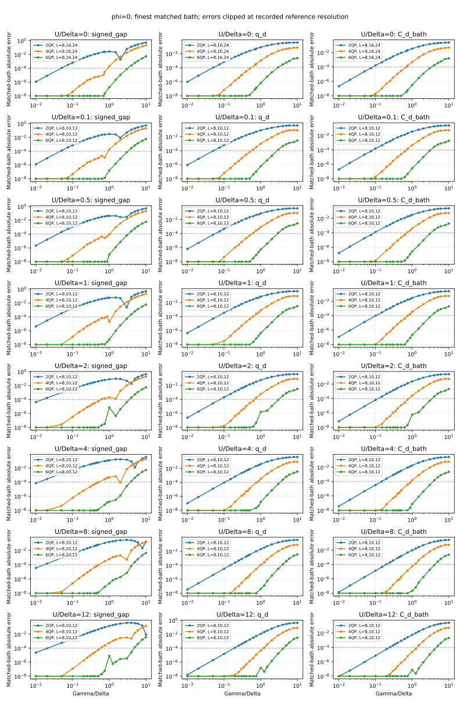
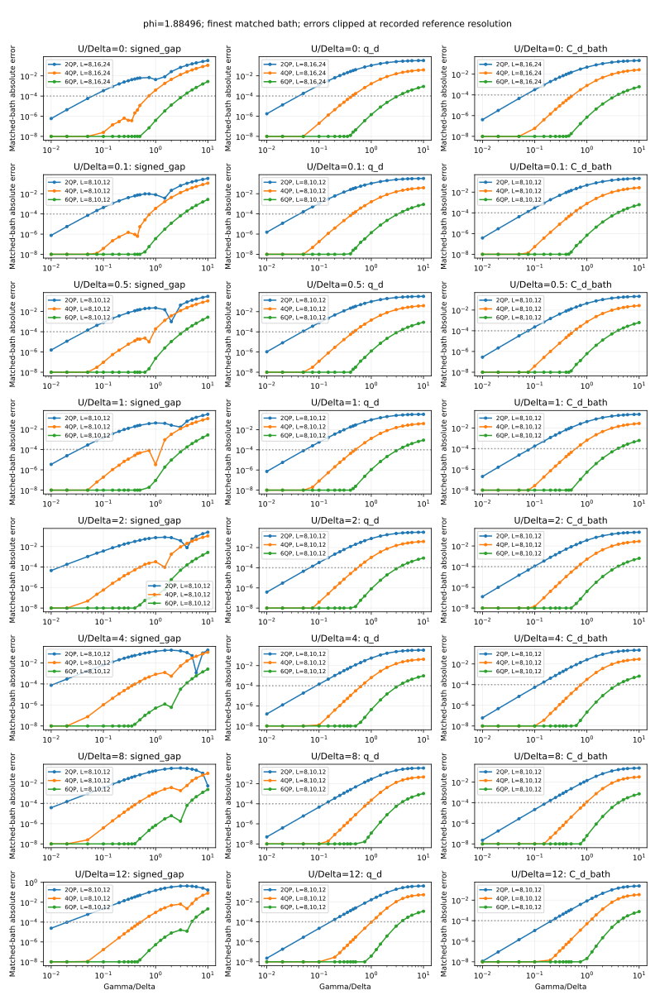

# Large-hybridization convergence study

## TL;DR

How many quasiparticles are enough at strong dot-lead coupling? This study
compares **2QP, 4QP and 6QP truncations with exact finite-bath solutions and DMRG**
up to total hybridization $\Gamma/\Delta=10$, across eight interactions and two
superconducting phases. It checks excitation gaps, local observables and currents.

- **Even six QPs are insufficient for high precision at strong coupling.** At
  $\Gamma/\Delta=10$, representative eight-level calculations have 6QP gap errors
  from $0.002\Delta$ to $0.006\Delta$, including in the noninteracting model.
- **A good gap can hide a poor state.** Cancellation between sector-energy errors
  can mask large local-observable errors; increasing the cutoff need not improve
  every observable monotonically.
- **Finite-bath accuracy is not continuum convergence.** Accepted DMRG results
  agree with exact same-bath references within $10^{-5}$ where checked, but no
  DMRG point meets the bath-resolution target for all reported observables.
  The reported fixed-bath cutoff thresholds are not established continuum limits.

## Physical scope

| Quantity | Definition/value |
|---|---|
| Gap and energy unit | $\Delta=1$ |
| Interaction | $U/\Delta=0,0.1,0.5,1,2,4,8,12$ |
| Hybridization | **Total** $\Gamma=\Gamma_L+\Gamma_R$; equal leads; 18 values from $\Gamma/\Delta=0.01$ to $10$ |
| Phase difference | $\phi=0$ and $3\pi/5$; lead phases $[-\phi/2,+\phi/2]$ |
| Normal-state half-bandwidth | $D/\Delta=100$ |
| Gate | Half filling: $\epsilon_d=-U/2$, `detuning=0` |
| Local field and direct interlead hopping | Zero |

This gives **288 base-grid points**. The QP expansion uses the isolated BCS
reservoir vacuum. The dot Hamiltonian is $H_d=\frac U2(n_d-1)^2$, with the
disconnected BCS vacuum energy subtracted; see [model conventions](../docs/models.md).
Bath weights represent the normal-state measure and are not renormalized.

The lowest active-space singlet and doublet define the signed gap; the doublet
is followed even when excited. The main gap and doublet observables are

```math
\delta E=E_D-E_S,\qquad q_d=2\langle S_d^z\rangle,\qquad
P_2=\langle n_{d\uparrow}n_{d\downarrow}\rangle.
```

The archive also retains charge probabilities, correlation with the total spin
of both leads, and both parity branches' energies and currents. Current is in
units of **$2e\Delta/\hbar$**; the equilibrium current uses the lower-energy branch.

## Main results

At $\Gamma/\Delta=10$, the following **eight-level cosh-bath** results compare
each truncation with the **same finite Hamiltonian**, using independent
physical-electron BdG at $U=0$ and unrestricted ED at $U=12$. Here $L=8$ counts
signed spinful normal levels **per lead**. These are cutoff errors, not bath errors.

| $U/\Delta$ | $\phi$ | 2QP gap error / $\Delta$ | 4QP gap error / $\Delta$ | 6QP gap error / $\Delta$ | 6QP error in $q_d$ |
|---:|---|---:|---:|---:|---:|
| 0 | 0 | 0.543697 | 0.233864 | 0.00569867 | 0.00120434 |
| 0 | $3\pi/5$ | 0.335174 | 0.112527 | 0.00285802 | 0.000955156 |
| 12 | 0 | 0.00658584 | 0.165986 | 0.00464839 | 0.00243147 |
| 12 | $3\pi/5$ | 0.173371 | 0.0815682 | 0.00220915 | 0.00124537 |

The noninteracting model is not exempt: its hybridized ground state contains
many QP components relative to the disconnected reservoirs. At $U=12$, $\phi=0$,
the 2QP gap happens to be closer to ED than the 4QP gap, yet the $q_d$ error is
**0.44024 at 2QP versus 0.10451 at 4QP**. Sector energies are variational; their
difference and local observables are not monotone in cutoff.

The plots use the finest available **matched bath** at each point, identified
in their legends. Values at the reference-resolution floor denote unresolved
smaller differences. The [numerical report](output/report.md) gives the first
sampled crossings of a $10^{-3}\Delta$ gap error for every interaction and phase;
errors can subsequently cross back below the threshold.





## Accuracy and limitations

The archived campaign ended on **24 September 2026**. Its targets were
**$10^{-5}$ finite-bath observable accuracy** and **$10^{-3}$ empirical bath
resolution**, assessed separately for each observable. Earlier, tighter results
retain their original precision and provenance.

<!-- deadline-results:start -->

**Current status:** final deadline-limited report; remaining bath-resolution limits are explicitly reported.

Snapshot: 2026-09-24 06:15 CEST. [Current numerical report and breakdown tables](output/report.md).

| Method | Accepted finite-bath points | Fully bath-resolved points |
|---|---:|---:|
| 2QP | 288/288 | 129/288 |
| 4QP | 288/288 | 49/288 |
| 6QP | 288/288 | 55/288 |
| DMRG | 288/288 | 0/288 |
<!-- deadline-results:end -->

"Accepted" means the finite calculation passed its numerical checks, **not**
that a QP truncation is accurate. Same-bath comparisons isolate cutoff error;
bath refinements test discretization error. Continuum claims require both the
QP bath and the reference to be resolved at fixed $D$. These are empirical
stability estimates, not rigorous error bounds; unresolved cases remain explicit.

DMRG is checked against exact same-bath observables where available; otherwise
bond stability and residual checks are used. Observable accuracy, full-state
residual and bath convergence are separate diagnostics; see the
[accuracy evidence](output/report.md#dmrg-accuracy-evidence).

Exactly decoupled modes are frozen in their vacuum. In particular, this omits
spectator excitations in the free antisymmetric lead channel at zero phase.
Discarded-mode and continuum-edge margins are retained: an above-edge coupled
branch must **not** be interpreted as a resolved physical subgap excitation.

## Files and reproducibility

| Evidence | Location |
|---|---|
| Grid and solver settings | [Original profile](input/study.json), [historical deadline overrides](input/deadline.json) |
| Measurements and errors | [Observables](output/observables.csv), [comparisons](output/comparisons.csv) |
| Achieved resolution and thresholds | [Convergence](output/convergence.csv), [breakdown brackets](output/breakdown.csv) |
| Baths and provenance | [Explicit coefficients](output/baths.json), [manifest and dataset parts](output/manifest.json) |

From the repository root with `.[dmrg,plots]` installed, **verify and replot the
shipped archive without running a solver**:

```sh
python -B large_Gamma/analyze.py large_Gamma/output --replot --output results/large-Gamma-plots
```

For **fresh numerical calculations**, use the original high-precision profile
below. These runs may take days and do not replay the deadline-limited selection
of archived work. The historical `deadline.py` calculation command rejects its
expired default deadline and is not the entry point for a fresh checkout.

```sh
export OPENBLAS_NUM_THREADS=1 OMP_NUM_THREADS=1 MKL_NUM_THREADS=1 VECLIB_MAXIMUM_THREADS=1

# Inspect dimensions, then run a small pilot.
python -B large_Gamma/run.py --dry-run
python -B large_Gamma/run.py --profile pilot --jobs 4

# Full grid, convergence ladders and adaptive refinement.
python -B large_Gamma/run.py --jobs 4 --refine

# Export fresh results without replacing the shipped archive.
python -B large_Gamma/analyze.py runs/large_Gamma/study --output results/large-Gamma-fresh --plots
```

Fresh working records stay under ignored `runs/large_Gamma/`. Repeating a run
resumes matching unfinished work but skips terminal timeout, resource-limit and
worker failures marked `complete=True` by `run.py`. Inspect `tasks/` failure
records and `logs/` under the run directory, adjust limits/settings, and retry in
a new `--output` directory (also required whenever settings change).
Use `--backend qp` without TeNPy and `--max-levels` to bound exploratory runs.
Small offline regressions: `python -B -m pytest tests/test_large_gamma.py`.

Background: [observable-resolved QP benchmark](../docs/qp_convergence.md) and
[bath representations](../docs/bath_representations.md). This is a solver
convergence study, not a reproduction of a paper figure.
